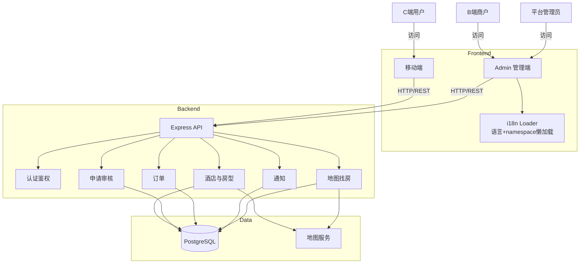

# 易宿酒店预订平台 - 技术架构文档

## 1. 架构风格
- B/S 架构，前后端分离
- 前端：移动端（Taro + React），PC 管理端（React + Vite + Ant Design）
- 后端：Node.js（Express），RESTful API
- 数据库：Supabase（PostgreSQL）

## 2. 分层与职责
### 2.1 前端应用层
- `mobile`：用户端搜索、详情、订单、收藏
- `admin`：商户/管理员后台、审核流、消息中心

### 2.2 网关与业务层
- 路由聚合层：认证、酒店、申请、订单、通知、地图
- 业务服务层：状态流转、库存计算、审核规则、通知触发

### 2.3 地图找房架构
- **前端**：`mobile/src/pages/map` 动态加载高德地图 H5 SDK（AMap v2.0），以价格气泡覆盖物展示酒店位置，支持 POI 搜索、筛选、气泡与卡片列表联动
- **后端接口**：`GET /api/map/hotel-locations` 聚合 DB 酒店坐标 + 动态价格计算
- **价格一致性**：直接复用 `roomAvailabilityService` + `pricingService`，避免引用 `hotelService`（防止循环依赖）
- **坐标来源**：DB `hotels.lat/lng`（商户地图选址时写入），无坐标酒店不上图；DB 无数据时降级 Mock
- **高德 KEY**：服务端 `AMAP_KEY` 环境变量（POI/geocode/regeocode）；前端使用 Web SDK KEY；未配置时均有模拟数据兜底

### 2.3 数据层
- PostgreSQL：业务主数据（用户、酒店、房型、订单、申请、通知）
- 外部地图服务：POI 检索与地址解析

## 3. Admin 国际化子架构（2026-02 落地）
### 3.1 词典组织
- 从单文件翻译演进为 namespace 分层：`common/auth/dashboard/hotels/...`
- 目录规范：`admin/src/locales/{lng}/{namespace}.json`

### 3.2 资源加载策略
- 语言维度懒加载：仅在首次使用语言时加载对应资源
- namespace 维度懒加载：按路由声明的业务域按需加载
- 基础 namespace（公共 UI 文案）在初始化阶段预加载

### 3.3 路由联动
- 路由元数据声明 `namespaces`
- 路由切换时先加载目标 namespace，再渲染页面组件
- 页面组件使用 `React.lazy` 做代码分割

### 3.4 质量门禁
- `i18n:check`：校验双语 key 一致性
- `i18n:check:strict`：在一致性基础上，阻断新增硬编码中文

### 3.5 展示一致性子层（2026-02）
- 面向“同一业务实体跨页面一致展示”新增统一约束：
    - 房型价格：`basePrice/currentPrice` 必须走模板型 i18n key
    - 房型优惠：标签必须显示优惠值与有效期
    - 优惠活动：详情页与审核页共享甘特图时间视图
    - 房型图片：详情/审核页面统一展示缩略图预览

### 3.6 多语言表格韧性（2026-02）
- 在 Admin 端表格层引入“内容驱动列宽估算”能力：
    - 根据当前语言文案和当前行操作项估算 `Actions` 列宽
    - 结合 `scroll.x=max-content` 提供极端场景兜底
- 目标：避免中英切换后按钮挤压、截断、溢出。

### 3.7 Admin 长列表远程查询子架构（2026-02）
- 列表查询范式统一为“服务端分页 + 服务端筛选”：
    - 分页参数：`page/pageSize`
    - 筛选参数：`keyword/status/city/type/hotelId`（按业务域使用）
- 前端复用层：
    - `useRemoteTableQuery`：统一搜索防抖、分页态与翻页逻辑
    - `TableFilterBar`：统一搜索框、下拉筛选、重置与刷新入口
- 后端兼容策略：
    - 未传 `page/pageSize` 返回旧数组结构（兼容历史调用）
    - 传入 `page/pageSize` 返回 `{ page, pageSize, total, list }`
- 已落地接口：
    - `GET /api/admin/hotels`、`GET /api/merchant/hotels`
    - `GET /api/admin/requests`
    - `GET /api/user/merchants`
    - 城市选项接口：`GET /api/admin/hotels/cities`、`GET /api/merchant/hotels/cities`

## 4. Mermaid 架构示意

## 5. 非功能性要求
- 安全：JWT 认证、角色鉴权、敏感操作校验
- 性能：路由级代码分割、词典按需加载、服务端分页与筛选、分页与增量渲染
- 可维护：业务域分层（路由、服务、词典、检查脚本）
- 可扩展：新增语言只需补 `{lng}/{namespace}.json` 并接入 loader
