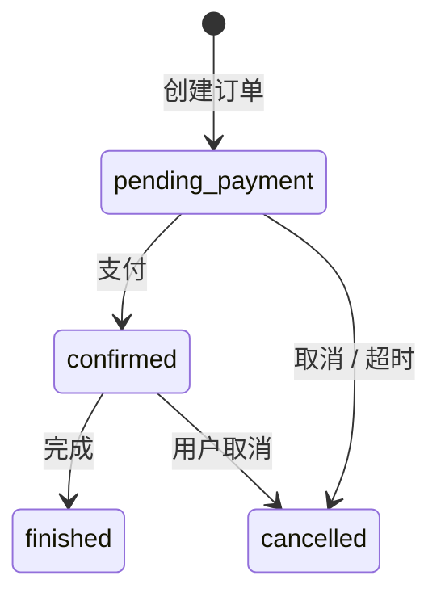
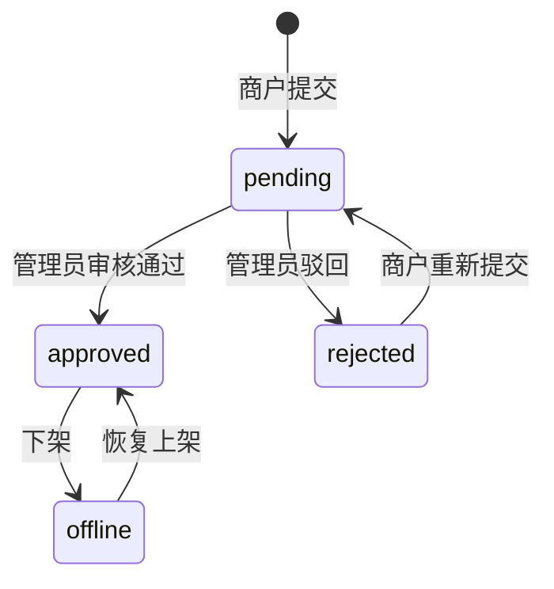
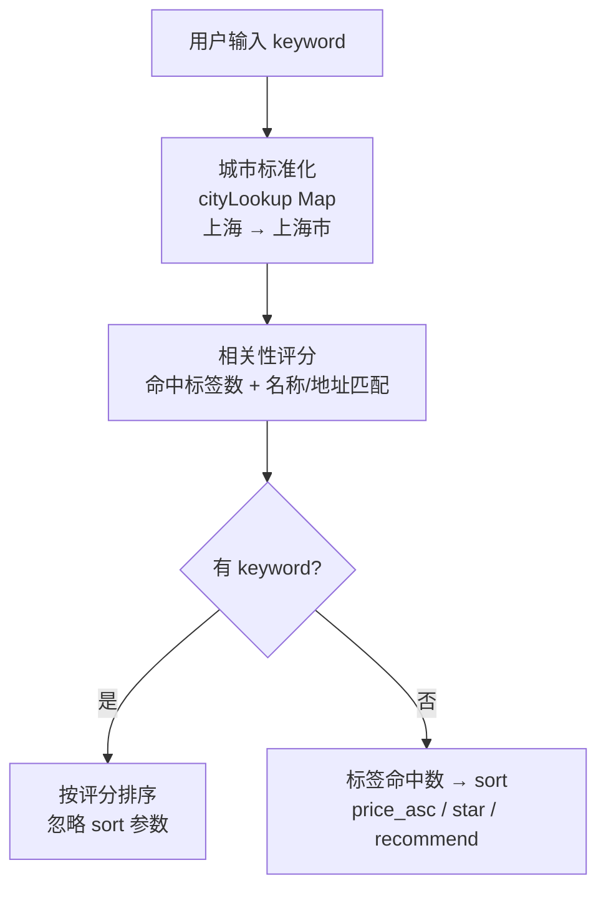

# 易宿酒店预订平台答辩PPT（V7）初稿 - 按你反馈重写版

## 1. 本稿目标
- 每个技术段都带少量代码，避免空讲概念。
- 架构图全部改为 PPT 内直接绘制，统一视觉与排版风格。
- PPT中不要出现答辩重点相关字样

---

## 2. 视觉方向（蓝色多巴胺）

### 2.1 配色（蓝色多巴胺）
- `#071B4D` 深蓝主背景
- `#1677FF` 主强调蓝
- `#39A9FF` 亮蓝
- `#4CC9F0` 青蓝点缀
- `#EAF4FF` 浅底
- `#0E1F3D` 深文字
- `#5B6B8C` 次级文字

### 2.2 版式原则
- 章节页深底，内容页浅底。
- 只用一种圆角卡片语言（圆角 10）。
- 每页最多 1 段代码，代码不超过 8 行。

---

## 3. 页结构（建议 17 页）

## 0 封面
- 标题：易宿酒店预订平台
- 副标题：三端架构设计与技术实现

## 1 目录
- 项目目标、技术挑战、成员分工
- 三端总架构及技术栈
- 三端系统分层架构图（PPT）
- 移动端：长列表、卡片、动效
- 管理端：表格分页、性能优化
- 服务端：分层架构、状态机、库存计算、智能检索
- 三大专项：性能 / 抽象 / 动效
- 总结与下一步

## 2 项目目标与技术挑战
- 目标：打通“发布 -> 审核 -> 搜索 -> 预订 -> 支付 -> 通知”闭环。
- 挑战：
  - 客户端流畅性与易用性
  - 管理端长列表与重组件性能
  - 页面/组件重复实现导致维护成本高
  - 动效一致性与性能平衡

## 3 三端协同总架构（必须含技术栈）
- 三端技术栈：
  - 移动端：Taro + React + antd-mobile
  - 管理端：React + Vite + Ant Design + react-router
  - 服务端：Node.js + Express + JWT
  - 数据层：Supabase(PostgreSQL) + AMap地图服务
- 关键链路：
  - 两端前端统一走 API Gateway
  - 网关后按域路由到 auth/hotel/request/order/notify
  - 复杂业务规则集中在 service 层，前端不重复判定

代码点缀（1段）：
```js
router.use('/merchant/hotels', authRequired, requireRole('merchant'), merchantHotelRoutes)
router.use('/admin/hotels', authRequired, requireRole('admin'), adminHotelRoutes)
router.use('/requests', authRequired, requestRoutes)
```

## 4 三端系统分层架构图（PPT）
- 分层视角（纵向）：
  - 接入层：移动端 + 管理端 + 角色入口
  - 应用层：页面路由、业务页面、查询与列表抽象
  - 接口层：API Gateway（鉴权、聚合、兼容）
  - 领域服务层：状态机、库存、订单、通知规则
  - 数据与外部层：PostgreSQL + 地图服务
- 横切能力（横向）：
  - 鉴权与权限、性能优化、组件抽象、动效体系

## 5 移动端架构设计
- 分层：Page Layer -> List Factory -> List Container -> Card Layer。
- 明确职责：
  - Page：数据请求与业务回调
  - List Factory：根据 type 组装列表
  - List Container：滚动/刷新/加载/骨架/空态/动效
  - Card：纯展示（OrderCard/HotelCard/RoomTypeCard）

## 6 移动端技术实现（组件抽象）

**核心思路：一个 `ListContainer` + 一个工厂函数，覆盖四类列表页面**

- `ListContainer`（通用滚动容器）：把下拉刷新 / 上拉加载更多 / 骨架屏 / 空态 / 入场动画全部封装在内，业务页面**不需要重复实现**这些能力
- `createListByType`（列表工厂函数）：传入 `type` 参数，返回不同的列表装配结果
  - `'order'` → `OrderCard` + 订单专用骨架屏
  - `'favorite'` → `HotelCard` + `SwipeAction` 右滑取消收藏（`enableSwipe` 控制开关，不需要时不注入）
  - `'room'` → `RoomTypeCard` + 售罄状态判定逻辑注入
  - `'hotel'` → `HotelCard`（搜索结果列表）
- 每个 Card 组件（`OrderCard` / `HotelCard` / `RoomTypeCard`）**纯展示**，只接收数据和回调，不感知外层滚动容器
- **复用收益**：`pages/orders`（订单列表）、`pages/favorites`（收藏）、`pages/list`（搜索结果）三个页面均只需调用工厂函数，无需各自实现滚动刷新逻辑

代码点缀（1段）：
```jsx
// 收藏页：开启滑删 + 入场动画，只需传 type 和回调，无需关心滚动/刷新实现
{createListByType({
  type: 'favorite',
  items,
  onOpen,       // 点击跳详情
  onRemove,     // 右滑 → 取消收藏
  animate: true // 启用入场动效
})}
```

## 7 移动端技术实现（动效详细版）

**三类动效，全部封装在 `ListContainer` 内，业务页面传 `animate=true` 即可开启，无需关心实现细节**

### 动效一：列表项入场动画（阶梯错开进场）
- **是什么**：页面数据加载完成后，卡片从"略微偏下 + 略微缩小 + 透明"的状态浮入正常位置
- **怎么实现**：
  - 每个列表项加 `list-stagger-enter` class，触发 `@keyframes list-item-enter`
  - 关键帧：`opacity 0→1`，`translateY(6px)→0`，`scale(0.995)→1`，时长 0.22s，ease-out
  - 每项延迟 = `Math.min(index, 10) × 20ms`：第 0 项立即播，第 5 项延迟 100ms……**第 10 项之后全部固定 200ms**，避免列表很长时后面的卡片等很久才出现

### 动效二：骨架屏流光扫描
- **是什么**：数据加载中时，卡片区域显示灰色占位条，占位条上有光从左向右扫过的效果
- **怎么实现**：占位条用 CSS 横向渐变背景（`#edf1f6 → #f8fbff → #edf1f6`），通过 `@keyframes` 把 `background-position` 从 `100%→0%` 循环移动，产生"扫光"视觉，1.2s 无限循环
- **覆盖两个场景**：初次加载（全页骨架）和上拉加载更多（底部追加 2 条骨架），复用同一套样式

### 动效三：下拉刷新三阶段反馈
- **拖拽中**：指示小圆点实时跟随拉距放大，`scale = 0.6 + (拉距/阈值) × 0.6`；容器高度随拖动距离增长，给用户弹性拉伸感
- **已达阈值（ready）**：拉距 ≥ 72px 时圆点颜色加深（`#1677ff → #1a6dff`），告知用户"松手就会刷新"
- **刷新中（loading）**：松手后圆点进入 pulse 动画，`scale(1) → scale(1.4) → scale(1)` 循环，0.9s 无限，直到数据返回

代码点缀（1段，入场动画核心逻辑）：
```jsx
// 前 10 项错开进场，第 11 项起同时出现，避免等待时间随列表变长
const delay = animate ? `${Math.min(index, 10) * 20}ms` : '0ms'
<View
  className={`list-item${animate ? ' list-stagger-enter' : ''}`}
  style={animate ? { animationDelay: delay } : undefined}
/>
// CSS keyframe:
// from { opacity:0; transform: translateY(6px) scale(0.995) }
// to   { opacity:1; transform: translateY(0)   scale(1)     }
```

## 8 管理端架构设计

**三层结构，各自解决一个核心问题**

### 路由层（Route Layer）—— 解决"重组件拖慢首屏"
- 15 个页面组件全部 `React.lazy` 按需加载，用户访问哪个页面才下载对应 JS，首屏只加载登录/工作台代码
- 页面内的大体积子组件（图表、批量操作弹窗、审核大表格）同样独立拆包，进入对应页面才加载
- 路由树**分角色嵌套**，权限在路由层统一收口：
  - 所有已登录路由 → `RequireAuth`（无 token 强跳 `/login`）
  - 商户路由组（`/hotels/*`）→ `RequireRole allow="merchant"`
  - 管理员路由组（`/audit/*` `/requests/*` 等）→ `RequireRole allow="admin"`

### 查询层（Query Layer）—— 解决"每个列表页重复写查询逻辑"
- `useRemoteTableQuery`：统一管理关键词 / 页码 / 每页条数 / 总条数 + 搜索防抖，一行 Hook 调用替代约 20 行重复的 `useState/useEffect`
- `TableFilterBar`：统一搜索框 + 筛选下拉 + 操作按钮的布局，所有列表页复用同一组件

### 功能层（Feature Layer）—— 解决"商户/管理员页面大量重复"
- `RoomsTabBase` / `OrdersTabBase`：商户和管理员的房型表、订单表共用同一套基座，通过 props 注入差异（翻译 key 前缀、是否显示状态列、操作回调）
- 工作台、酒店详情等页面按角色装配不同的功能模块（商户看销售数据，管理员看审核数据）

## 9 管理端技术实现（性能优化怎么做）

**三类优化手段，对应三种性能瓶颈**

### 手段一：代码分割（解决 JS bundle 过大）
- **页面级**：15 个页面组件全部 `React.lazy`，路由切换时才下载对应 chunk
- **组件级**：页面内大体积组件单独拆包，不随页面一起加载：
  - `DashboardBatchModals`：工作台批量操作弹窗，只在打开弹窗时才加载
  - `AuditTable`：审核大表格，进入审核页才加载
  - `echarts-for-react`：ECharts 图表库（体积较大），进入订单统计页才加载

### 手段二：请求时机优化（解决非关键请求抢占首屏）
- 未读消息数、管理员待审任务数 → 通过 `requestIdleCallback`（不支持时降级 `setTimeout 400ms`）在浏览器**空闲时**才发起请求，首屏渲染期间不占网络
- 酒店详情页的「房型」「订单」tab → **Tab 激活时才发起对应数据请求**，默认只加载首个 Tab 的数据

### 手段三：渲染减负（解决大量 DOM 渲染卡顿）
- **分页**：所有列表页服务端分页，默认每页 10 条，不一次性渲染全部数据
- **`useMemo` 稳定引用**：列定义数组、状态映射对象用 `useMemo` 包裹，父组件重渲染时表格结构不重建
- **`content-visibility: auto`**：消息列表每条通知滚出视口后，浏览器跳过其布局与绘制

代码点缀（1段）：
```jsx
// 三个重组件独立拆包，进入对应页面/触发对应操作时才加载
const DashboardBatchModals = lazy(() => import('../components/DashboardBatchModals.jsx'))
const AuditTable           = lazy(() => import('../components/audit/AuditTable.jsx'))
const ReactECharts         = lazy(() => import('echarts-for-react'))
// 非关键数据用 requestIdleCallback 延迟请求
scheduleIdleTask(async () => {
  setUnreadCount(await getUnreadCount())
}, { timeout: 1500, fallbackDelay: 400 })
```

性能实测汇总（来自 `docs/performance-pic`）：

| 页面 | 路由 | 截图文件 | Performance | Accessibility | Best Practices | SEO | FCP(s) | LCP(s) | TBT(ms) | CLS | Speed Index(s) |
| --- | --- | --- | ---: | ---: | ---: | ---: | ---: | ---: | ---: | ---: | ---: |
| 工作台（商户） | `/` | `979479909c9bc65e4922352cfc458264.png` | 97 | 89 | 100 | 73 | 0.7 | 1.1 | 70 | 0 | 1.0 |
| 我的酒店（商户） | `/hotels` | `ab20950a86a5fc78cbfb5aa9b0392545.png` | 98 | 92 | 100 | 73 | 0.7 | 0.9 | 30 | 0.001 | 1.1 |
| 订单统计（商户） | `/hotels/2/stats` | `a759ad12eadf4397fec3e675fbe8ab8a.png` | 94 | 92 | 100 | 73 | 0.6 | 1.5 | 70 | 0 | 1.0 |
| 账户管理（商户） | `/account` | `0545e0d9fdd6832a4d6f90f682fa7570.png` | 99 | 92 | 100 | 73 | 0.6 | 0.8 | 90 | 0.024 | 0.8 |
| 酒店管理（管理员） | `/admin-hotels` | `2263dccd42b25e4a60f676ee14788e68.png` | 97 | 92 | 100 | 73 | 0.6 | 1.1 | 60 | 0.009 | 0.8 |
| 酒店审核（管理员） | `/audit` | `604c6218-fd74-4eee-ba59-24286038da05.png` | 99 | 92 | 100 | 73 | 0.6 | 0.8 | 30 | 0.002 | 0.7 |
| 申请审核（管理员） | `/requests` | `8f4a93d0-90db-4645-af73-f991071c0f72.png` | 99 | 92 | 100 | 73 | 0.7 | 0.9 | 40 | 0 | 0.8 |
| 商户管理（管理员） | `/merchants` | `1b251d6d-d57a-4b4a-92b4-abc0bb164f09.png` | 95 | 88 | 100 | 73 | 0.7 | 0.8 | 170 | 0 | 0.9 |
| 账户管理（管理员） | `/account` | `image.png` | 98 | 92 | 100 | 73 | 0.7 | 1.0 | 50 | 0.027 | 0.7 |

## 10 管理端技术实现（页面与组件复用怎么做）

**复用点一：查询状态 Hook（`useRemoteTableQuery`）**

所有列表页都需要关键词搜索、分页、防抖这一套逻辑。没有 Hook 时，每个页面自己写 `useState + useEffect + setTimeout`，约 20 行代码重复 10 次。

Hook 内部做了两件事：
1. 搜索框输入变化后，等待 350ms 无新输入才更新 `keyword`（防抖），同时把页码重置为第 1 页
2. 换页时如果 `pageSize` 也变了，自动重置到第 1 页，避免页码越界

业务页面只需一行：`const { keyword, page, pageSize, total, setTotal, handlePageChange, setSearchInput } = useRemoteTableQuery()`

---

**复用点二：筛选栏组件（`TableFilterBar`）**

统一搜索框 + 多个 Select 筛选 + 重置/刷新按钮的布局。传入 `filterItems` 数组配置每个筛选项，不用每个页面手写 `<Row><Col>` 栅格布局。

---

**复用点三：房型表 / 订单表共享基座（`RoomsTabBase` / `OrdersTabBase`）**

商户端酒店详情和管理员端酒店详情的房型表，表格列结构完全相同，只有以下差异：
- 管理员可看"上架/下架状态"列，商户看不到
- 管理员有"设置折扣 / 取消折扣"操作列，商户没有
- 按钮文案、翻译 key 前缀不同

抽取 `RoomsTabBase` 后，差异全部通过 props 注入，不需要维护两份几乎一样的表格代码。

代码点缀（1段）：
```jsx
// 商户端：隐藏状态列和操作列
<RoomsTabBase roomTypes={rooms} i18nPrefix="merchant.room"
  showStatusColumn={false} showActionColumn={false} />

// 管理员端：多出状态列 + 折扣操作列
<RoomsTabBase roomTypes={rooms} i18nPrefix="admin.room"
  showStatusColumn={true} showActionColumn={true}
  onOpenDiscount={handleOpenDiscount}
  onCancelDiscount={handleCancelDiscount} />
```

## 11 管理端技术实现（鉴权与权限管理怎么做）
- 前端路由守卫：
  - `RequireAuth`：无 token 跳转 `/login`
  - `RequireRole`：角色不符跳转 `/unauthorized`
  - 路由分组：admin-only 与 merchant-only
- 后端接口守卫：
  - `authRequired`：Bearer Token 校验，401 拦截
  - `requireRole(role)`：角色检查，403 拦截
  - 在路由挂载阶段统一加中间件

代码点缀（1段）：
```js
const authRequired = (req, res, next) => { ...verifyToken(token)... }
const requireRole = (role) => (req, res, next) => { ... }
```

## 12 服务端架构设计（项目亮点 + 技术说明）
- 分层架构（PPT直绘纵向五层）：
  - 接入层：移动端 / PC管理端，三种角色身份入口
  - 路由层：`authRequired` 中间件 → `requireRole` 角色分域（merchant / admin / user）
  - 控制层：Controller 负责参数解析与响应格式化
  - 服务层：业务规则集中（状态机 / 实时库存 / 动态定价 / 通知触发）
  - 数据层：Supabase（PostgreSQL）+ 高德地图服务 + 短信服务
- 四大设计亮点（右侧卡片区）：
  - **角色路由分域**：三类路由在挂载阶段即完成鉴权，前端无权越界调用
  - **JWT + bcrypt 双重安全**：`authRequired` Bearer 校验 + `bcrypt.hash(10)` 密码存储
  - **通知驱动闭环**：状态变更自动触发 `notificationService`，前端无需轮询
  - **接口双模兼容**：不传分页参数返回全量数组，传入后返回 `{ page, pageSize, total, list }`，旧调用零改造

代码点缀（1段）：
```js
// 路由挂载时即完成角色鉴权，不依赖各 Controller 单独判断
router.use('/merchant/hotels', authRequired, requireRole('merchant'), merchantHotelRoutes)
router.use('/admin/hotels',    authRequired, requireRole('admin'),    adminHotelRoutes)
router.use('/requests',        authRequired, requestRoutes)
```

## 13 服务端技术实现（状态机 + 难点突破：规则集中在服务端）

订单状态机：


酒店状态机：

- 难点突破（右侧卡片区）：
  - **下单定价快照**：价格由服务端 `pricingService.calculateRoomPrice` 在下单时计算并锁定，前端传入价格仅作展示参考，防止客户端篡改
  - **折扣生效期判定**：按入住/退房区间与 `discount_periods` 做重叠检测，多段优惠期自动命中，前端无需感知
  - **状态迁移合法性守护**：非法状态跳转（如 `finished → confirmed`）在 Service 层拦截并返回 400，前端只触发动作不做判定
  - **通知一致性**：任意状态变更后 `notificationService` 自动推送，两端数据视图始终同步

代码点缀（1段）：
```js
// 下单时服务端快照定价，前端传入价格不参与计算
const effectivePrice = calculateRoomPrice(roomType, { checkIn, checkOut })
const total_price = roundToTwo(effectivePrice * quantity * nights)
order.price_per_night = effectivePrice  // 写入订单留存证据
```

## 14 服务端技术实现（难点突破 + 成果展示）

### 左侧卡片：实时库存计算
- **难点**：库存不预先扣减，每次查询需动态计算可售数量
- 实现步骤：
  1. 取出状态为 `pending_payment / confirmed / finished` 且退房日晚于今天的订单
  2. 仅筛选**日期区间与查询区间重叠**的订单（`check_in < 查询checkOut` 且 `check_out > 查询checkIn`）
  3. 按 `room_type_id` 累加 `quantity` 得到占用量 Map
  4. `available = stock - occupied`，结果最低取 0

代码点缀（1段）：
```js
// 日期区间重叠筛选：check_in < checkOut 且 check_out > checkIn
query.lt('check_in', normalizedCheckOut).gt('check_out', normalizedCheckIn)
// 按房型累加占用量
;(data || []).forEach(row => {
  const prev = map.get(row.room_type_id) || 0
  map.set(row.room_type_id, prev + row.quantity)
})
```

### 右侧卡片：智能搜索排序
- **难点**：关键词"上海五星酒店"需跨城市、名称、设施多维度命中并合理排序



### 底部成果面板（4个数据卡片）
- API 端点：**30+** 个（auth / hotel / request / order / notify / map 全覆盖）
- 服务端测试：**10** 个测试文件（supertest 集成测试 + jest 单元测试）
- 状态机守护：订单 **4** 种状态、酒店 **4** 种状态，Service 层统一拦截非法迁移
- 接口兼容：全量 + 分页双模输出，旧调用**零改造**

## 15 三大专项总结页
- 性能优化：关键路径减负 + 请求时机优化 + 渲染减负
- 组件抽象：列表、查询、详情页共享基座
- 动效体系：统一入口、统一节奏、统一回退

## 16 总结与下一步
- 下一步：
  - 管理端继续细分域路由和词典
  - 移动端增加体验埋点（加载耗时、掉帧）
  - 服务端完善错误码标准化和 i18n 映射

---

## 4. 架构图产出方式（按你要求：PPT 直接绘制）

### 4.1 产出规范
- 不再通过 HTML 截图导入图片，统一在 PPT 中用形状直接绘制。
- 所有架构图遵循同一风格：
  - 圆角卡片 + 细边框 + 纯扁平
  - 标题色统一 `#1677FF`
  - 连线统一 `#39A9FF` 且箭头方向明确
  - 单页控制在“主结构 + 关键说明 + 1段代码”三块

### 4.2 当前四类架构图（PPT直绘）
- 三端协同总架构（含技术栈）
- 三端系统分层架构图（企业常见分层范式）
- 管理端分层架构（性能/复用/权限）
- 服务端分层架构（Router/Controller/Service/Data）

### 4.3 状态机绘图约束（强制）
- 必须包含：状态节点、迁移箭头、事件标签。
- 订单状态机至少展示：
  - `pending_payment -> confirmed -> finished`
  - `pending_payment -> cancelled`
  - `confirmed -> cancelled`（业务允许时）
- 酒店状态机至少展示：
  - `pending -> approved/rejected`
  - `approved <-> offline`
  - 驳回后重提路径（虚线回路）

---

## 5. 对照《大作业说明》可继续补强的点
- 功能完成度（60 分）：
  - 在第 2 页加“必做功能清单对照表”（查询/列表/详情/登录注册/录入编辑/审核发布下线），每项标注“已实现页面 + 核心交互”。
  - 在第 14 页补“功能覆盖率”指标（必做点覆盖数量、关键路径通过率）。
- 技术复杂度（10 分）：
  - 在第 9 页加“长列表优化”专栏，明确移动端上滑自动加载与管理端分页/渲染减负对应实现。
  - 在第 13 页补“实时更新价格机制”链路（服务端库存与订单状态驱动价格/可售信息更新）。
- 用户体验（10 分）：
  - 在第 7 页新增“动效和交互体验收益”小指标：入场节奏、下拉反馈、空态/骨架一致性。
  - 在第 14 页补“兼容性覆盖说明”（至少组内机型、PC主流浏览器）。
- 代码质量（10 分）：
  - 在第 6/10 页补“抽象前后对比”：重复代码点位数、复用组件数、统一 Hook 覆盖页面数。
  - 在总结页补“代码结构与测试”信息：目录分层、关键中间件测试（如 `authMiddleware.test.js`）。
- 项目创新性（10 分）：
  - 在第 14 页增加“自发增强功能”卡片：动效统一入口、跨端状态规则统一、地图与 POI 增强。

## 6. PPT 兼容性约束（防 Office 自动修复）
- 架构图全部使用 PPT 原生形状直绘，不嵌入截图型复杂 SVG。
- 连线避免零长度与复杂虚线组合，统一实线箭头。
- 卡片改为纯扁平，不使用阴影特效，降低不同 Office 版本渲染差异。
- 每个文本框预留足够高度，避免自动换行挤出边界。
- 导出后固定校验：`python -m markitdown docs/答辩PPT_v7_蓝色多巴胺版.pptx`，确认内容完整无缺失。
