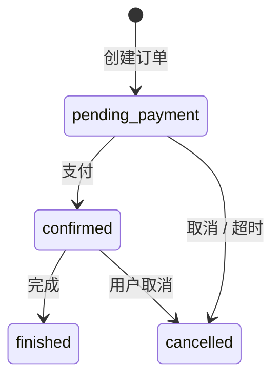
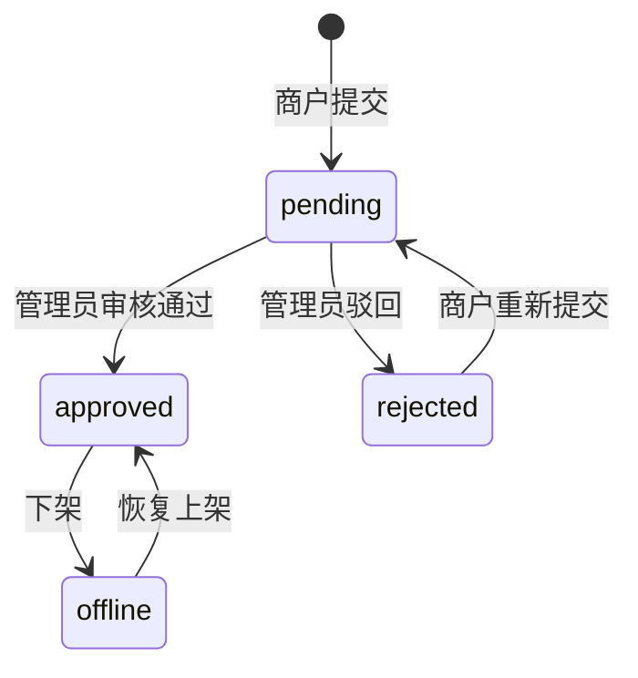
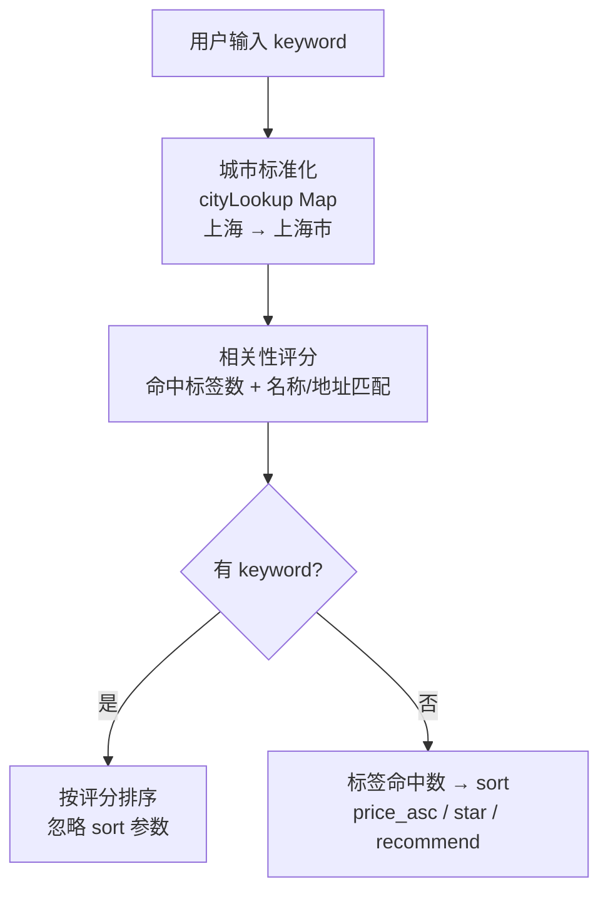

# 易宿酒店预订平台答辩PPT（V7）初稿 - 按你反馈重写版

## 1. 本稿目标
- 每个技术段都带少量代码，避免空讲概念。
- 架构图全部改为 PPT 内直接绘制，统一视觉与排版风格。
- PPT中不要出现答辩重点相关字样

---

## 2. 视觉方向（蓝色多巴胺）

### 2.1 配色（蓝色多巴胺）
- `#071B4D` 深蓝主背景
- `#1677FF` 主强调蓝
- `#39A9FF` 亮蓝
- `#4CC9F0` 青蓝点缀
- `#EAF4FF` 浅底
- `#0E1F3D` 深文字
- `#5B6B8C` 次级文字

### 2.2 版式原则
- 章节页深底，内容页浅底。
- 只用一种圆角卡片语言（圆角 10）。
- 每页最多 1 段代码，代码不超过 8 行。

---

## 3. 页结构（建议 17 页）

## 0 封面
- 标题：易宿酒店预订平台
- 副标题：三端架构设计与技术实现

## 1 目录
- 项目目标、技术挑战、成员分工
- 三端总架构及技术栈
- 三端系统分层架构图（PPT）
- 移动端：长列表、卡片、动效
- 管理端：表格分页、性能优化
- 服务端：分层架构、状态机、库存计算、智能检索
- 三大专项：性能 / 抽象 / 动效
- 总结与下一步

## 2 项目目标与技术挑战
- 目标：打通“发布 -> 审核 -> 搜索 -> 预订 -> 支付 -> 通知”闭环。
- 挑战：
  - 客户端流畅性与易用性
  - 管理端长列表与重组件性能
  - 页面/组件重复实现导致维护成本高
  - 动效一致性与性能平衡

## 3 三端协同总架构（必须含技术栈）
- 三端技术栈：
  - 移动端：Taro + React + antd-mobile
  - 管理端：React + Vite + Ant Design + react-router
  - 服务端：Node.js + Express + JWT
  - 数据层：Supabase(PostgreSQL) + AMap地图服务
- 关键链路：
  - 两端前端统一走 API Gateway
  - 网关后按域路由到 auth/hotel/request/order/notify
  - 复杂业务规则集中在 service 层，前端不重复判定

代码点缀（1段）：
```js
router.use('/merchant/hotels', authRequired, requireRole('merchant'), merchantHotelRoutes)
router.use('/admin/hotels', authRequired, requireRole('admin'), adminHotelRoutes)
router.use('/requests', authRequired, requestRoutes)
```

## 4 三端系统分层架构图（PPT）
- 分层视角（纵向）：
  - 接入层：移动端 + 管理端 + 角色入口
  - 应用层：页面路由、业务页面、查询与列表抽象
  - 接口层：API Gateway（鉴权、聚合、兼容）
  - 领域服务层：状态机、库存、订单、通知规则
  - 数据与外部层：PostgreSQL + 地图服务
- 横切能力（横向）：
  - 鉴权与权限、性能优化、组件抽象、动效体系

## 5 移动端架构设计
- 分层：Page Layer -> List Factory -> List Container -> Card Layer。
- 明确职责：
  - Page：数据请求与业务回调
  - List Factory：根据 type 组装列表
  - List Container：滚动/刷新/加载/骨架/空态/动效
  - Card：纯展示（OrderCard/HotelCard/RoomTypeCard）

## 6 移动端技术实现（组件抽象）
- 已抽象组件/能力：
  - `ListContainer`（`mobile/src/components/OrderList/index.jsx`）
  - `createListByType`（订单/收藏/房型/酒店四类列表工厂）
  - `OrderCard`、`HotelCard`、`RoomTypeCard`
  - 收藏滑删场景：`SwipeAction` 作为可选能力注入
- 复用页面：
  - `pages/detail`
  - `pages/favorites`
  - `pages/orders`

代码点缀（1段）：
```jsx
{createListByType({
  type: 'favorite',
  items,
  onOpen,
  onRemove,
  animate: true
})}
```

## 7 移动端技术实现（动效详细版）
- 动效触发：
  - 只有 `animate=true` 时启用入场动画
  - 列表项级别注入 `list-stagger-enter`
- 动效编排：
  - `delay = Math.min(index, 10) * 20ms`
  - 前 10 项阶梯入场，避免长列表后段过慢
- 动效执行：
  - 时长 `0.22s`
  - easing `ease-out`
  - 关键帧：`translateY(6px) + scale(0.995) -> 0 + 1`
- 下拉反馈动效：
  - `list-pull-dot` 循环缩放（0.9s）
  - `ready` 状态点颜色变化，提供触发阈值反馈

代码点缀（1段）：
```jsx
const delay = animate ? `${Math.min(index, 10) * 20}ms` : '0ms'
<View className={`list-item${animate ? ' list-stagger-enter' : ''}`} style={{ animationDelay: delay }} />
```

## 8 管理端架构设计
- 架构分层：
  - Route Layer：`React.lazy` 路由分包（15处）
  - Query Layer：`useRemoteTableQuery + TableFilterBar`
  - Feature Layer：共享基座与业务页装配
- 页面权限分域：
  - merchant 路由组
  - admin 路由组

## 9 管理端技术实现（性能优化怎么做）
- 路由与模块懒加载：
  - 页面路由懒加载（`App.jsx`）
  - 重组件懒加载：`DashboardBatchModals`、`AuditTable`、`RoomsTab/OrdersTab`、`echarts-for-react`
- 请求时机优化：
  - 低优先级信息改为空闲或延后请求
  - 仅在 tab 激活时拉取对应数据
- 渲染减负：
  - 长列表分页
  - `memo` 收口列定义与映射对象
  - `content-visibility` 用于消息列表条目

代码点缀（1段）：
```jsx
const DashboardBatchModals = lazy(() => import('../components/DashboardBatchModals.jsx'))
const AuditTable = lazy(() => import('../components/audit/AuditTable.jsx'))
const ReactECharts = lazy(() => import('echarts-for-react'))
```

## 10 管理端技术实现（页面与组件复用怎么做）
- 查询态复用：
  - `useRemoteTableQuery` 统一 `keyword/page/pageSize/total` 和防抖
  - `TableFilterBar` 统一筛选区结构
- 详情页复用：
  - `RoomsTabBase` 作为商户/管理员房型表基座
  - `OrdersTabBase` 作为商户/管理员订单表基座
  - 差异通过 props 和 i18n key 前缀注入

代码点缀（1段）：
```js
export const useRemoteTableQuery = ({ initialPageSize = 10, debounceMs = 350 } = {}) => { ... }
```

## 11 管理端技术实现（鉴权与权限管理怎么做）
- 前端路由守卫：
  - `RequireAuth`：无 token 跳转 `/login`
  - `RequireRole`：角色不符跳转 `/unauthorized`
  - 路由分组：admin-only 与 merchant-only
- 后端接口守卫：
  - `authRequired`：Bearer Token 校验，401 拦截
  - `requireRole(role)`：角色检查，403 拦截
  - 在路由挂载阶段统一加中间件

代码点缀（1段）：
```js
const authRequired = (req, res, next) => { ...verifyToken(token)... }
const requireRole = (role) => (req, res, next) => { ... }
```

## 12 服务端架构设计（项目亮点 + 技术说明）
- 分层架构（PPT直绘纵向五层）：
  - 接入层：移动端 / PC管理端，三种角色身份入口
  - 路由层：`authRequired` 中间件 → `requireRole` 角色分域（merchant / admin / user）
  - 控制层：Controller 负责参数解析与响应格式化
  - 服务层：业务规则集中（状态机 / 实时库存 / 动态定价 / 通知触发）
  - 数据层：Supabase（PostgreSQL）+ 高德地图服务 + 短信服务
- 四大设计亮点（右侧卡片区）：
  - **角色路由分域**：三类路由在挂载阶段即完成鉴权，前端无权越界调用
  - **JWT + bcrypt 双重安全**：`authRequired` Bearer 校验 + `bcrypt.hash(10)` 密码存储
  - **通知驱动闭环**：状态变更自动触发 `notificationService`，前端无需轮询
  - **接口双模兼容**：不传分页参数返回全量数组，传入后返回 `{ page, pageSize, total, list }`，旧调用零改造

代码点缀（1段）：
```js
// 路由挂载时即完成角色鉴权，不依赖各 Controller 单独判断
router.use('/merchant/hotels', authRequired, requireRole('merchant'), merchantHotelRoutes)
router.use('/admin/hotels',    authRequired, requireRole('admin'),    adminHotelRoutes)
router.use('/requests',        authRequired, requestRoutes)
```

## 13 服务端技术实现（状态机 + 难点突破：规则集中在服务端）

订单状态机：


酒店状态机：

- 难点突破（右侧卡片区）：
  - **下单定价快照**：价格由服务端 `pricingService.calculateRoomPrice` 在下单时计算并锁定，前端传入价格仅作展示参考，防止客户端篡改
  - **折扣生效期判定**：按入住/退房区间与 `discount_periods` 做重叠检测，多段优惠期自动命中，前端无需感知
  - **状态迁移合法性守护**：非法状态跳转（如 `finished → confirmed`）在 Service 层拦截并返回 400，前端只触发动作不做判定
  - **通知一致性**：任意状态变更后 `notificationService` 自动推送，两端数据视图始终同步

代码点缀（1段）：
```js
// 下单时服务端快照定价，前端传入价格不参与计算
const effectivePrice = calculateRoomPrice(roomType, { checkIn, checkOut })
const total_price = roundToTwo(effectivePrice * quantity * nights)
order.price_per_night = effectivePrice  // 写入订单留存证据
```

## 14 服务端技术实现（难点突破 + 成果展示）

### 左侧卡片：实时库存计算
- **难点**：库存不预先扣减，每次查询需动态计算可售数量
- 实现步骤：
  1. 取出状态为 `pending_payment / confirmed / finished` 且退房日晚于今天的订单
  2. 仅筛选**日期区间与查询区间重叠**的订单（`check_in < 查询checkOut` 且 `check_out > 查询checkIn`）
  3. 按 `room_type_id` 累加 `quantity` 得到占用量 Map
  4. `available = stock - occupied`，结果最低取 0

代码点缀（1段）：
```js
// 日期区间重叠筛选：check_in < checkOut 且 check_out > checkIn
query.lt('check_in', normalizedCheckOut).gt('check_out', normalizedCheckIn)
// 按房型累加占用量
;(data || []).forEach(row => {
  const prev = map.get(row.room_type_id) || 0
  map.set(row.room_type_id, prev + row.quantity)
})
```

### 右侧卡片：智能搜索排序
- **难点**：关键词"上海五星酒店"需跨城市、名称、设施多维度命中并合理排序



### 底部成果面板（4个数据卡片）
- API 端点：**30+** 个（auth / hotel / request / order / notify / map 全覆盖）
- 服务端测试：**10** 个测试文件（supertest 集成测试 + jest 单元测试）
- 状态机守护：订单 **4** 种状态、酒店 **4** 种状态，Service 层统一拦截非法迁移
- 接口兼容：全量 + 分页双模输出，旧调用**零改造**

## 15 三大专项总结页
- 性能优化：关键路径减负 + 请求时机优化 + 渲染减负
- 组件抽象：列表、查询、详情页共享基座
- 动效体系：统一入口、统一节奏、统一回退

## 16 总结与下一步
- 下一步：
  - 管理端继续细分域路由和词典
  - 移动端增加体验埋点（加载耗时、掉帧）
  - 服务端完善错误码标准化和 i18n 映射

---

## 4. 架构图产出方式（按你要求：PPT 直接绘制）

### 4.1 产出规范
- 不再通过 HTML 截图导入图片，统一在 PPT 中用形状直接绘制。
- 所有架构图遵循同一风格：
  - 圆角卡片 + 细边框 + 纯扁平
  - 标题色统一 `#1677FF`
  - 连线统一 `#39A9FF` 且箭头方向明确
  - 单页控制在“主结构 + 关键说明 + 1段代码”三块

### 4.2 当前四类架构图（PPT直绘）
- 三端协同总架构（含技术栈）
- 三端系统分层架构图（企业常见分层范式）
- 管理端分层架构（性能/复用/权限）
- 服务端分层架构（Router/Controller/Service/Data）

### 4.3 状态机绘图约束（强制）
- 必须包含：状态节点、迁移箭头、事件标签。
- 订单状态机至少展示：
  - `pending_payment -> confirmed -> finished`
  - `pending_payment -> cancelled`
  - `confirmed -> cancelled`（业务允许时）
- 酒店状态机至少展示：
  - `pending -> approved/rejected`
  - `approved <-> offline`
  - 驳回后重提路径（虚线回路）

---

## 5. 对照《大作业说明》可继续补强的点
- 功能完成度（60 分）：
  - 在第 2 页加“必做功能清单对照表”（查询/列表/详情/登录注册/录入编辑/审核发布下线），每项标注“已实现页面 + 核心交互”。
  - 在第 14 页补“功能覆盖率”指标（必做点覆盖数量、关键路径通过率）。
- 技术复杂度（10 分）：
  - 在第 9 页加“长列表优化”专栏，明确移动端上滑自动加载与管理端分页/渲染减负对应实现。
  - 在第 13 页补“实时更新价格机制”链路（服务端库存与订单状态驱动价格/可售信息更新）。
- 用户体验（10 分）：
  - 在第 7 页新增“动效和交互体验收益”小指标：入场节奏、下拉反馈、空态/骨架一致性。
  - 在第 14 页补“兼容性覆盖说明”（至少组内机型、PC主流浏览器）。
- 代码质量（10 分）：
  - 在第 6/10 页补“抽象前后对比”：重复代码点位数、复用组件数、统一 Hook 覆盖页面数。
  - 在总结页补“代码结构与测试”信息：目录分层、关键中间件测试（如 `authMiddleware.test.js`）。
- 项目创新性（10 分）：
  - 在第 14 页增加“自发增强功能”卡片：动效统一入口、跨端状态规则统一、地图与 POI 增强。

## 6. PPT 兼容性约束（防 Office 自动修复）
- 架构图全部使用 PPT 原生形状直绘，不嵌入截图型复杂 SVG。
- 连线避免零长度与复杂虚线组合，统一实线箭头。
- 卡片改为纯扁平，不使用阴影特效，降低不同 Office 版本渲染差异。
- 每个文本框预留足够高度，避免自动换行挤出边界。
- 导出后固定校验：`python -m markitdown docs/答辩PPT_v7_蓝色多巴胺版.pptx`，确认内容完整无缺失。
