# Admin 管理端 - 业务流程图文档

> 本文档描述 PC 管理端（admin）核心业务场景的完整流程，涵盖商户操作、管理员操作和系统自动处理三个维度。

## 1. 酒店全生命周期流程

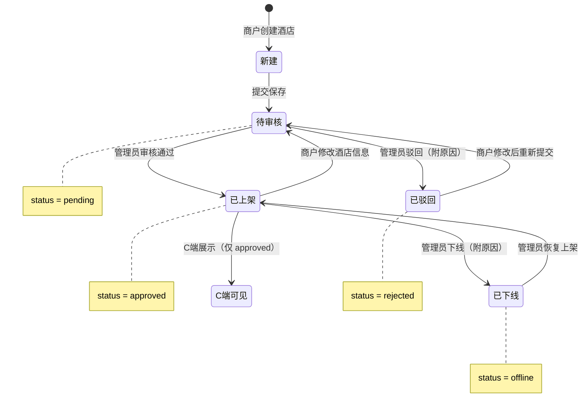

## 2. 商户注册与登录流程

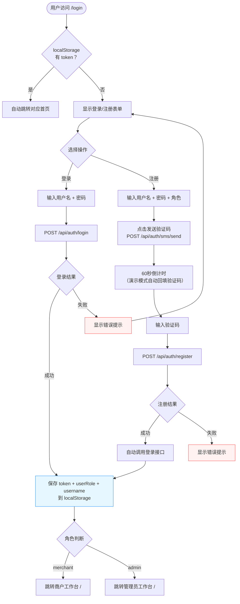

## 3. 商户创建/编辑酒店流程

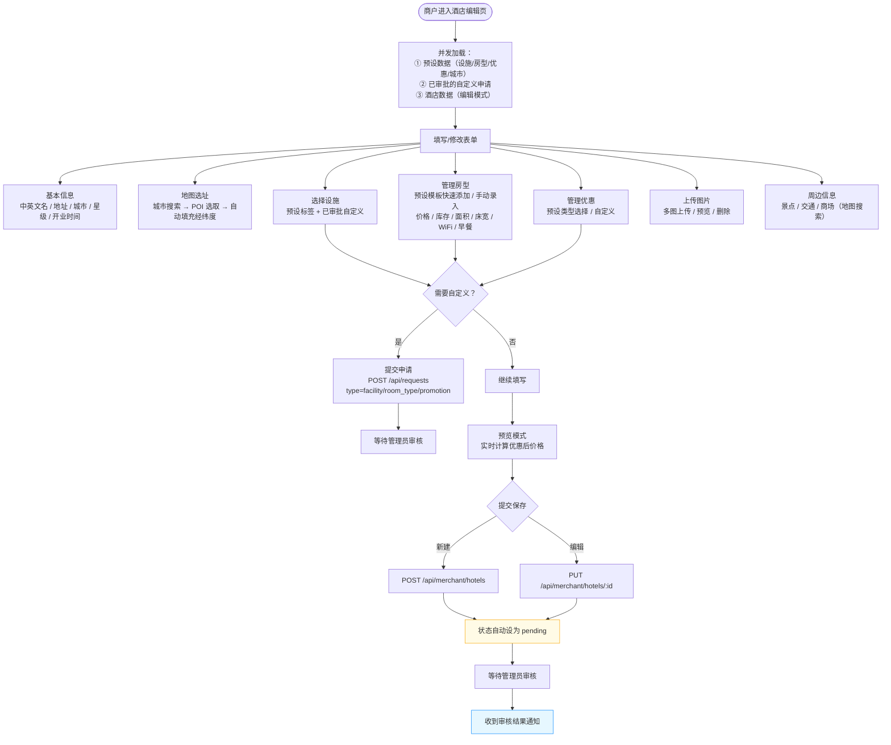

## 4. 管理员酒店审核流程

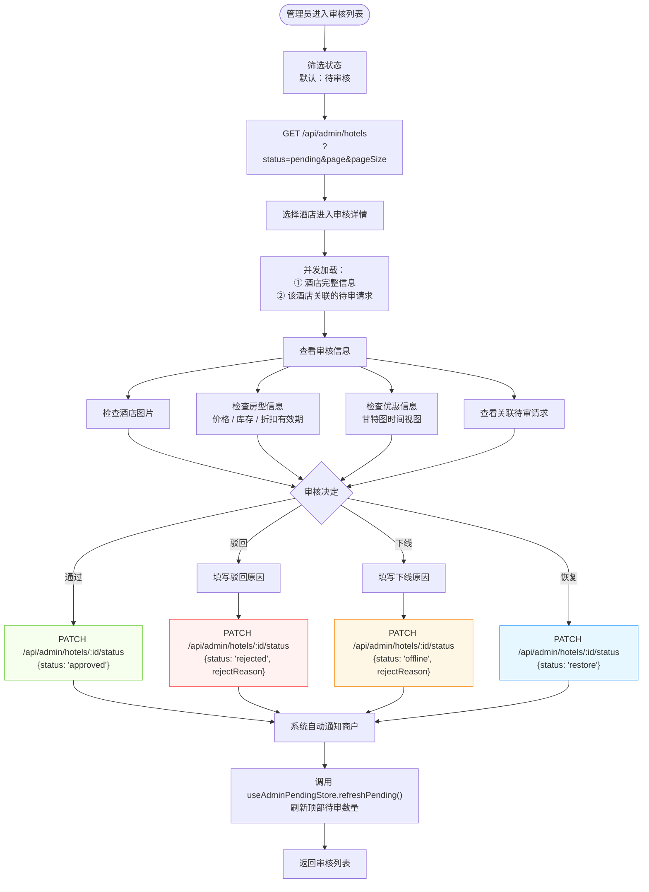

## 5. 申请审核流程

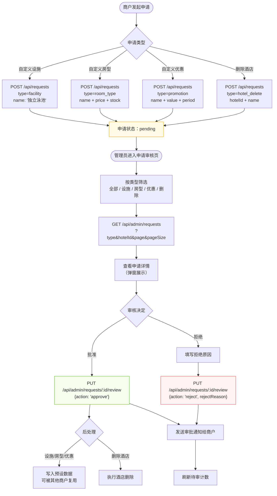

## 6. 消息通知流程

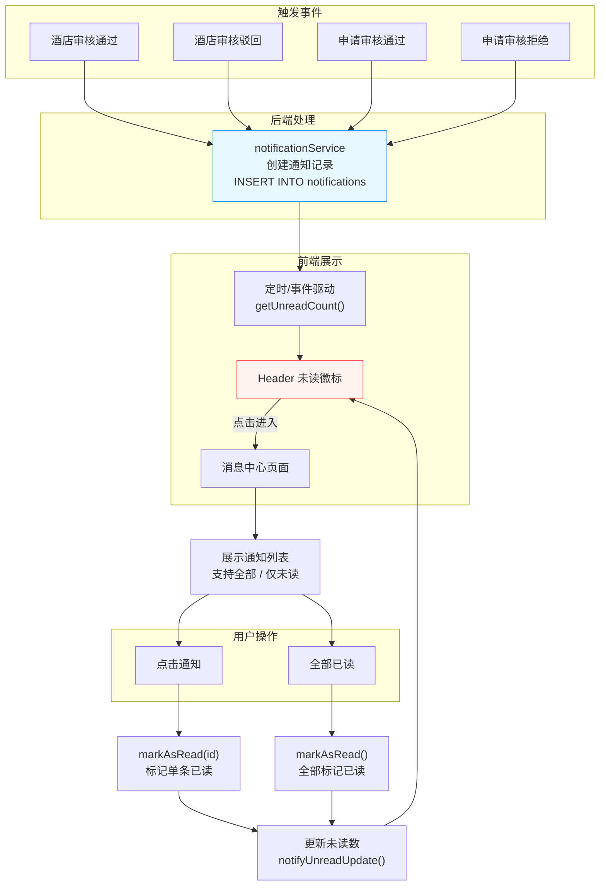

## 7. 批量操作流程

### 7.1 批量折扣

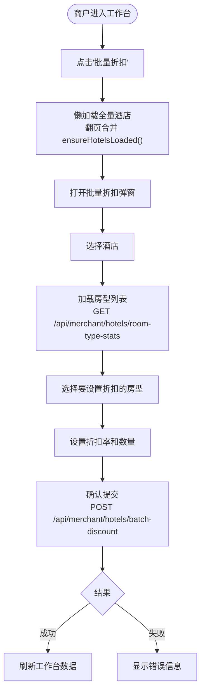

### 7.2 批量房型操作

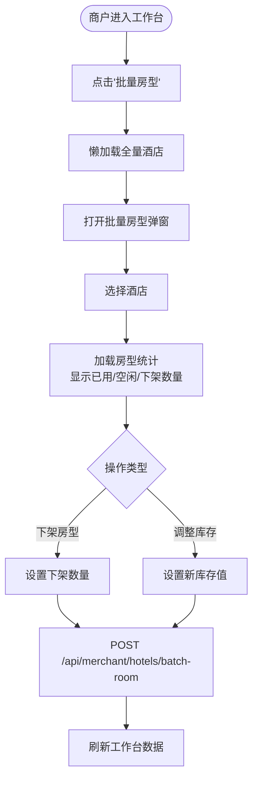

## 8. CSV 导入/导出酒店流程

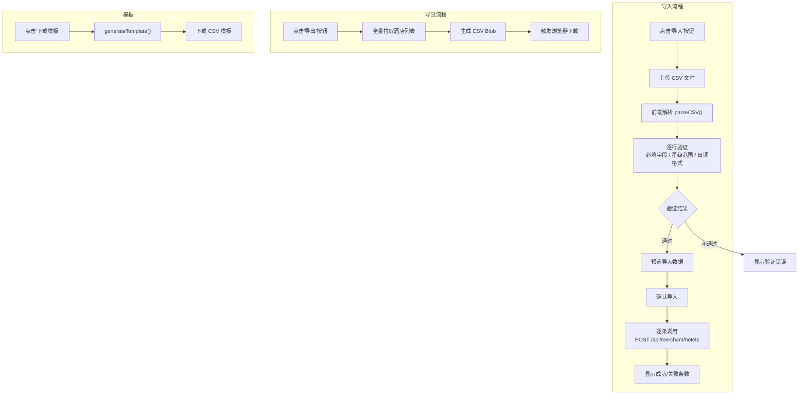

## 9. 订单统计查看流程

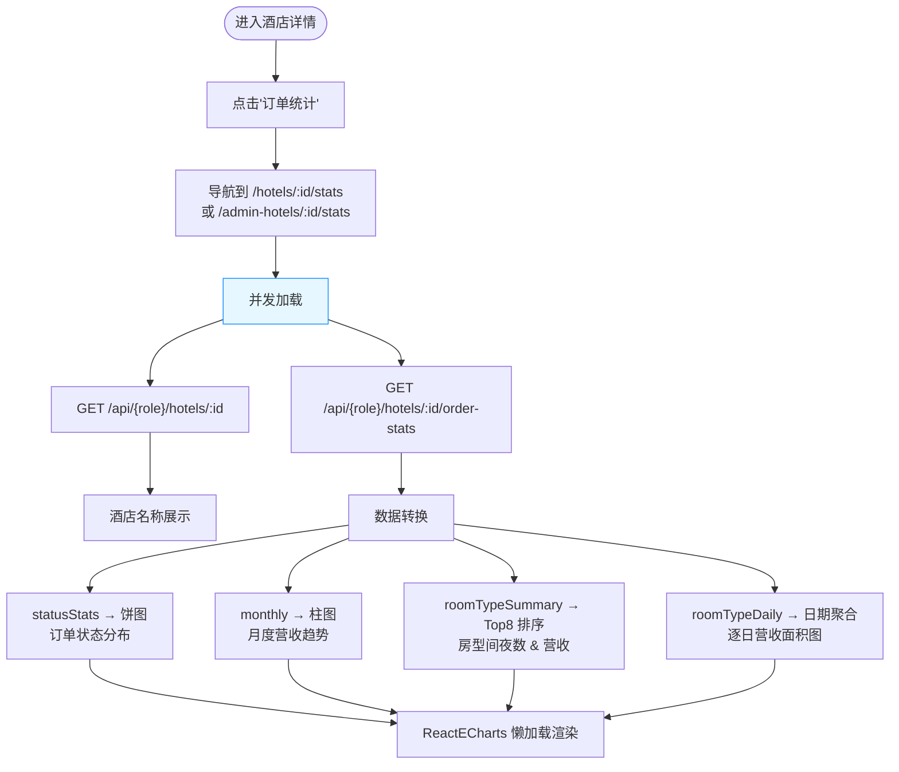

## 10. 商户管理流程（管理员）

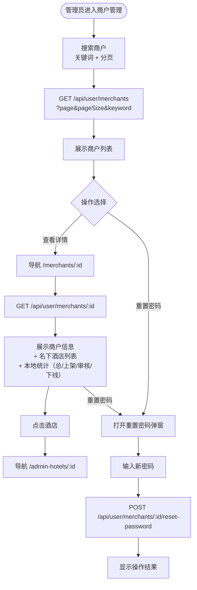

## 11. 账户管理流程

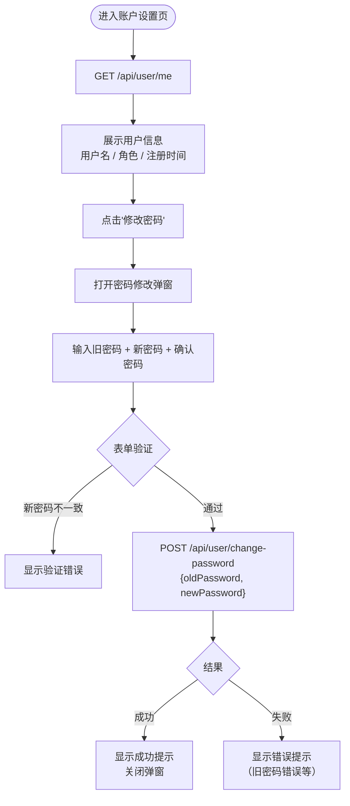

## 12. 页面路由守卫流程

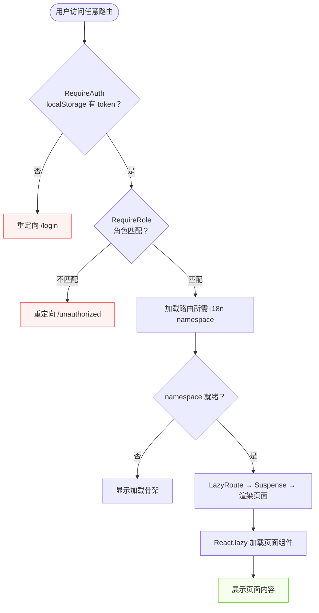

## 13. 管理员待审轮询流程

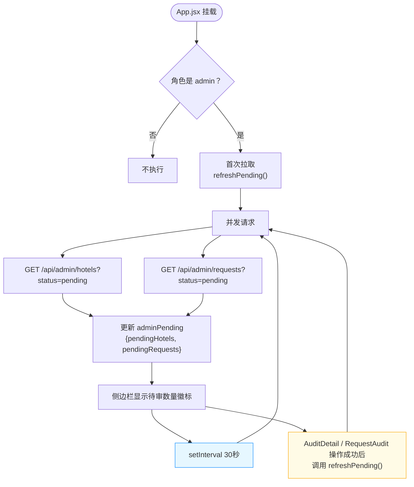
