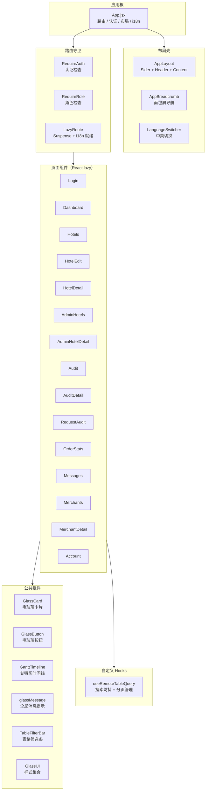
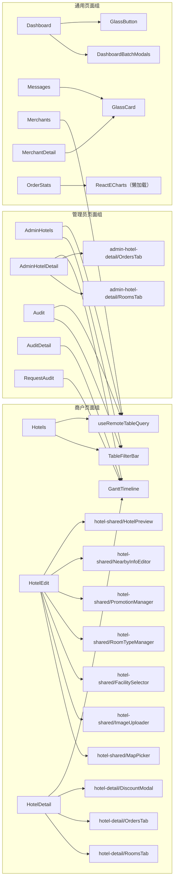
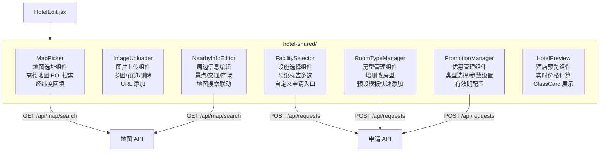
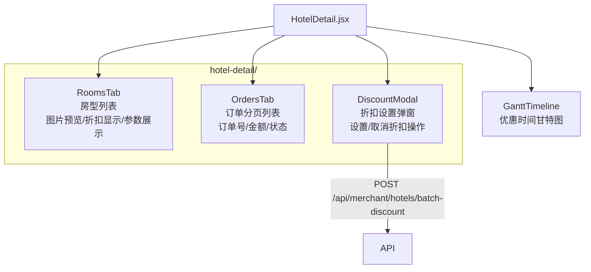
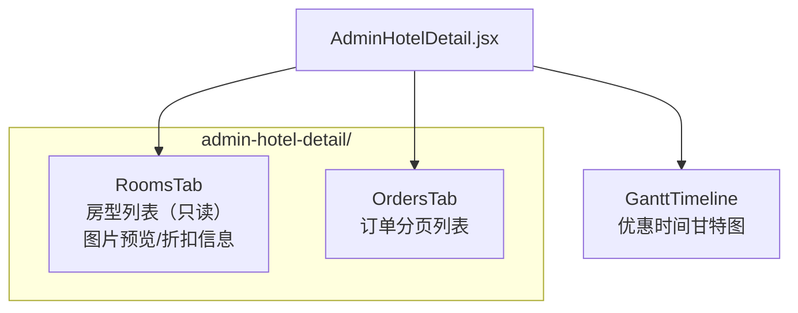
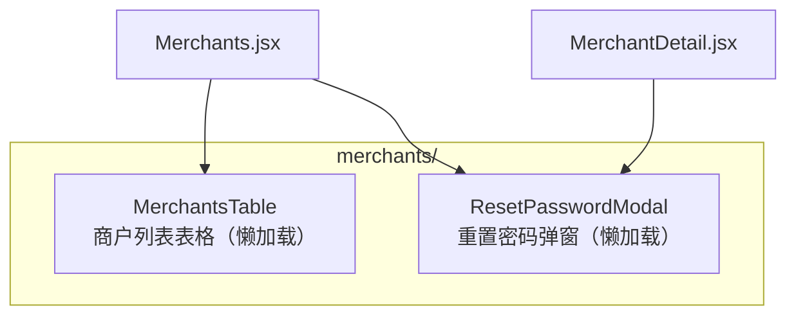
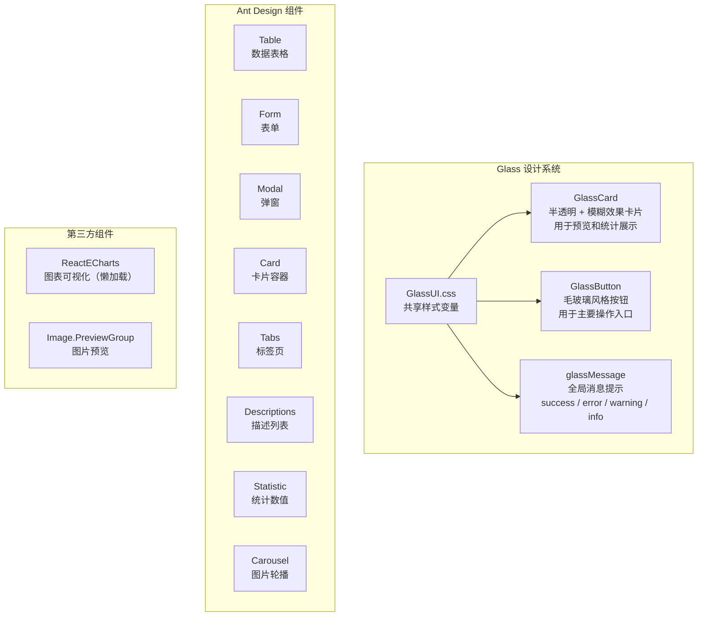
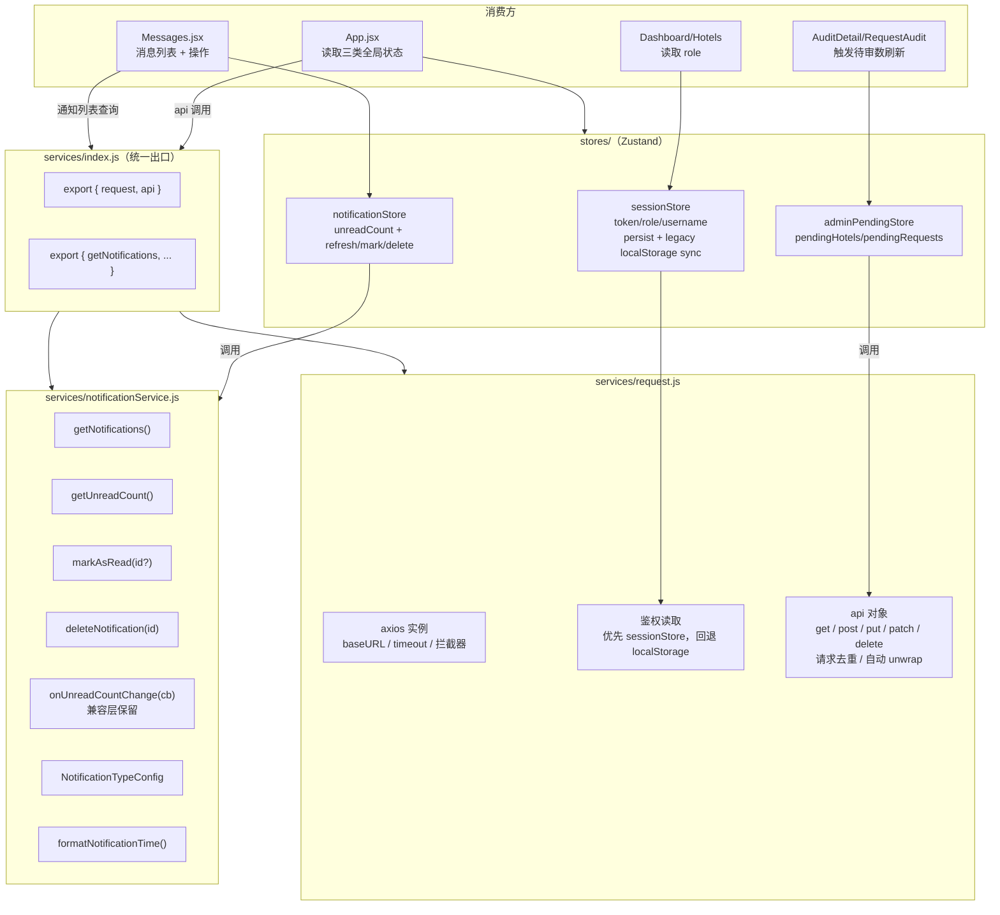
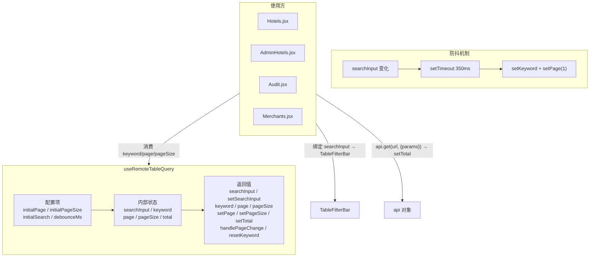
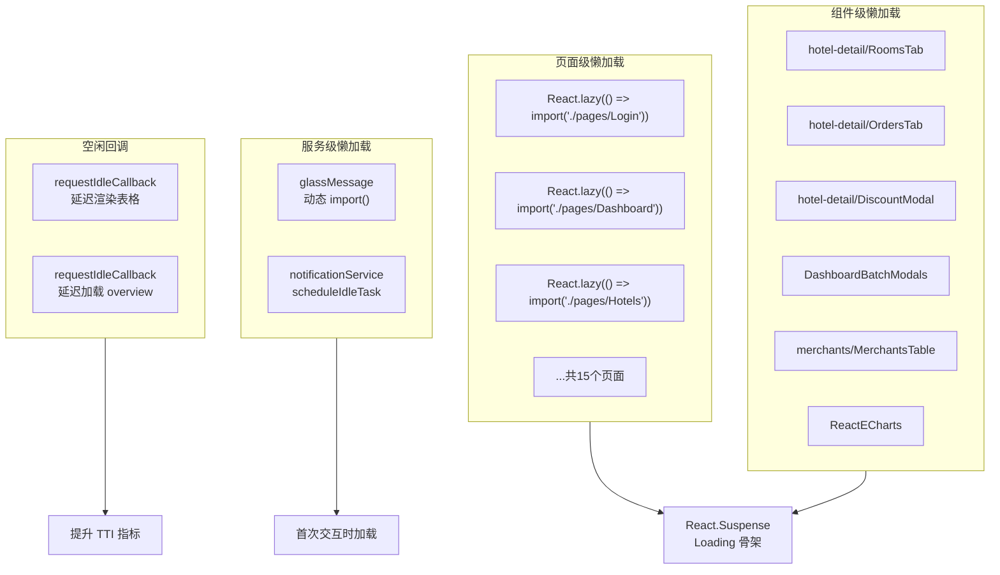

# Admin 管理端 - 组件架构图文档

> 本文档描述 PC 管理端（admin）的组件层次结构、依赖关系和复用模式。

## 1. 组件层次总览



## 2. 页面与组件依赖关系



## 3. 共享组件详细架构

### 3.1 hotel-shared 组件族



### 3.2 hotel-detail 组件族（商户侧）



### 3.3 admin-hotel-detail 组件族（管理员侧）



### 3.4 merchants 组件族



## 4. 公共 UI 组件规范



## 5. 状态与服务层架构



## 6. Hooks 架构



## 7. 懒加载策略



## 8. 完整文件结构图

```
admin/src/
├── main.jsx                    # 入口：i18n 初始化 → ReactDOM.render
├── App.jsx                     # 根组件：路由/布局/i18n + Zustand 全局状态消费
├── App.css                     # 全局样式
├── index.css                   # CSS Reset
│
├── routes/
│   └── routeConfig.js          # 路由元数据 + namespace 映射
│
├── services/
│   ├── index.js                # 服务统一出口（barrel）
│   ├── request.js              # axios 封装 + 请求去重 api 对象（store token 优先）
│   └── notificationService.js  # 通知 CRUD + 兼容监听
│
├── stores/
│   ├── index.js                # store 统一出口
│   ├── sessionStore.js         # 认证态持久化 + 旧键兼容
│   ├── notificationStore.js    # 未读数/已读/删除动作
│   └── adminPendingStore.js    # 管理员待审统计
│
├── hooks/
│   └── useRemoteTableQuery.js  # 远程表格搜索防抖 + 分页
│
├── components/
│   ├── index.js                # 组件统一出口
│   ├── GlassCard.jsx           # 毛玻璃卡片
│   ├── GlassButton.jsx         # 毛玻璃按钮
│   ├── GlassUI.jsx             # UI 基础组件
│   ├── GlassUI.css             # Glass 样式
│   ├── glassMessage.js         # 全局消息提示
│   ├── GlassMessageView.jsx    # 消息渲染视图
│   ├── GanttTimeline.jsx       # 甘特图时间线
│   ├── TableFilterBar.jsx      # 表格筛选条
│   ├── DashboardBatchModals.jsx# 批量操作弹窗
│   ├── hotel-shared/           # 酒店编辑共享组件
│   ├── hotel-detail/           # 商户酒店详情子组件
│   ├── admin-hotel-detail/     # 管理员酒店详情子组件
│   ├── audit/                  # 审核相关子组件
│   └── merchants/              # 商户管理子组件
│
├── pages/
│   ├── Login.jsx               # 登录/注册
│   ├── Dashboard.jsx           # 工作台
│   ├── Hotels.jsx              # 商户酒店列表
│   ├── HotelEdit.jsx           # 酒店编辑/新建
│   ├── HotelDetail.jsx         # 商户酒店详情
│   ├── AdminHotels.jsx         # 管理员酒店列表
│   ├── AdminHotelDetail.jsx    # 管理员酒店详情
│   ├── Audit.jsx               # 审核列表
│   ├── AuditDetail.jsx         # 审核详情
│   ├── RequestAudit.jsx        # 申请审核
│   ├── OrderStats.jsx          # 订单统计
│   ├── Messages.jsx            # 消息中心
│   ├── Merchants.jsx           # 商户管理列表
│   ├── MerchantDetail.jsx      # 商户详情
│   └── Account.jsx             # 账户设置
│
├── locales/                    # i18n 资源
│   ├── zh-CN/                  # 中文
│   │   ├── common.json
│   │   ├── auth.json
│   │   ├── dashboard.json
│   │   └── ...
│   └── en-US/                  # 英文
│       ├── common.json
│       ├── auth.json
│       ├── dashboard.json
│       └── ...
│
├── utils/                      # 工具函数
└── assets/                     # 静态资源
```
