# Admin 管理端 - 数据流图文档

> 本文档描述 PC 管理端（admin）各模块的数据流向，涵盖前端组件、服务层、API 层到后端数据库的完整链路。

## 1. 全局数据流概览

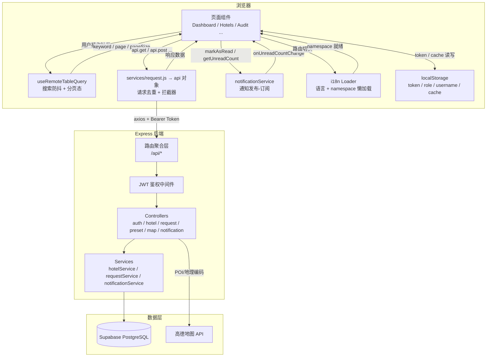

## 2. 认证数据流

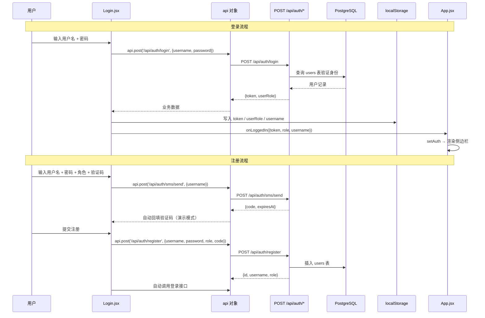

## 3. 商户侧数据流

### 3.1 酒店列表（Hotels.jsx）

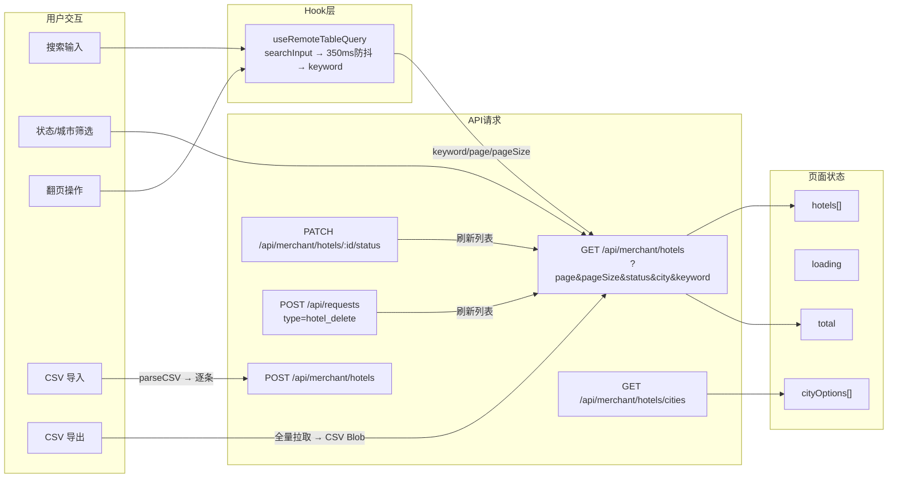

### 3.2 酒店编辑（HotelEdit.jsx）

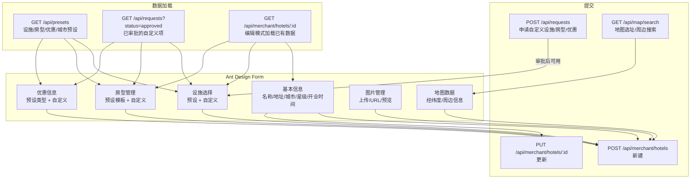

### 3.3 酒店详情（HotelDetail.jsx）

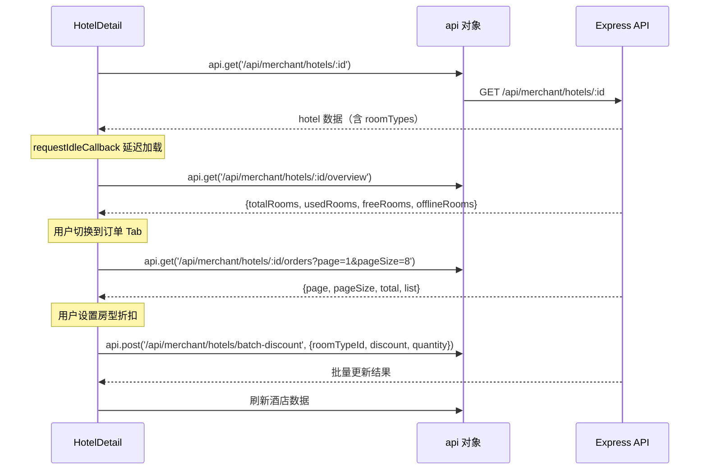

## 4. 管理员侧数据流

### 4.1 审核流数据流

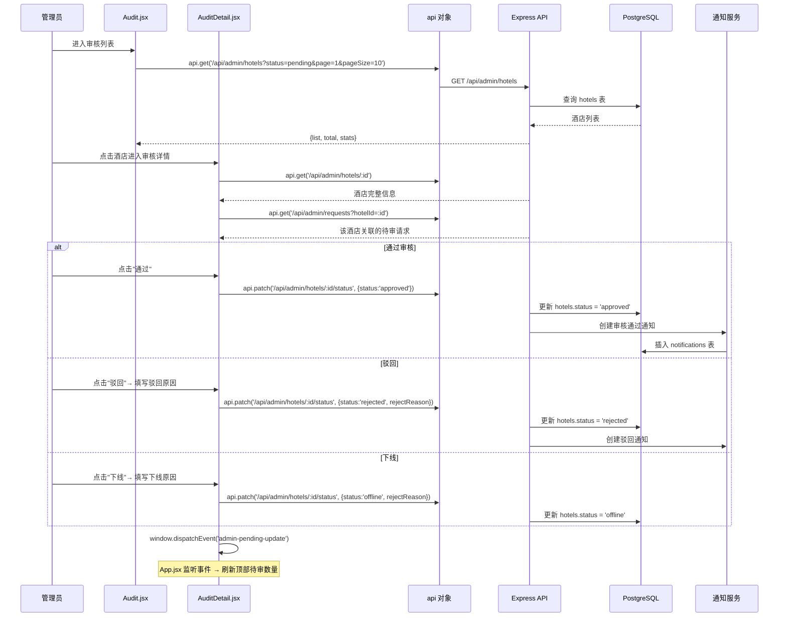

### 4.2 申请审核数据流（RequestAudit.jsx）

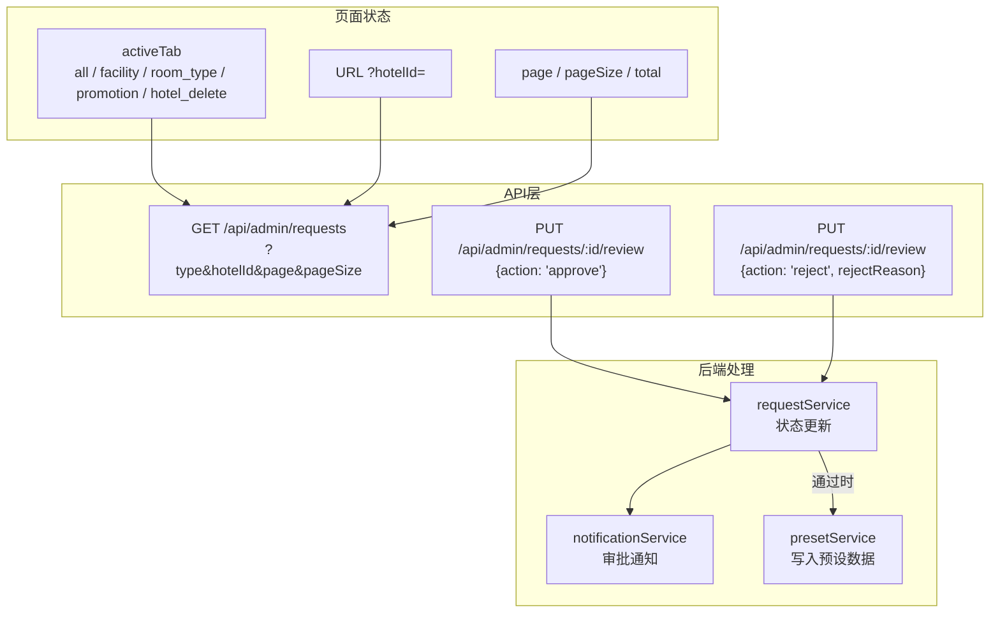

### 4.3 管理员酒店详情（AdminHotelDetail.jsx）

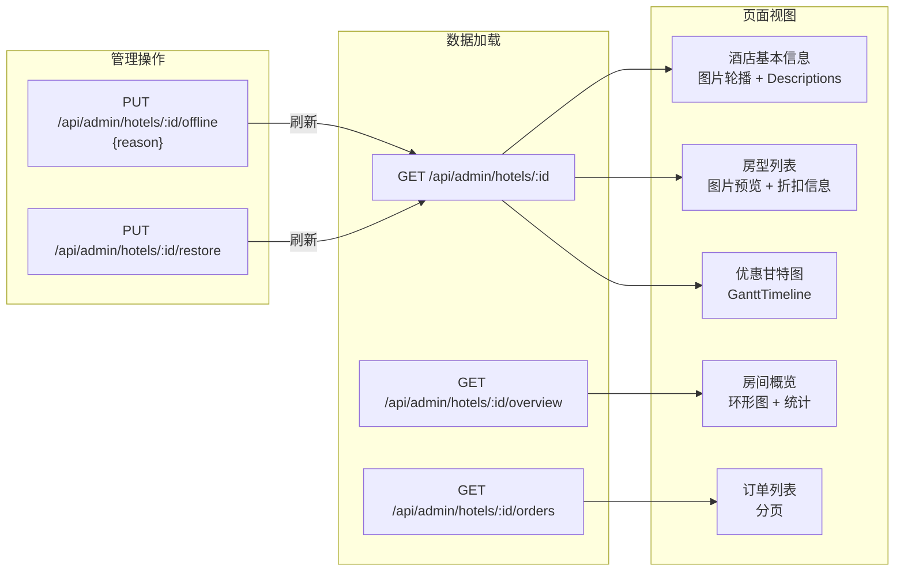

## 5. 消息通知数据流

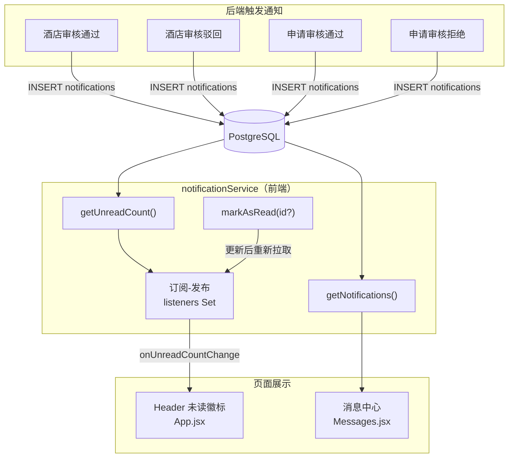

## 6. 工作台数据流（Dashboard.jsx）

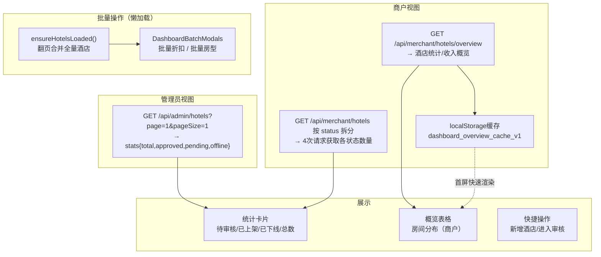

## 7. 订单统计数据流（OrderStats.jsx）

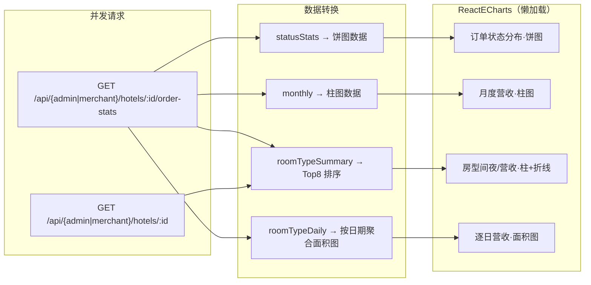

## 8. 请求层数据流详解

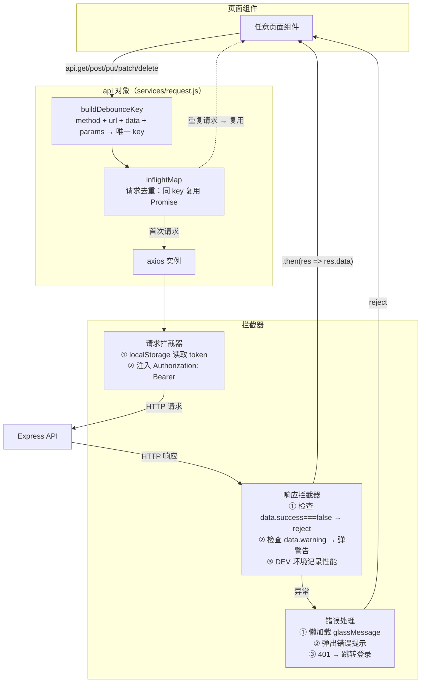

## 9. 商户管理数据流（Merchants / MerchantDetail）

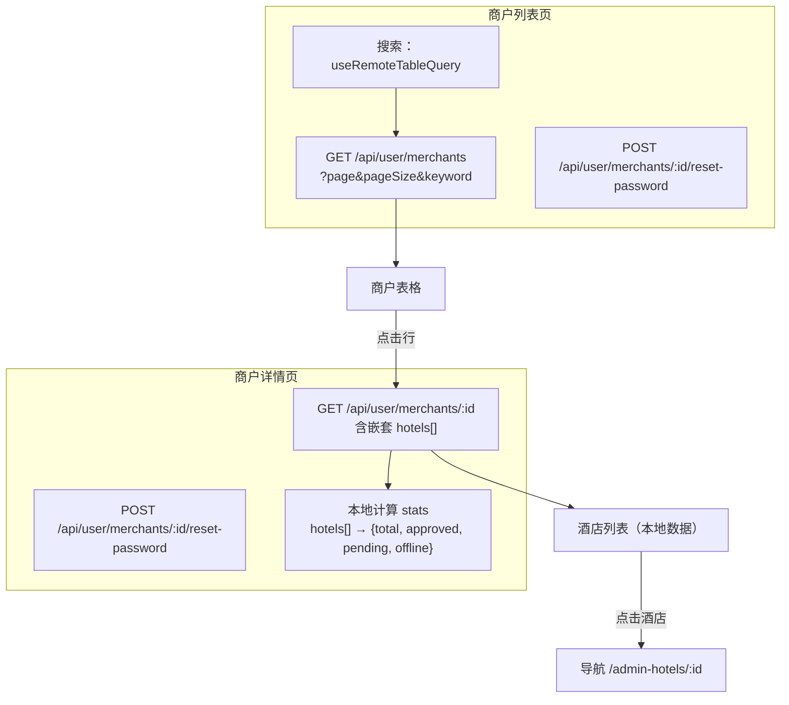

## 10. i18n 数据流

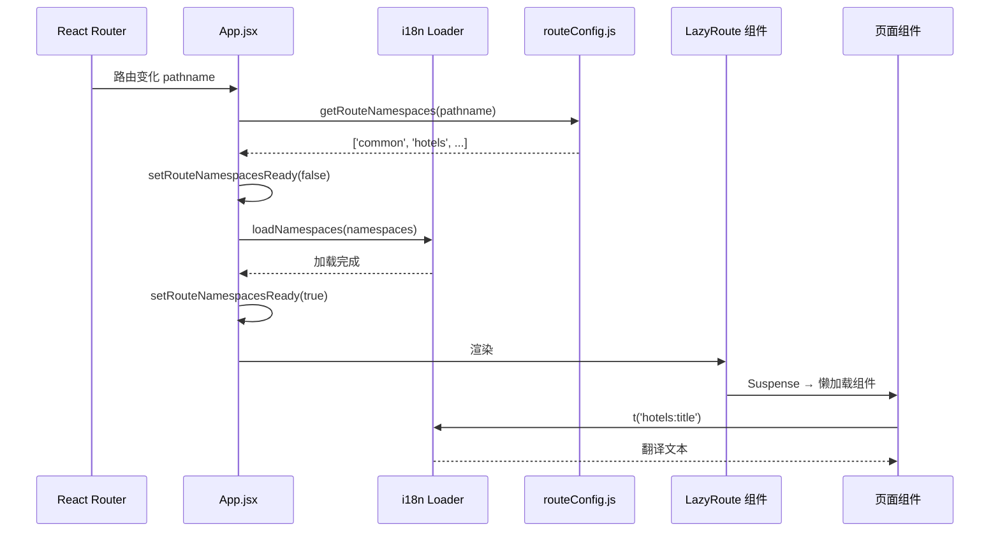
