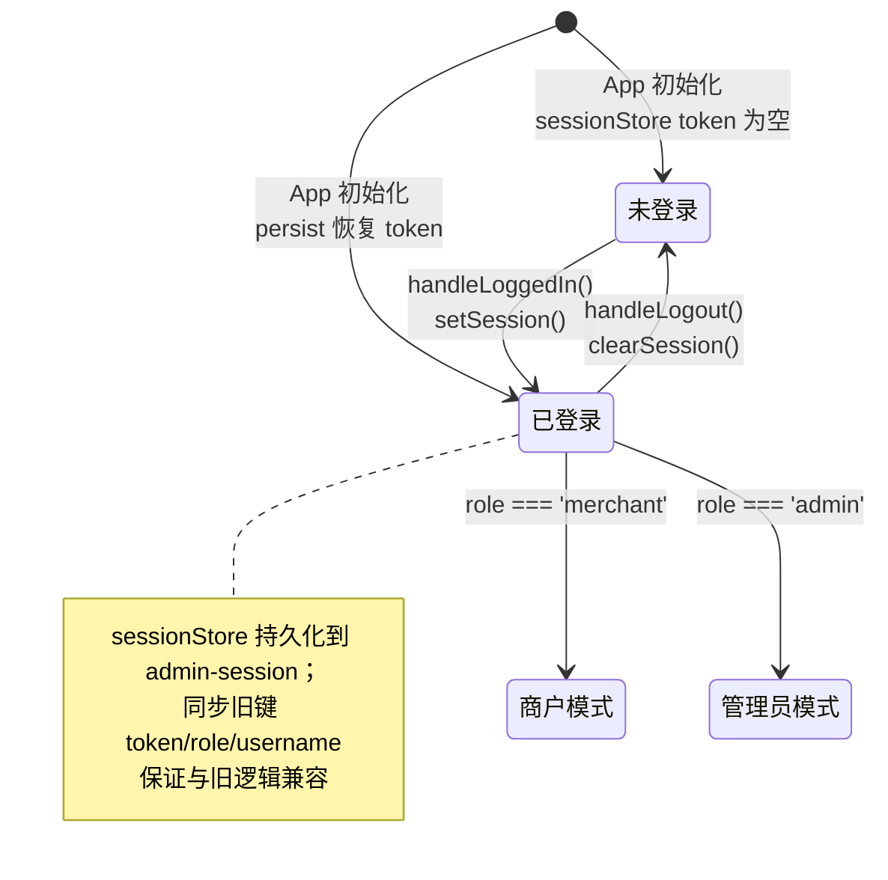
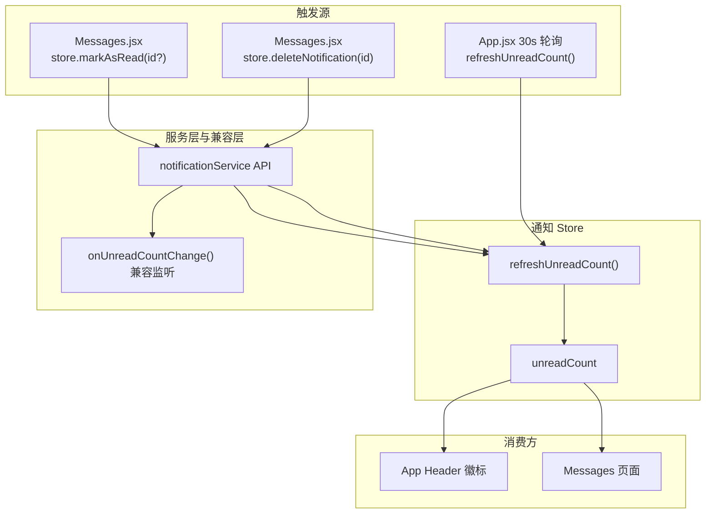
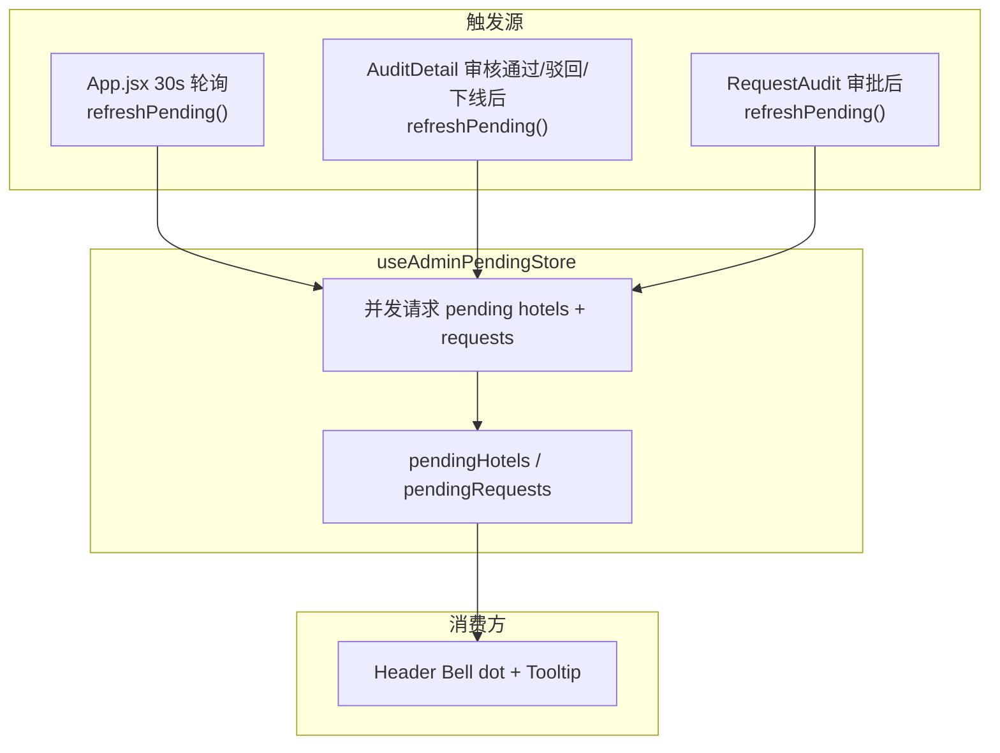

# Admin 管理端 - 状态管理与 API 接口文档

> 本文档记录 PC 管理端（admin）的前端状态管理方案、各页面状态结构以及 API 接口调用清单。

## 1. 状态管理方案

Admin 端采用 **Zustand（全局）+ React State（页面局部）+ localStorage（兼容）** 方案。

| 状态层级 | 载体 | 说明 |
|---------|------|------|
| 全局认证状态 | `useSessionStore`（persist） | token / role / username，兼容旧 localStorage 键 |
| 全局未读数 | `useNotificationStore` | unreadCount，统一刷新/已读/删除动作 |
| 全局待审数 | `useAdminPendingStore` | pendingHotels / pendingRequests（仅 admin） |
| 路由级 i18n | `App.jsx` state | routeNamespacesReady |
| 页面级业务状态 | 各页面组件 `useState` | 列表、详情、表单等 |
| 表格搜索/分页 | `useRemoteTableQuery` hook | 搜索防抖 + 分页态 |
| 兼容层 | `notificationService` listeners | 保留 `onUnreadCountChange` 兼容旧测试/旧调用 |

### 1.1 全局状态结构

```typescript
interface SessionStoreState {
  token: string;
  role: 'merchant' | 'admin' | '';
  username: string;
  setSession(payload: { token?: string; role?: string; username?: string }): void;
  clearSession(): void;
}

interface NotificationStoreState {
  unreadCount: number;
  loadingUnread: boolean;
  setUnreadCount(count: number): void;
  refreshUnreadCount(): Promise<number>;
  markAsRead(notificationId?: number): Promise<boolean>;
  deleteNotification(notificationId: number): Promise<boolean>;
  clear(): void;
}

interface AdminPendingStoreState {
  pendingHotels: number;
  pendingRequests: number;
  loading: boolean;
  refreshPending(): Promise<{ pendingHotels: number; pendingRequests: number }>;
  clearPending(): void;
}

// App.jsx 中仍保留的路由/视图级状态
interface AppViewState {
  routeNamespacesReady: boolean;
}
```

### 1.2 认证状态流转



### 1.3 通知状态同步机制



### 1.4 管理员待审数同步机制



## 2. 各页面状态结构

### 2.1 Dashboard（工作台）

```typescript
interface DashboardState {
  stats: {
    pending: number;    // 待审核
    approved: number;   // 已上架
    offline: number;    // 已下线
    total: number;      // 总数
  };
  statsLoading: boolean;
  hotels: Hotel[];          // 批量操作用（懒加载）
  hotelsLoading: boolean;
  hotelsReady: boolean;
  batchModalType: 'discount' | 'room' | null;
  overview: MerchantOverview | null;  // 仅商户
  overviewLoading: boolean;
}
```

**缓存策略**：`overview` 结果缓存到 `localStorage('dashboard_overview_cache_v1')`，下次进入先用缓存渲染再请求刷新。

### 2.2 Hotels（商户酒店列表）

```typescript
interface HotelsState {
  hotels: Hotel[];
  loading: boolean;
  statusFilter: string;     // 状态筛选
  cityFilter: string;       // 城市筛选
  cityOptions: string[];    // 城市候选列表
  importModalOpen: boolean;
  importData: ParsedHotel[];
  importing: boolean;
  deleteModalOpen: boolean;
  deleteTarget: Hotel | null;
  deleting: boolean;
  // useRemoteTableQuery 提供：
  searchInput: string;
  keyword: string;          // 防抖后的搜索词
  page: number;
  pageSize: number;
  total: number;
}
```

### 2.3 HotelEdit（酒店编辑/新建）

```typescript
interface HotelEditState {
  form: AntdForm;           // Ant Design 表单实例
  loading: boolean;
  saving: boolean;
  activeTab: 'edit' | 'preview';
  presets: {
    facilities: string[];
    roomTypes: RoomTypeTemplate[];
    promotionTypes: PromotionType[];
    cities: string[];
  };
  approvedFacilities: string[];
  approvedRoomTypes: RoomTypeTemplate[];
  approvedPromotions: PromotionType[];
  pendingFacilities: Request[];
  pendingRoomTypes: Request[];
  pendingPromotions: Request[];
}
```

### 2.4 HotelDetail / AdminHotelDetail（酒店详情）

```typescript
interface HotelDetailState {
  hotel: Hotel | null;
  loading: boolean;
  overview: {
    totalRooms: number;
    usedRooms: number;
    freeRooms: number;
    offlineRooms: number;
    occupancyRate: number;
  } | null;
  orders: Order[];
  ordersTotal: number;
  ordersPage: number;
  ordersLoading: boolean;
  activeTab: 'overview' | 'rooms' | 'orders';
  // 商户独有：
  discountModal: boolean;
  selectedRoom: RoomType | null;
  discountLoading: boolean;
}
```

### 2.5 Audit / AuditDetail（审核）

```typescript
// Audit
interface AuditState {
  loading: boolean;
  hotels: Hotel[];
  statusFilter: string;     // 默认 'pending'
  // useRemoteTableQuery 提供分页搜索
}

// AuditDetail
interface AuditDetailState {
  loading: boolean;
  hotel: Hotel | null;
  pendingRequests: Request[];
  rejecting: boolean;
  offlineModal: boolean;
  actionLoading: boolean;
  rejectForm: AntdForm;
  offlineForm: AntdForm;
}
```

### 2.6 RequestAudit（申请审核）

```typescript
interface RequestAuditState {
  tableLoading: boolean;
  requests: Request[];
  activeTab: 'all' | 'facility' | 'room_type' | 'promotion' | 'hotel_delete';
  page: number;
  pageSize: number;
  total: number;
  rejecting: boolean;
  rejectForm: AntdForm;
  detailModal: { visible: boolean; request: Request | null };
  reviewingId: number | null;
  reviewingAction: 'approve' | 'reject' | null;
}
```

### 2.7 Messages（消息中心）

```typescript
interface MessagesState {
  loading: boolean;
  notifications: Notification[];
  activeTab: 'all' | 'unread';
  currentPage: number;
  markAllLoading: boolean;
  // 派生计算：
  unreadCount: number;       // reduce 计算
  displayList: Notification[]; // 按 tab 过滤
  pagedList: Notification[];   // 前端分页 PAGE_SIZE=12
}
```

### 2.8 Merchants / MerchantDetail（商户管理）

```typescript
// Merchants
interface MerchantsState {
  loading: boolean;
  merchants: Merchant[];
  total: number;
  resetModal: { visible: boolean; merchantId: number | null };
  resetting: boolean;
  // useRemoteTableQuery 提供分页搜索
}

// MerchantDetail
interface MerchantDetailState {
  merchant: Merchant & { hotels: Hotel[] } | null;
  loading: boolean;
  resetModal: boolean;
  resetting: boolean;
  // 派生计算：
  stats: { total, approved, pending, offline };
}
```

### 2.9 OrderStats（订单统计）

```typescript
interface OrderStatsState {
  loading: boolean;
  hotel: Hotel | null;
  orderStats: {
    totalOrders: number;
    revenue: number;
    statusStats: { name: string; value: number }[];
    monthly: { month: string; revenue: number }[];
    roomTypeSummary: { name: string; nights: number; revenue: number }[];
    roomTypeDaily: { date: string; roomType: string; revenue: number }[];
  } | null;
  renderCharts: boolean;  // requestIdleCallback 延迟
}
```

### 2.10 Account（账户设置）

```typescript
interface AccountState {
  loading: boolean;
  user: { id: number; username: string; role: string; created_at: string } | null;
  passwordModal: boolean;
  saving: boolean;
  form: AntdForm;
}
```

## 3. API 接口调用清单

### 3.1 认证模块

| 方法 | 路径 | 请求体 | 响应 | 调用页面 |
|------|------|--------|------|----------|
| POST | `/api/auth/login` | `{username, password}` | `{token, userRole}` | Login |
| POST | `/api/auth/register` | `{username, password, role, code}` | `{id, username, role}` | Login |
| POST | `/api/auth/sms/send` | `{username}` | `{code, expiresAt}` | Login |

### 3.2 用户模块

| 方法 | 路径 | 请求体/参数 | 响应 | 调用页面 |
|------|------|-------------|------|----------|
| GET | `/api/user/me` | - | 用户信息 | Account |
| POST | `/api/user/change-password` | `{oldPassword, newPassword}` | 结果 | Account |
| GET | `/api/user/merchants` | `?page&pageSize&keyword` | `{page,pageSize,total,list}` | Merchants |
| GET | `/api/user/merchants/:id` | - | 商户详情（含 hotels） | MerchantDetail |
| POST | `/api/user/merchants/:id/reset-password` | `{newPassword}` | 结果 | Merchants, MerchantDetail |

### 3.3 商户酒店模块

| 方法 | 路径 | 请求体/参数 | 响应 | 调用页面 |
|------|------|-------------|------|----------|
| GET | `/api/merchant/hotels` | `?page&pageSize&status&city&keyword` | `{page,pageSize,total,list}` | Dashboard, Hotels |
| GET | `/api/merchant/hotels/cities` | - | 城市数组 | Hotels |
| GET | `/api/merchant/hotels/overview` | - | 工作台统计 | Dashboard |
| GET | `/api/merchant/hotels/:id` | - | 酒店详情 | HotelDetail, HotelEdit |
| GET | `/api/merchant/hotels/:id/overview` | - | 房间概览 | HotelDetail |
| GET | `/api/merchant/hotels/:id/orders` | `?page&pageSize` | 订单分页 | HotelDetail |
| GET | `/api/merchant/hotels/:id/order-stats` | - | 订单统计 | OrderStats |
| GET | `/api/merchant/hotels/room-type-stats` | `?hotelIds` | 房型库存 | Dashboard |
| POST | `/api/merchant/hotels` | 酒店完整数据 | 新酒店 | HotelEdit, Hotels(导入) |
| PUT | `/api/merchant/hotels/:id` | 酒店更新数据 | 更新结果 | HotelEdit |
| PATCH | `/api/merchant/hotels/:id/status` | `{action}` | 状态结果 | Hotels |
| POST | `/api/merchant/hotels/batch-discount` | `{roomTypeId, discount, quantity}` | 更新结果 | HotelDetail, Dashboard |
| POST | `/api/merchant/hotels/batch-room` | 批量操作数据 | 更新结果 | Dashboard |

### 3.4 管理员酒店模块

| 方法 | 路径 | 请求体/参数 | 响应 | 调用页面 |
|------|------|-------------|------|----------|
| GET | `/api/admin/hotels` | `?page&pageSize&status&city&keyword` | `{page,pageSize,total,list,stats}` | Dashboard, AdminHotels, Audit |
| GET | `/api/admin/hotels/cities` | - | 城市数组 | AdminHotels |
| GET | `/api/admin/hotels/:id` | - | 酒店详情 | AdminHotelDetail, AuditDetail |
| GET | `/api/admin/hotels/:id/overview` | - | 房间概览 | AdminHotelDetail |
| GET | `/api/admin/hotels/:id/orders` | `?page&pageSize` | 订单分页 | AdminHotelDetail |
| GET | `/api/admin/hotels/:id/order-stats` | - | 订单统计 | OrderStats |
| PATCH | `/api/admin/hotels/:id/status` | `{status, rejectReason?}` | 更新结果 | AuditDetail |
| PUT | `/api/admin/hotels/:id/offline` | `{reason}` | 更新结果 | AdminHotelDetail |
| PUT | `/api/admin/hotels/:id/restore` | - | 更新结果 | AdminHotelDetail |

### 3.5 申请审核模块

| 方法 | 路径 | 请求体/参数 | 响应 | 调用页面 |
|------|------|-------------|------|----------|
| POST | `/api/requests` | `{type, name, data, hotelId?}` | 申请详情 | HotelEdit, Hotels |
| GET | `/api/requests` | `?status&type` | 申请列表 | HotelEdit |
| GET | `/api/admin/requests` | `?type&hotelId&page&pageSize` | `{page,pageSize,total,list}` | AuditDetail, RequestAudit |
| PUT | `/api/admin/requests/:id/review` | `{action, rejectReason?}` | 审核结果 | RequestAudit |

### 3.6 预设数据模块

| 方法 | 路径 | 响应 | 调用页面 |
|------|------|------|----------|
| GET | `/api/presets` | 设施+房型+优惠+城市 | HotelEdit |

### 3.7 通知消息模块

| 方法 | 路径 | 参数 | 响应 | 调用页面 |
|------|------|------|------|----------|
| GET | `/api/notifications` | `?unreadOnly` | 通知列表 | Messages |
| GET | `/api/notifications/unread-count` | - | 未读数 | App.jsx |
| PUT | `/api/notifications/:id/read` | - | 结果 | Messages |
| PUT | `/api/notifications/read-all` | - | 结果 | Messages |

### 3.8 地图服务模块

| 方法 | 路径 | 参数 | 响应 | 调用页面 |
|------|------|------|------|----------|
| GET | `/api/map/search` | `?keyword&city` | POI 列表 | HotelEdit |

## 4. 请求层能力矩阵

| 能力 | 实现 | 说明 |
|------|------|------|
| 自动鉴权 | 请求拦截器注入 `Authorization: Bearer` | 优先读取 `useSessionStore.getState().token`，回退 localStorage 旧键 |
| 请求去重 | `inflightMap` + `buildDebounceKey` | 同一请求只发一次，复用 Promise |
| 错误统一处理 | 响应拦截器 + `glassMessage` 懒加载 | 网络错误/业务异常自动提示 |
| 警告展示 | 响应 `data.warning` 检查 | 自动弹出警告消息 |
| 业务异常检测 | `data.success === false` → reject | 统一异常语义 |
| 超时控制 | 15000ms | 防止请求挂起 |
| 性能监控 | DEV 环境记录 method/url/status/duration | 开发调试辅助 |
| 自动 unwrap | `.then(res => res.data)` | 调用方直接拿业务数据 |

## 5. 数据兼容性约定

### 5.1 分页响应兼容

```javascript
// 后端双模式输出
// 1. 未传 page/pageSize → 返回纯数组（旧格式）
[hotel1, hotel2, ...]

// 2. 传入 page/pageSize → 返回分页结构（新格式）
{ page: 1, pageSize: 10, total: 100, list: [hotel1, hotel2, ...] }

// 前端兼容处理（Dashboard 等页面）
const toList = (data) => data?.list ?? data ?? [];
const toTotal = (data) => data?.total ?? data?.length ?? 0;
```

### 5.2 房型图片字段兼容

```javascript
// 房型图片来源字段优先级
const images = roomType.images
  || roomType.image_urls
  || roomType.room_images
  || [];
```

### 5.3 操作列宽度自适应

```javascript
// 根据当前语言和操作按钮数量动态估算
const estimateActionColumnWidth = (lang, actionCount) => {
  const baseWidth = lang === 'en-US' ? 120 : 100;
  return baseWidth * actionCount;
};
// 兜底：scroll.x = 'max-content'
```

## 6. 跨页面同步机制（当前实现）

| 场景 | 触发时机 | 机制 | 消费方 |
|------|---------|------|--------|
| 管理员待审数刷新 | `AuditDetail` / `RequestAudit` 操作成功后 | 直接调用 `useAdminPendingStore.refreshPending()` | `App.jsx` Header 待审徽标 |
| 未读消息刷新 | `Messages` 已读/删消息后 | `useNotificationStore` 动作内刷新未读数 | `App.jsx` Header、`Messages.jsx` |
| 认证态同步 | 登录/退出 | `useSessionStore.setSession/clearSession` + persist | 路由守卫、菜单、请求拦截器 |

> 说明：`admin-pending-update` 自定义事件已移除。`notificationService.onUnreadCountChange` 仅作为兼容层保留，不再是主状态同步链路。
