# Mobile 移动端 - 业务流程图文档

> 本文档使用 Mermaid 图描述易宿酒店移动端各核心业务流程，覆盖用户旅程、订单生命周期、认证、搜索、收藏、地图、支付等场景。

## 1. 用户核心旅程

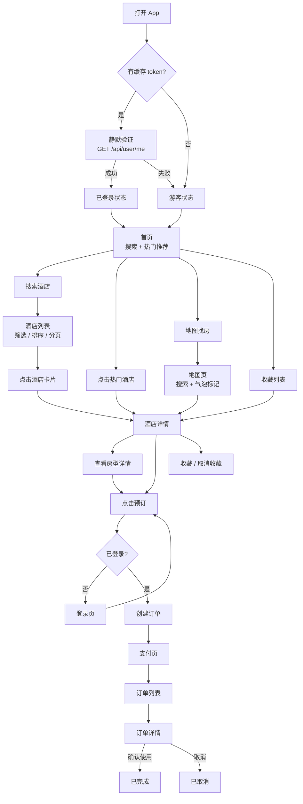

## 2. 订单状态机

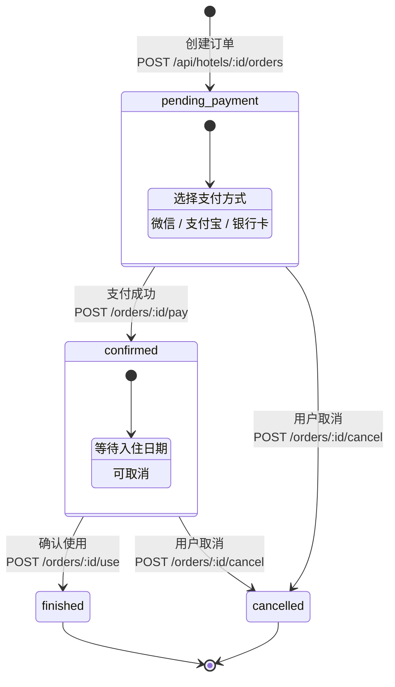

## 3. 注册流程

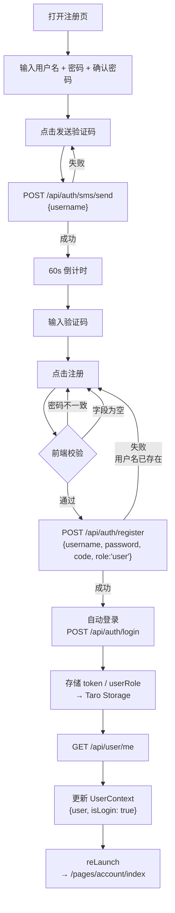

## 4. 登录流程

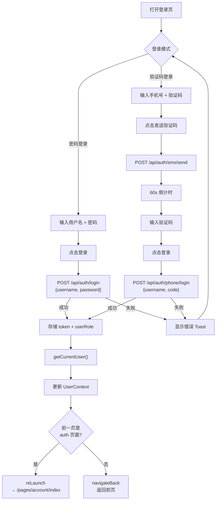

## 5. 搜索与筛选流程

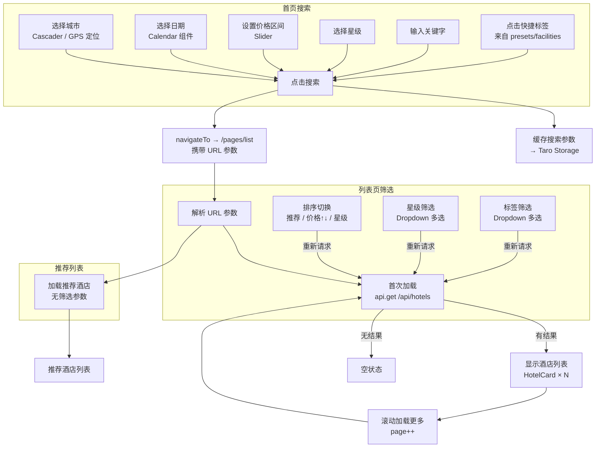

## 6. 酒店详情与预订流程

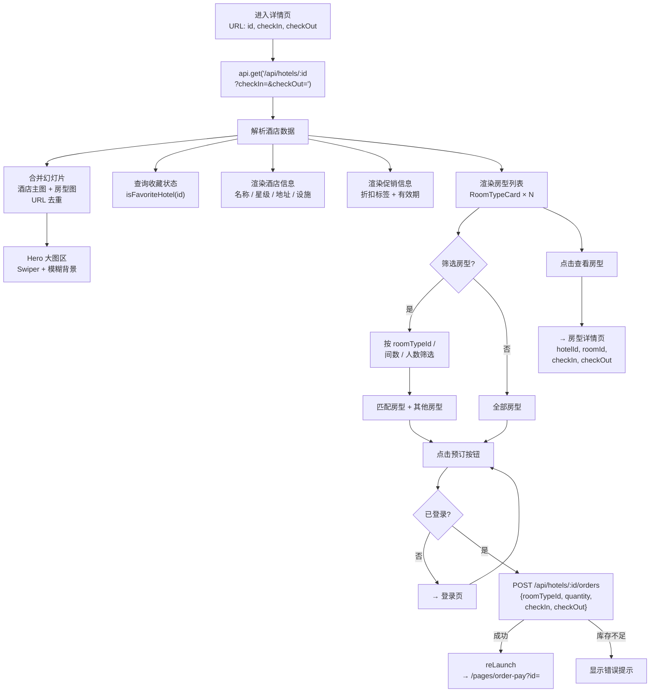

## 7. 支付流程

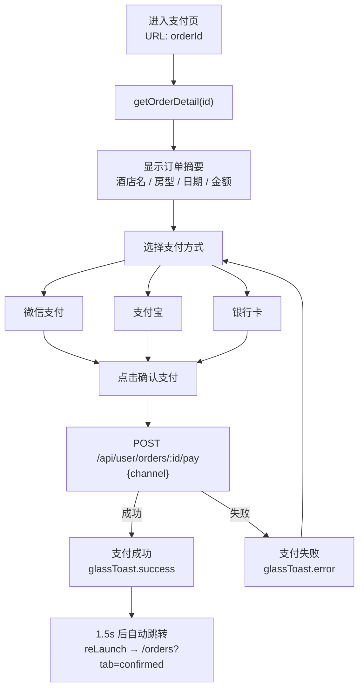

## 8. 订单管理流程

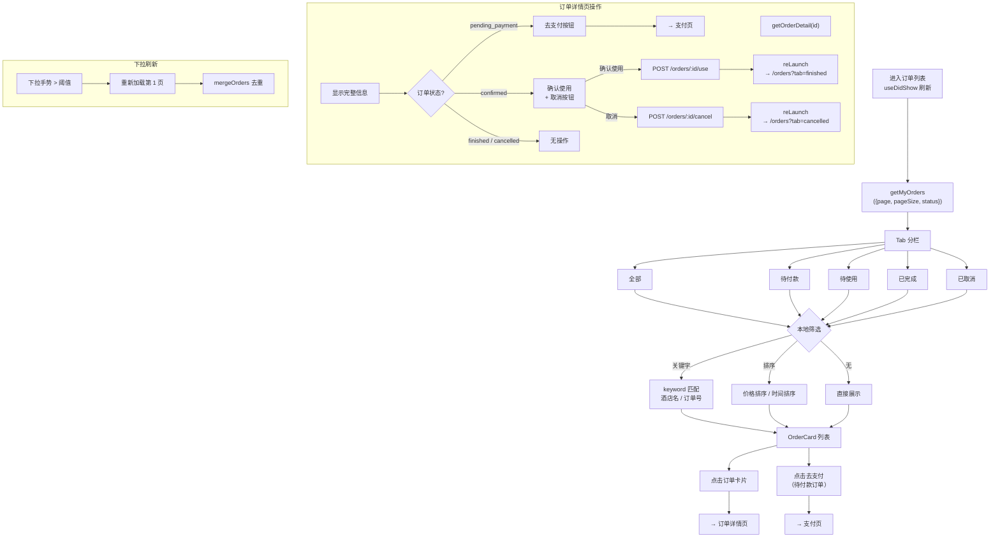

## 9. 收藏管理流程

```mermaid
flowchart TD
    subgraph 详情页操作["酒店详情页"]
        EnterDetail["进入详情页"] --> CheckFav["isFavoriteHotel(id)"]
        CheckFav -->|已收藏| ShowFilled["❤ 实心"]
        CheckFav -->|未收藏| ShowEmpty["♡ 空心"]

        ShowFilled --> ClickHeart["点击收藏按钮"]
        ShowEmpty --> ClickHeart
        ClickHeart --> Toggle["toggleFavoriteHotel(hotel)"]
        Toggle -->|当前已收藏| Remove["DELETE /api/user/favorites/:id"]
        Toggle -->|当前未收藏| Add["POST /api/user/favorites<br/>{hotelId}"]
        Remove --> ShowEmpty
        Add --> ShowFilled
    end

    subgraph 收藏列表["收藏列表页"]
        EnterFav["进入收藏页<br/>useDidShow"] --> LoadFav["getFavoriteHotels()"]
        LoadFav --> SortTime["按 savedAt 降序排列"]
        SortTime --> RenderList["HotelCard 列表<br/>(type='favorite')"]

        RenderList --> SwipeLeft["左滑操作"]
        SwipeLeft --> SwipeDelete["removeFavoriteHotel(id)"]
        SwipeDelete --> Animate["列表动画移除"]

        RenderList --> ClearBtn["清空全部按钮"]
        ClearBtn --> Confirm["二次确认"]
        Confirm --> ClearAPI["clearFavoriteHotels()"]
        ClearAPI --> EmptyState["空状态<br/>去逛逛按钮"]

        RenderList --> ClickCard["点击酒店卡片"]
        ClickCard --> NavDetail["→ 酒店详情页"]
    end
```

## 10. 地图找房流程

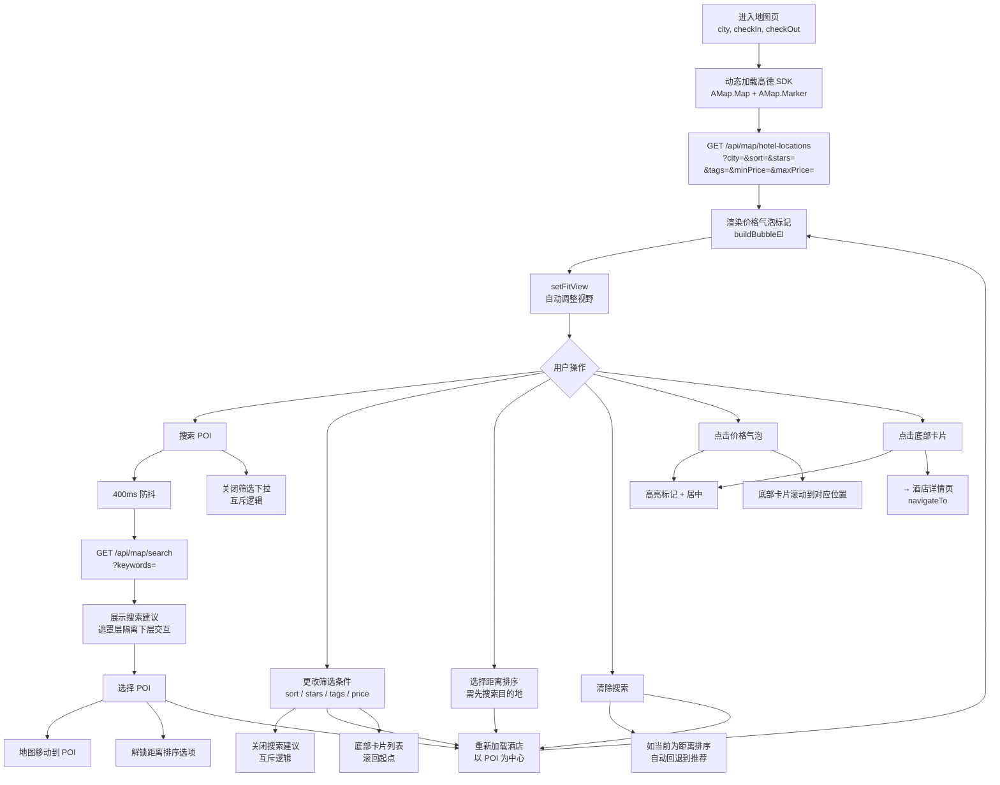

## 11. GPS 定位与逆地理编码流程

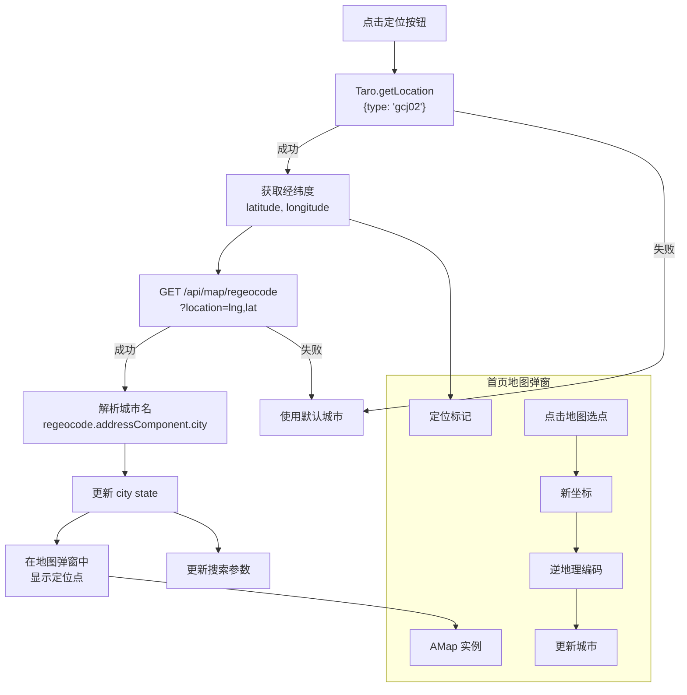

## 12. 页面导航流程

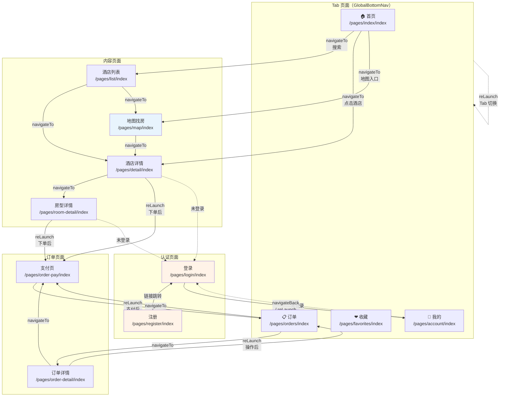

## 13. Hero 大图交互流程

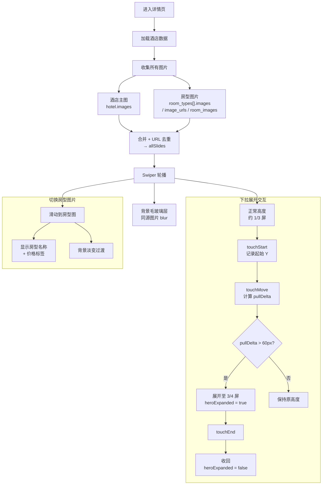

## 14. 验证码发送与校验流程

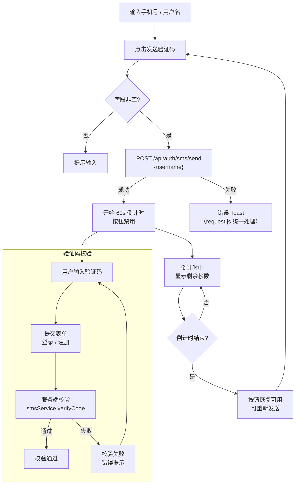
