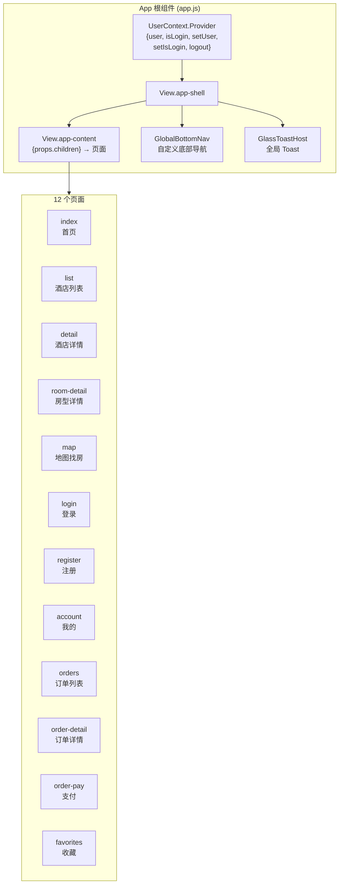
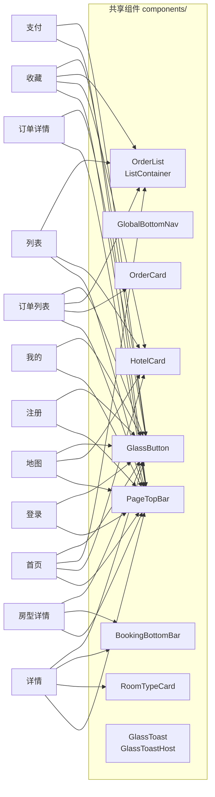
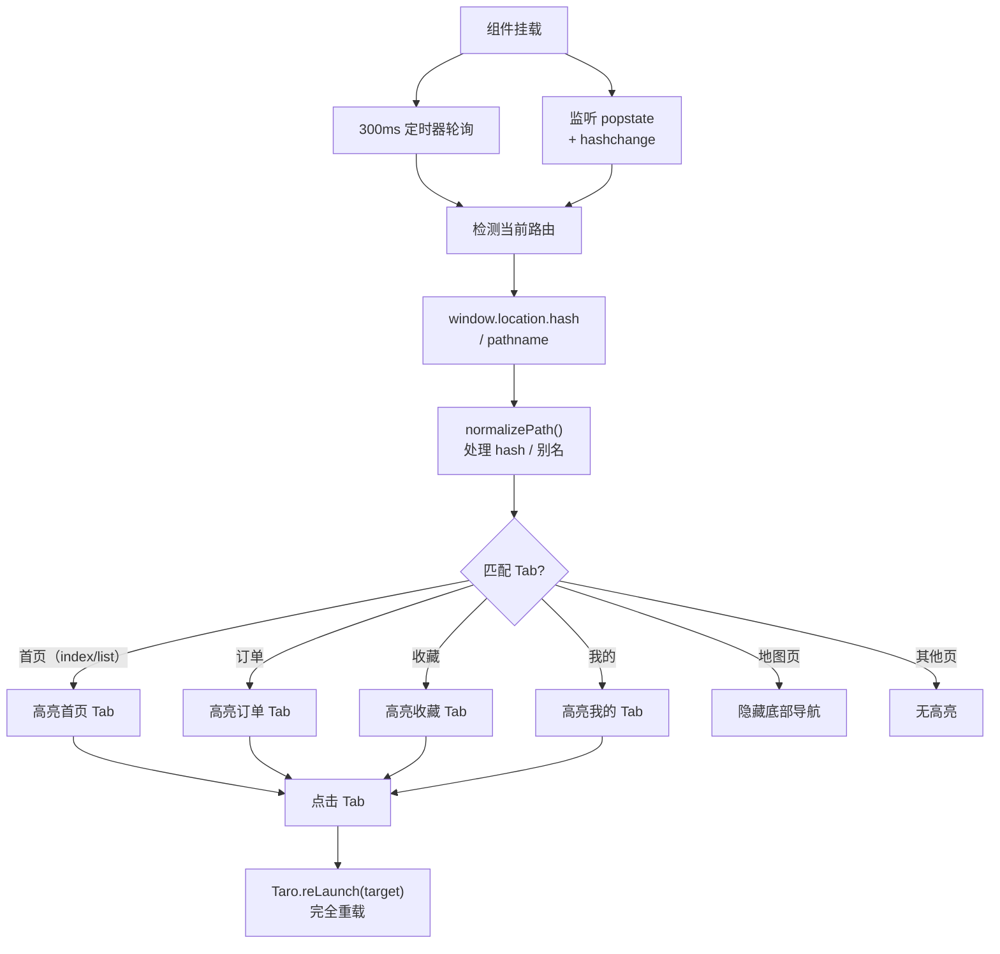
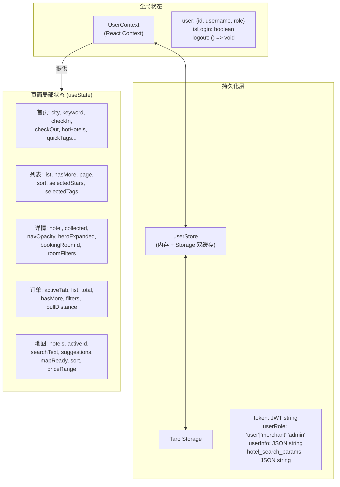

# Mobile 移动端 - 组件架构与状态管理文档

> 本文档描述易宿酒店移动端（Taro + React）的组件架构、状态管理方案、完整 API 调用清单和文件结构。

## 1. 组件层级架构



## 2. 页面—组件依赖关系



## 3. 共享组件规格

### 3.1 组件清单

| 组件 | 文件 | 行数 | Props | 功能描述 |
|------|------|------|-------|----------|
| PageTopBar | PageTopBar/index.jsx | ~70 | title, onBack, rightActions[], showBack, transparent, fixed, elevated, children | 页面顶部导航栏，支持透明/固定/阴影模式 |
| GlobalBottomNav | GlobalBottomNav/index.jsx | ~160 | - | 自定义底部 Tab 导航，路由感知，地图页隐藏 |
| HotelCard | HotelCard/index.jsx | ~90 | hotel, onClick, badgeText, extraMetaItems, showPrice | 酒店列表卡片，左图右信息 |
| OrderCard | OrderCard/index.jsx | ~110 | order, onPay, onDetail | 订单卡片，含状态标签和操作按钮 (memo) |
| OrderList / ListContainer | OrderList/index.jsx | ~500 | items, renderItem, hasMore, loading, onLoadMore, onRefresh... | 通用列表容器 + 工厂函数 |
| RoomTypeCard | RoomTypeCard/index.jsx | ~130 | room, onBook, onOpen, booking, soldOut, metaResolver | 房型卡片 (memo) |
| BookingBottomBar | BookingBottomBar/index.jsx | ~57 | price, actionText, loading, disabled, onAction, leftContent | 底部预订操作栏 |
| GlassButton | GlassButton/index.jsx | ~45 | children, onClick, tone, fill, size, block, loading, disabled | 毛玻璃风格按钮 |
| GlassToastHost | GlassToast/index.jsx | ~90 | - | 全局 Toast 宿主（仅 H5 激活） |

### 3.2 OrderList 工厂函数

`createListByType({type, ...})` 支持 4 种列表类型：

| type | 渲染项 | 骨架屏 | 特殊功能 |
|------|--------|--------|----------|
| `order` | OrderCard | 订单骨架 | - |
| `favorite` | HotelCard | 酒店骨架 | SwipeAction 左滑删除 |
| `room` | RoomTypeCard | - | - |
| 默认(hotel) | HotelCard | 酒店骨架 | - |

### 3.3 GlobalBottomNav 路由感知机制



## 4. 状态管理方案

### 4.1 三层状态架构



### 4.2 各页面状态详情

#### 首页 (index) — ~30+ state

| 分类 | State | 说明 |
|------|-------|------|
| 搜索 | city, keyword, checkIn, checkOut | 搜索参数 |
| 筛选 | selectedStar, selectedPrice, priceRange | 筛选条件 |
| 快捷标签 | quickTags, tagsLoading | 来自 presets |
| 热门酒店 | hotHotels, hotLoading, hotHasMore, hotPage | 瀑布流分页 |
| 定位 | latitude, longitude | GPS |
| 弹窗 | calendarVisible, filterVisible, cityPickerVisible, mapVisible | 弹窗开关 |
| 地图 | mapInstance, markerInstance | AMap 实例 |
| 性能 | deferNonCritical | requestIdleCallback 延迟 |
| 图片 | hotImageRatios, hotCardWidth | 瀑布流自适应 |

#### 酒店详情 (detail) — ~15 state

| State | 说明 |
|-------|------|
| hotel, loading | 酒店数据 |
| checkIn, checkOut | 日期区间 |
| navOpacity | 滚动渐变导航栏 |
| heroExpanded | Hero 下拉展开 |
| bannerIndex, bannerImageError | 轮播控制 |
| bookingRoomId | 预订中的房型 ID |
| collected | 收藏状态 |
| calendarVisible, filterVisible | 弹窗 |
| roomFilters, draftFilters | 房型筛选条件 |

#### 订单列表 (orders) — ~10 state

| State | 说明 |
|-------|------|
| activeTab | 当前 Tab (all/pending_payment/confirmed/finished/cancelled) |
| list, total, hasMore, loading, refreshing | 分页数据 |
| pullDistance, isHeaderElevated | 下拉刷新 |
| filterVisible, filters, draftFilters | 本地筛选 (keyword/priceSort/dateSort) |

#### 地图 (map) — ~15 state

| State | 说明 |
|-------|------|
| searchText, suggestions, showSuggestions, selectedPOI | POI 搜索 |
| hotels, loading, activeId | 酒店数据 |
| city, checkIn, checkOut | 搜索参数 |
| mapReady | SDK 初始化 |
| sort, selectedStars, selectedTags, priceRange, minPrice, maxPrice | 筛选 |
| mapRef, markersRef, poiMarkerRef | AMap 实例引用 |

## 5. 完整 API 调用清单

### 5.1 按模块分类

#### 认证 API

| 端点 | 方法 | 调用位置 | 描述 |
|------|------|---------|------|
| `/api/auth/sms/send` | POST | login, register | 发送验证码 |
| `/api/auth/register` | POST | register | 用户注册 |
| `/api/auth/login` | POST | login, register(自动登录) | 密码登录 |
| `/api/auth/phone/login` | POST | login | 验证码登录 |
| `/api/user/me` | GET | app.js, login, register, account | 获取当前用户 |

#### 酒店 API

| 端点 | 方法 | 调用位置 | 描述 |
|------|------|---------|------|
| `/api/hotels` | GET | index, list | 酒店搜索/列表 |
| `/api/hotels/:id` | GET | detail, room-detail | 酒店详情 |
| `/api/hotels/:id/orders` | POST | detail, room-detail | 创建订单 |

#### 用户订单 API

| 端点 | 方法 | 调用位置 | 描述 |
|------|------|---------|------|
| `/api/user/orders` | GET | orders | 订单列表 |
| `/api/user/orders/:id` | GET | order-detail, order-pay | 订单详情 |
| `/api/user/orders/:id/pay` | POST | order-pay | 模拟支付 |
| `/api/user/orders/:id/cancel` | POST | order-detail | 取消订单 |
| `/api/user/orders/:id/use` | POST | order-detail | 确认使用 |

#### 收藏 API

| 端点 | 方法 | 调用位置 | 描述 |
|------|------|---------|------|
| `/api/user/favorites` | GET | favorites | 收藏列表 |
| `/api/user/favorites` | POST | detail | 添加收藏 |
| `/api/user/favorites` | DELETE | favorites | 清空收藏 |
| `/api/user/favorites/:id` | GET | detail | 查询收藏状态 |
| `/api/user/favorites/:id` | DELETE | detail, favorites | 移除收藏 |

#### 预设数据 API

| 端点 | 方法 | 调用位置 | 描述 |
|------|------|---------|------|
| `/api/presets/facilities` | GET | index, list, map | 设施标签列表 |

#### 地图 API

| 端点 | 方法 | 调用位置 | 描述 |
|------|------|---------|------|
| `/api/map/regeocode` | GET | index | 逆地理编码 |
| `/api/map/hotel-locations` | GET | map | 酒店坐标列表 |
| `/api/map/search` | GET | map | POI 搜索 |

#### 图片代理 API

| 端点 | 方法 | 调用位置 | 描述 |
|------|------|---------|------|
| `/api/image` | GET | resolveImageUrl → 全局 | 图片压缩代理 |

### 5.2 API 调用总量

| 模块 | 端点数 |
|------|--------|
| 认证 | 5 |
| 酒店 | 3 |
| 用户订单 | 5 |
| 收藏 | 5 |
| 预设 | 1 |
| 地图 | 3 |
| 图片 | 1 |
| **总计** | **23** |

## 6. 请求层能力

### 6.1 request.js 配置

| 配置项 | 值 | 说明 |
|--------|---|------|
| baseURL | `window.location.origin` (H5) | 可被 `TARO_APP_API_BASE` 覆盖 |
| Token 来源 | `Taro.getStorageSync('token')` | 注入 `Authorization: Bearer xxx` |
| 成功判断 | `statusCode 200-299` + `data.success !== false` | 双重检查 |
| 错误提示 | `glassToast.error(msg)` | 统一 Toast |
| 防重复提示 | `__toastShown` 标记 | 避免页面层二次弹出 |

### 6.2 resolveImageUrl 图片优化

```javascript
resolveImageUrl(url, { w, h, q, fmt })
// → /api/image?url={encodedUrl}&w={w}&h={h}&q={q}&fmt=webp
```

| 调用场景 | 尺寸参数 |
|---------|----------|
| HotelCard 缩略图 | w=112, h=132 |
| RoomTypeCard 缩略图 | w=84, h=84 |
| 详情页 Hero 大图 | w=750 |
| 列表页卡片 | w=112, h=132 |

## 7. 动效与交互模式

### 7.1 动效清单

| 位置 | 动效 | 实现方式 | 时长 |
|------|------|----------|------|
| 全局页面切换 | blur(6px→0) + scale(0.98→1) + opacity | CSS @keyframes `page-enter` | 0.28s |
| 列表项入场 | 交错延迟进入 | `.list-stagger-enter` + animationDelay | N×50ms |
| GlassToast | 滑入/滑出 | CSS `.glass-toast-enter/.leave` | 0.3s |
| Hero 下拉展开 | 高度过渡到 3/4 屏 | Touch 事件 + class toggle | 实时 |
| Hero 背景切换 | 模糊层淡变 | CSS transition | 0.5s |
| GlassButton 加载 | 旋转动画 | `.glass-button-spinner` | 循环 |
| adm-button 点击 | 缩放 + 透明度 | CSS transition | 0.18s |
| 下拉刷新指示 | 圆点缩放 | `.list-pull-dot` transform | 实时 |
| 订单操作后跳转 | 延迟跳转 | setTimeout(1500ms) | 1.5s |

### 7.2 性能优化策略

| 策略 | 实现 | 位置 |
|------|------|------|
| 延迟非关键 UI | `requestIdleCallback` → `deferNonCritical` | 首页 |
| 图片代理压缩 | resolveImageUrl + Sharp WebP | 全局 |
| 分页加载 | ScrollView onScrollToLower + page++ | 列表/订单/首页 |
| 组件 memo | React.memo 避免重渲染 | OrderCard, RoomTypeCard |
| 防抖搜索 | 400ms setTimeout | 地图 POI |
| 去重合并 | mergeOrders(基于 id) | 订单列表 |
| useRef 消抖 | ref 替代 state 存触摸数据 | 详情 Hero |

## 8. CSS 设计体系

### 8.1 全局 CSS 变量

| 变量 | 值 | 用途 |
|------|---|------|
| `--app-primary-start` | #0086f6 | 渐变起始蓝 |
| `--app-primary-end` | #2db7f5 | 渐变结束蓝 |
| `--app-primary-solid` | #1a6dff | 纯色蓝 |
| `--app-bottom-nav-height` | 58px | 底部导航高度 |
| `--app-safe-area-bottom` | env(safe-area-inset-bottom) | iOS 安全区 |

### 8.2 CSS 命名约定

**非 CSS Modules**，使用 BEM 风格前缀：

| 组件 | 前缀 |
|------|------|
| HotelCard | `.hotel-card-*` |
| OrderCard | `.hotel-order-*` |
| RoomTypeCard | `.room-type-card-*` |
| GlassButton | `.glass-button-*` |
| GlassToast | `.glass-toast-*` |
| BookingBottomBar | `.booking-bottom-bar-*` |
| PageTopBar | `.page-top-bar-*` |
| GlobalBottomNav | `.global-bottom-nav-*` |

### 8.3 毛玻璃设计系统

| 组件 | 效果 |
|------|------|
| GlassButton | 半透明背景 + backdrop-filter: blur |
| GlassToast | 毛玻璃卡片 + 图标 + 文字 |
| Hero 背景 | 同源图片 blur 层 |
| 底部导航 | 半透明背景 |

## 9. 路由配置

### 9.1 页面注册（app.config.js）

| 路径 | 页面 | 认证要求 |
|------|------|---------|
| `pages/index/index` | 首页 | 无 |
| `pages/list/index` | 酒店列表 | 无 |
| `pages/detail/index` | 酒店详情 | 预订时需要 |
| `pages/room-detail/index` | 房型详情 | 预订时需要 |
| `pages/map/index` | 地图找房 | 无 |
| `pages/login/index` | 登录 | 无 |
| `pages/register/index` | 注册 | 无 |
| `pages/account/index` | 我的 | 无（未登录显示登录入口） |
| `pages/orders/index` | 订单列表 | 是 |
| `pages/order-detail/index` | 订单详情 | 是 |
| `pages/order-pay/index` | 支付 | 是 |
| `pages/favorites/index` | 收藏 | 是 |

### 9.2 导航方式约定

| 方式 | 使用场景 |
|------|---------|
| `Taro.navigateTo` | 进入内容页（列表→详情、详情→房型、订单→详情） |
| `Taro.reLaunch` | Tab 切换、支付完成跳转、订单操作后跳转 |
| `Taro.navigateBack` | 登录成功返回前页 |

## 10. 完整文件结构

```
mobile/
├── package.json                    # Taro 4.1.11 + React 18
├── babel.config.js
├── Dockerfile
├── nginx.conf
├── preview-server.js               # 预览服务器
│
├── config/
│   ├── dev.js                      # 开发配置
│   ├── prod.js                     # 生产配置
│   └── index.js                    # 配置合并
│
├── src/
│   ├── app.config.js               # 路由注册（12 页面）
│   ├── app.js                      # App 根组件 + UserContext.Provider
│   ├── app.css                     # 全局样式 + CSS 变量 + 页面动画
│   ├── index.html                  # H5 入口模板
│   │
│   ├── services/
│   │   ├── request.js              # HTTP 请求层（api 对象 + 拦截器）
│   │   ├── auth.js                 # 认证 + 订单 API 封装
│   │   ├── favorites.js            # 收藏 API 封装
│   │   ├── UserContext.js          # React Context 定义
│   │   ├── userStore.js            # 双层缓存（内存 + Storage）
│   │   └── glassToast.js           # Toast 服务（H5/小程序适配）
│   │
│   ├── utils/
│   │   ├── dateRange.js            # 日期工具函数
│   │   └── cityData.js             # 省市数据字典（~1558 行）
│   │
│   ├── components/
│   │   ├── PageTopBar/             # 页面顶部导航栏
│   │   │   ├── index.jsx
│   │   │   └── index.css
│   │   ├── GlobalBottomNav/        # 自定义底部 Tab 导航
│   │   │   ├── index.jsx
│   │   │   └── index.css
│   │   ├── HotelCard/              # 酒店卡片
│   │   │   ├── index.jsx
│   │   │   └── index.css
│   │   ├── OrderCard/              # 订单卡片
│   │   │   ├── index.jsx
│   │   │   └── index.css
│   │   ├── OrderList/              # 通用列表容器 + 工厂
│   │   │   ├── index.jsx
│   │   │   └── index.css
│   │   ├── RoomTypeCard/           # 房型卡片
│   │   │   ├── index.jsx
│   │   │   └── index.css
│   │   ├── BookingBottomBar/       # 底部预订操作栏
│   │   │   ├── index.jsx
│   │   │   └── index.css
│   │   ├── GlassButton/            # 毛玻璃按钮
│   │   │   ├── index.jsx
│   │   │   └── index.css
│   │   └── GlassToast/             # 全局 Toast 组件
│   │       ├── index.jsx
│   │       └── index.css
│   │
│   ├── pages/
│   │   ├── index/                  # 首页（~998 行）
│   │   │   ├── index.jsx
│   │   │   └── index.css
│   │   ├── list/                   # 酒店列表（~640 行）
│   │   │   ├── index.jsx
│   │   │   └── index.css
│   │   ├── detail/                 # 酒店详情（~875 行）
│   │   │   ├── index.jsx
│   │   │   └── index.css
│   │   ├── room-detail/            # 房型详情（~310 行）
│   │   │   ├── index.jsx
│   │   │   └── index.css
│   │   ├── map/                    # 地图找房（~689 行）
│   │   │   ├── index.jsx
│   │   │   └── index.css
│   │   ├── login/                  # 登录（~215 行）
│   │   │   ├── index.jsx
│   │   │   └── index.css
│   │   ├── register/               # 注册（~190 行）
│   │   │   ├── index.jsx
│   │   │   └── index.css
│   │   ├── account/                # 我的（~85 行）
│   │   │   ├── index.jsx
│   │   │   └── index.css
│   │   ├── orders/                 # 订单列表（~370 行）
│   │   │   ├── index.jsx
│   │   │   └── index.css
│   │   ├── order-detail/           # 订单详情（~165 行）
│   │   │   ├── index.jsx
│   │   │   └── index.css
│   │   ├── order-pay/              # 支付（~140 行）
│   │   │   ├── index.jsx
│   │   │   └── index.css
│   │   └── favorites/              # 收藏（~110 行）
│   │       ├── index.jsx
│   │       └── index.css
│   │
│   └── assets/
│       └── tabbar/                 # Tab 图标资源
│
└── docs/
    └── implementation_plan.md      # 实施计划
```

## 11. 技术栈与依赖

| 分类 | 技术 | 版本 |
|------|------|------|
| 框架 | Taro | 4.1.11 |
| UI 库 | React | 18.2.x |
| UI 组件 | antd-mobile | 5.42.3 |
| 构建 | Webpack 5 | (Taro 内置) |
| 日期 | dayjs | latest |
| 动画 | rc-motion | latest |
| 图标 | @ant-design/icons | latest |
| 平台 | H5 (主要) | 兼容小程序 |
| 地图 | 高德地图 JS SDK | 动态加载 |

## 12. 平台适配策略

| 特性 | H5 | 小程序 |
|------|-----|--------|
| Toast | GlassToastHost (毛玻璃 UI) | Taro.showToast (原生) |
| 底部导航 | GlobalBottomNav (自定义) | GlobalBottomNav (自定义) |
| 地图 | AMap JS SDK (动态加载) | AMap JS SDK |
| 存储 | localStorage (Taro 封装) | wx.setStorage |
| 下拉刷新 | Touch 事件实现 | Touch 事件实现 |
| baseURL | window.location.origin | TARO_APP_API_BASE |
| 页面动画 | CSS @keyframes | CSS @keyframes |
| 安全区 | env(safe-area-inset-bottom) | env(safe-area-inset-bottom) |
