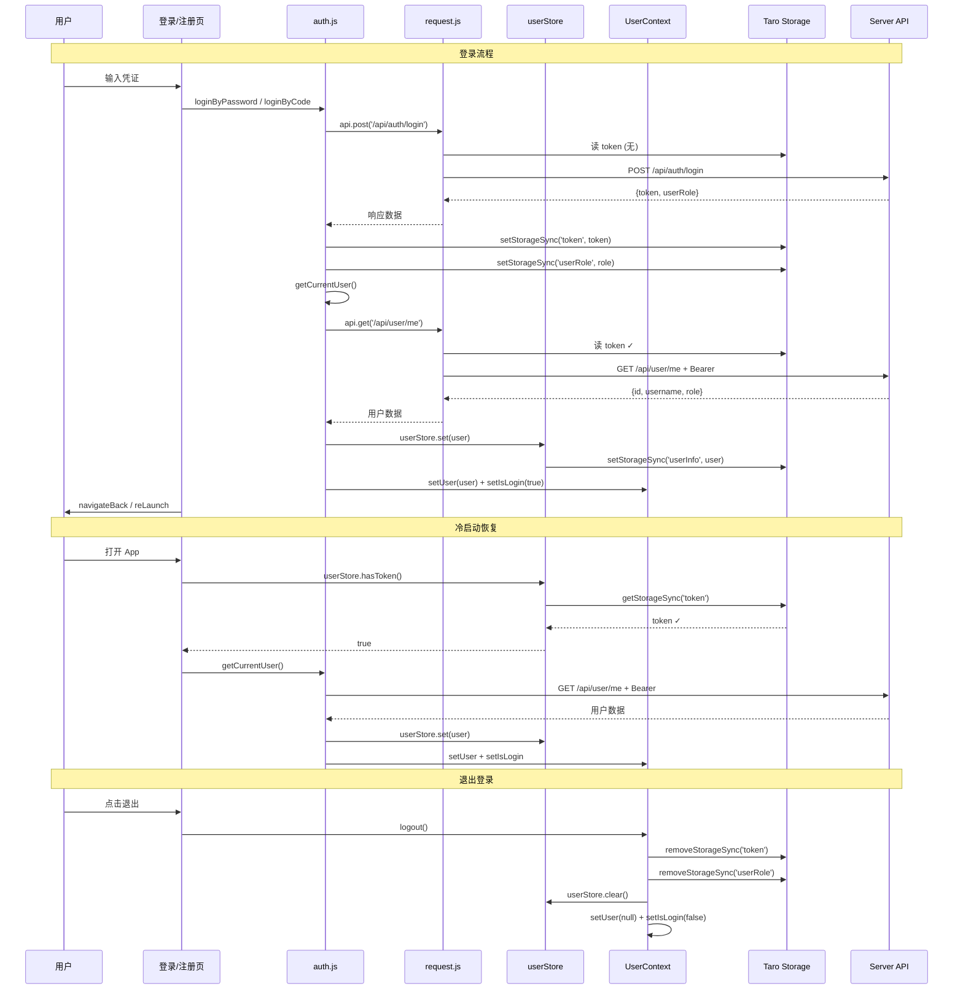
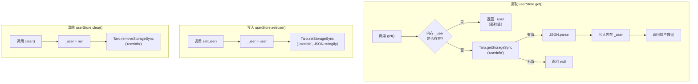
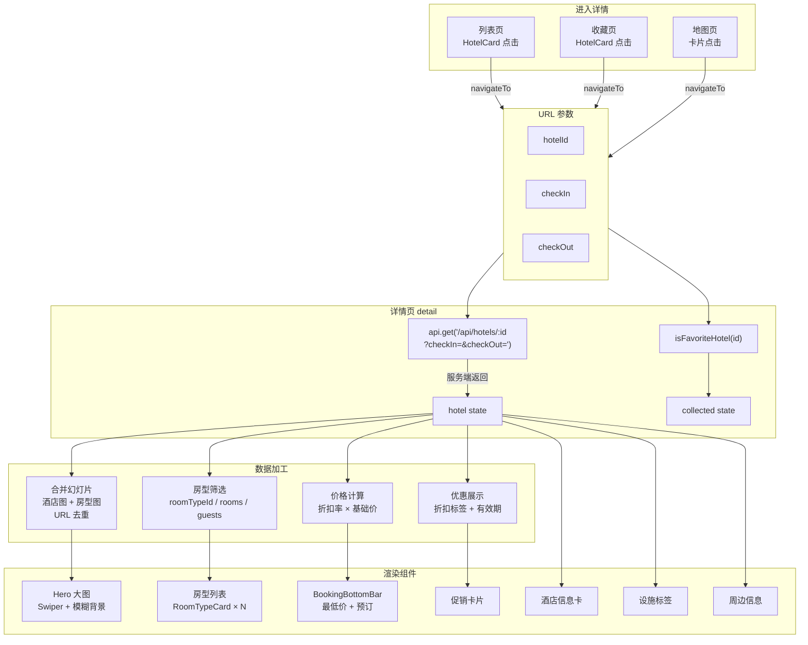
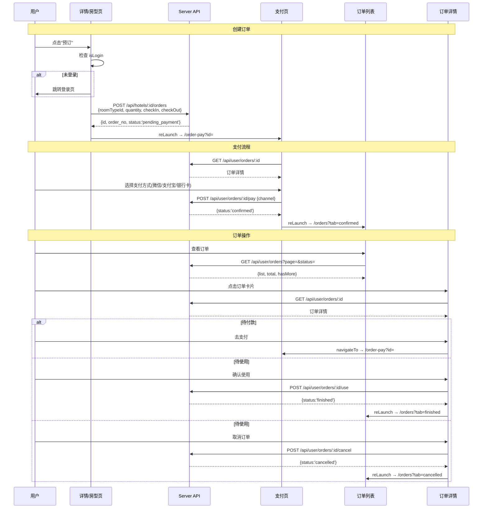
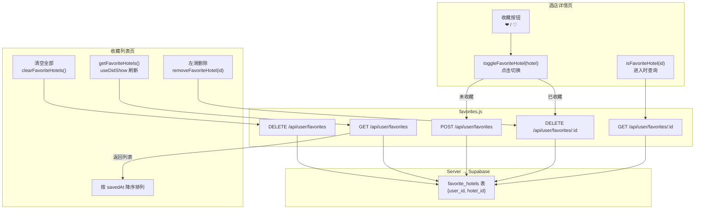
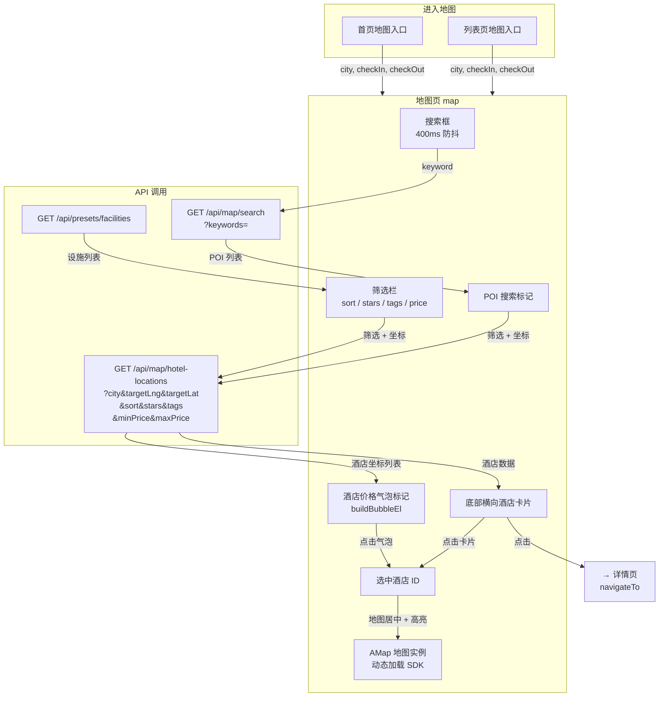
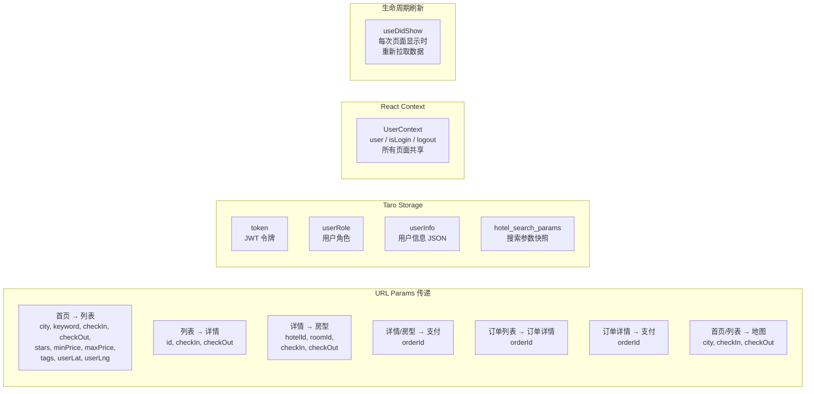
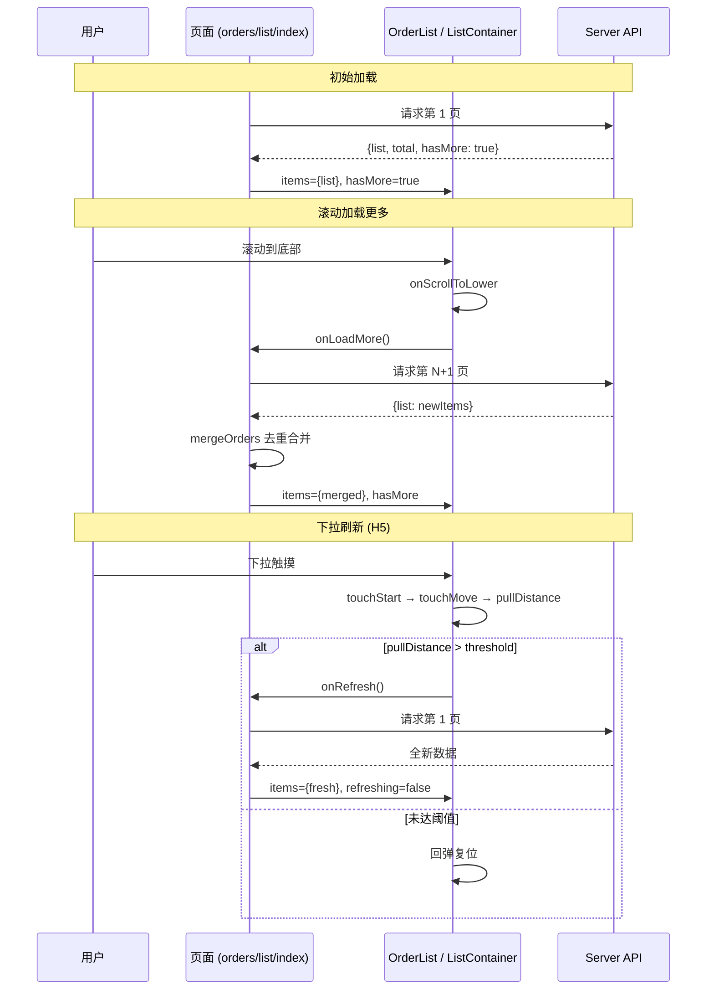

# Mobile 移动端 - 数据流图文档

> 本文档使用 Mermaid 图描述易宿酒店移动端（Taro + React + H5）的数据流转路径，覆盖全局请求链路、认证、搜索、订单、收藏、地图等核心模块。

## 1. 全局请求数据流

```mermaid
graph TB
    subgraph 页面层["页面层（12 个页面）"]
        Index["首页"]
        List["酒店列表"]
        Detail["酒店详情"]
        RoomDetail["房型详情"]
        Orders["订单列表"]
        OrderDetail["订单详情"]
        OrderPay["支付页"]
        Favorites["收藏"]
        MapPage["地图找房"]
        Login["登录"]
        Register["注册"]
        Account["我的"]
    end

    subgraph 服务层["Services 层"]
        AuthSvc["auth.js<br/>认证 + 订单"]
        FavSvc["favorites.js<br/>收藏操作"]
        RequestJS["request.js<br/>api.get / api.post / ..."]
    end

    subgraph 状态层["状态管理"]
        UserCtx["UserContext<br/>{user, isLogin, logout}"]
        UserStore["userStore<br/>双层缓存"]
        Storage["Taro Storage<br/>token / userRole / userInfo<br/>hotel_search_params"]
    end

    subgraph 后端["Server (Express)"]
        API["REST API<br/>:4100/api/*"]
    end

    Index & List & Detail & RoomDetail & MapPage -->|api.get| RequestJS
    Detail & RoomDetail -->|api.post /orders| RequestJS
    Orders & OrderDetail & OrderPay -->|getMyOrders / payOrder| AuthSvc
    Login & Register -->|loginByPassword / sendCode| AuthSvc
    Favorites -->|getFavoriteHotels / toggle| FavSvc
    Account -->|getCurrentUser| AuthSvc

    AuthSvc & FavSvc --> RequestJS
    RequestJS -->|1. 读 token| Storage
    RequestJS -->|2. 注入 Authorization| API
    API -->|3. JSON 响应| RequestJS
    RequestJS -->|4. 错误| GlassToast["glassToast<br/>全局提示"]

    AuthSvc -->|写入 token / userRole| Storage
    AuthSvc -->|set(user)| UserStore
    UserStore <-->|读写| Storage
    UserCtx -->|提供 user/isLogin| Index & Orders & Account & Detail
```

## 2. 认证数据流



## 3. 双层缓存数据流（userStore）



## 4. 酒店搜索数据流

```mermaid
graph TB
    subgraph 首页["首页 index"]
        City["城市选择<br/>Cascader / 定位"]
        Date["日期选择<br/>Calendar"]
        Star["星级筛选<br/>0-5"]
        Price["价格区间<br/>Slider"]
        KW["关键字输入"]
        Tags["快捷标签<br/>来自 presets/facilities"]
        SearchBtn["搜索按钮"]
    end

    subgraph URLParams["URL 参数传递"]
        Params["city, keyword, checkIn,<br/>checkOut, stars, minPrice,<br/>maxPrice, tags, userLat, userLng"]
    end

    subgraph 列表页["列表页 list"]
        ParseParams["解析 URL 参数<br/>Taro.getCurrentInstance()"]
        Sort["排序切换<br/>recommend/price_asc/price_desc/star"]
        Filter["筛选 Dropdown<br/>stars + tags"]
        ListAPI["api.get('/api/hotels')"]
        ResultList["搜索结果列表"]
        RecList["推荐酒店列表"]
        ScrollLoad["滚动加载更多"]
    end

    subgraph 缓存["本地缓存"]
        SearchCache["Taro Storage<br/>hotel_search_params"]
    end

    subgraph Server["Server"]
        HotelAPI["GET /api/hotels<br/>hotelService.searchHotels"]
    end

    City & Date & Star & Price & KW & Tags --> SearchBtn
    SearchBtn -->|navigateTo| Params
    SearchBtn -->|持久化| SearchCache
    Params -->|URL query string| ParseParams
    ParseParams --> Sort & Filter
    Sort & Filter --> ListAPI
    ListAPI -->|page=1| HotelAPI
    HotelAPI -->|{page, pageSize, total, list}| ResultList
    ScrollLoad -->|page++| ListAPI
    ListAPI -->|无搜索参数| RecList

    SearchCache -.->|首次打开恢复| ParseParams
```

## 5. 酒店详情数据流



## 6. 订单流转数据流



## 7. 收藏功能数据流



## 8. 地图找房数据流



## 9. 图片优化数据流

```mermaid
graph LR
    subgraph 组件["图片引用组件"]
        HotelCard["HotelCard<br/>112×132"]
        DetailHero["详情 Hero<br/>全宽"]
        RoomCard["RoomTypeCard<br/>84×84"]
    end

    subgraph Resolve["resolveImageUrl()"]
        Input["原始 URL"]
        Check{"已是代理 URL?"}
        Build["构造代理参数<br/>w, h, q, fmt=webp"]
        Output["代理 URL"]
    end

    subgraph Proxy["Server 图片代理"]
        ImageAPI["GET /api/image<br/>?url=&w=&h=&q=&fmt="]
        Sharp["Sharp 压缩<br/>resize + format"]
    end

    HotelCard -->|resolveImageUrl<br/>(url, {w:112,h:132})| Resolve
    DetailHero -->|resolveImageUrl<br/>(url, {w:750})| Resolve
    RoomCard -->|resolveImageUrl<br/>(url, {w:84,h:84})| Resolve
    Input --> Check
    Check -->|否| Build --> Output
    Check -->|是| Output
    Output --> ImageAPI --> Sharp
    Sharp -->|压缩后图片| HotelCard & DetailHero & RoomCard
```

## 10. Toast 通知数据流

```mermaid
graph TB
    subgraph 触发源["触发来源"]
        RequestErr["request.js<br/>请求错误"]
        BizLogic["业务逻辑<br/>登录成功 / 收藏操作"]
    end

    subgraph GlassToastSvc["glassToast 服务"]
        Show["glassToast.show(msg, type)"]
        PlatformCheck{"H5 平台?"}
        Listeners["通知 listeners<br/>subscribeGlassToast"]
        TaroToast["Taro.showToast<br/>小程序原生"]
    end

    subgraph Host["GlassToastHost 组件<br/>（App 根级渲染）"]
        Queue["toast 队列<br/>最多 4 条"]
        Render["渲染毛玻璃卡片<br/>图标 + 消息"]
        Timer["自动移除<br/>2200ms"]
        Animation["进入/离开动画<br/>CSS transition"]
    end

    RequestErr -->|error(msg)| Show
    BizLogic -->|success/warning/info| Show
    Show --> PlatformCheck
    PlatformCheck -->|H5| Listeners --> Queue
    PlatformCheck -->|小程序| TaroToast
    Queue --> Render --> Timer
    Render --> Animation
```

## 11. 页间数据传递总览



## 12. 下拉刷新与分页加载数据流


