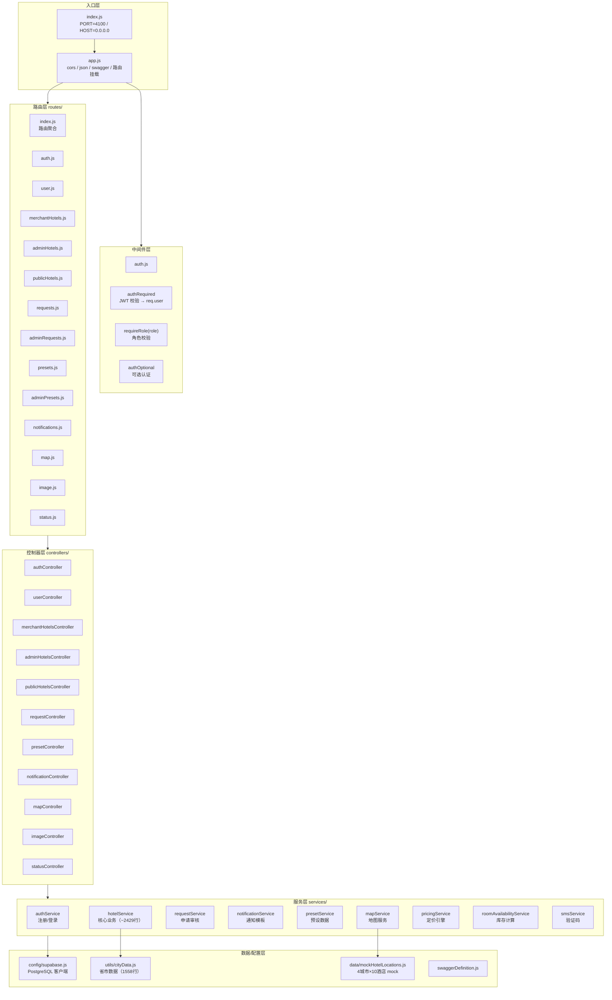
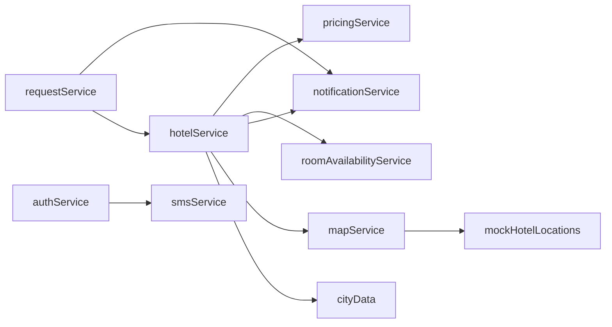
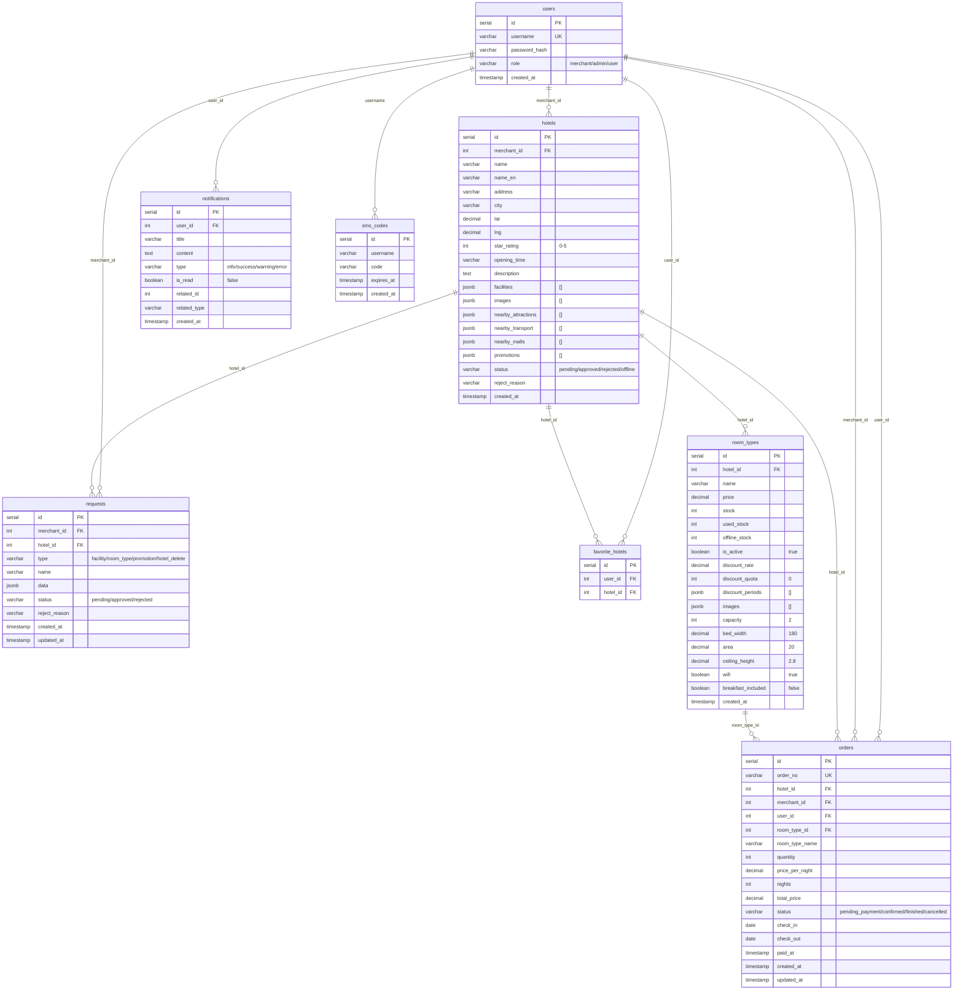
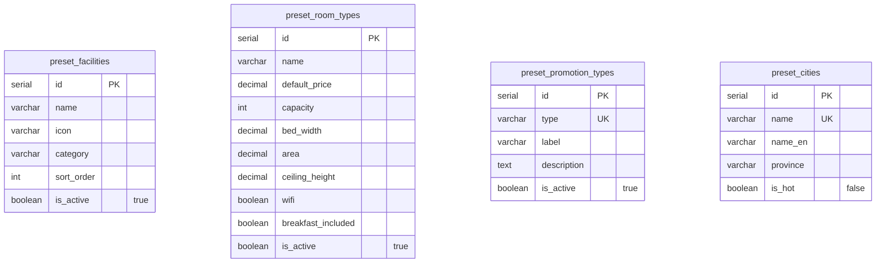

# Server 后端 - 架构与 API 接口文档

> 本文档描述后端服务（server）的分层架构、模块职责、完整 API 接口清单以及数据库设计。

## 1. 分层架构总览



## 2. 模块职责说明

### 2.1 控制器层（Controllers）

| 控制器 | 文件 | 职责 | 依赖服务 |
|--------|------|------|----------|
| authController | authController.js | 登录注册、验证码发送 | authService, smsService |
| userController | userController.js | 用户信息、订单管理、收藏、商户管理 | 直接操作 Supabase |
| merchantHotelsController | merchantHotelsController.js | 商户酒店 CRUD、批量操作、统计 | hotelService |
| adminHotelsController | adminHotelsController.js | 管理员酒店查看、审核、上下架 | hotelService |
| publicHotelsController | publicHotelsController.js | 公开酒店搜索、详情、下单 | hotelService |
| requestController | requestController.js | 申请提交、审核、通知查询 | requestService |
| presetController | presetController.js | 预设数据 CRUD | presetService |
| notificationController | notificationController.js | 通知列表、未读数、标记已读 | notificationService |
| mapController | mapController.js | POI 搜索、地理编码、酒店定位 | mapService |
| imageController | imageController.js | 图片代理压缩 | sharp |
| statusController | statusController.js | 健康检查、状态页 | 直接操作 Supabase |

### 2.2 服务层（Services）

| 服务 | 文件 | 核心职责 | 依赖 |
|------|------|----------|------|
| authService | authService.js | 用户注册/登录、JWT 签发 | smsService, auth 中间件 |
| hotelService | hotelService.js | **核心业务**：酒店 CRUD、智能搜索、订单创建、统计聚合 | pricingService, roomAvailabilityService, notificationService, mapService |
| requestService | requestService.js | 申请创建、审核处理、级联操作 | notificationService, hotelService |
| notificationService | notificationService.js | 通知发送、查询、标记已读 | - |
| presetService | presetService.js | 预设数据 CRUD | - |
| mapService | mapService.js | 高德 API 封装、geocode 缓存、mock 降级 | mockHotelLocations |
| pricingService | pricingService.js | 定价引擎：促销叠加、折扣计算 | - |
| roomAvailabilityService | roomAvailabilityService.js | 库存占用查询、可用量计算 | - |
| smsService | smsService.js | 验证码生成、存储、校验 | - |

### 2.3 服务间依赖关系



## 3. 完整 API 接口清单

### 3.1 认证模块 `/api/auth`

| 方法 | 路径 | 认证 | 请求体 | 响应 |
|------|------|------|--------|------|
| POST | `/api/auth/sms/send` | 无 | `{username}` | `{code, expiresAt}` |
| POST | `/api/auth/register` | 无 | `{username, password, role, code}` | `{id, username, role}` |
| POST | `/api/auth/login` | 无 | `{username, password}` | `{token, userRole}` |
| POST | `/api/auth/phone/register` | 无 | `{phone, code}` | `{token, userRole}` |
| POST | `/api/auth/phone/login` | 无 | `{phone/username, code}` | `{token, userRole}` |

### 3.2 用户模块 `/api/user`

| 方法 | 路径 | 认证 | 参数/请求体 | 响应 |
|------|------|------|-------------|------|
| GET | `/api/user/me` | Bearer | - | 用户信息 |
| POST | `/api/user/change-password` | Bearer | `{oldPassword, newPassword}` | 结果 |
| GET | `/api/user/orders` | Bearer | `?page&pageSize&status` | `{page,pageSize,total,list}` |
| GET | `/api/user/orders/:id` | Bearer | - | 订单详情（含 hotel） |
| POST | `/api/user/orders/:id/pay` | Bearer | `{channel}` | 更新后订单 |
| POST | `/api/user/orders/:id/cancel` | Bearer | - | 更新后订单 |
| POST | `/api/user/orders/:id/use` | Bearer | - | 更新后订单 |
| GET | `/api/user/favorites` | Bearer | - | 收藏列表 |
| GET | `/api/user/favorites/:hotelId` | Bearer | - | `{isFavorite}` |
| POST | `/api/user/favorites` | Bearer | `{hotelId}` | 收藏结果 |
| DELETE | `/api/user/favorites/:hotelId` | Bearer | - | 结果 |
| DELETE | `/api/user/favorites` | Bearer | - | 清空结果 |
| GET | `/api/user/merchants` | Bearer+admin | `?page&pageSize&keyword` | 商户列表 |
| GET | `/api/user/merchants/:id` | Bearer+admin | - | 商户详情+酒店 |
| POST | `/api/user/merchants/:id/reset-password` | Bearer+admin | `{newPassword}` | 结果 |

### 3.3 商户酒店模块 `/api/merchant/hotels`

> 全部接口需要 `authRequired` + `requireRole('merchant')`

| 方法 | 路径 | 参数/请求体 | 响应 |
|------|------|-------------|------|
| GET | `/` | `?page&pageSize&status&city&keyword` | 酒店列表（兼容数组/分页） |
| GET | `/cities` | - | 城市数组 |
| POST | `/` | 酒店完整数据 + roomTypes | 新酒店 |
| PUT | `/:id` | 更新数据 | 更新后酒店 |
| GET | `/:id` | - | 酒店详情（含定价+订单引用标记） |
| PATCH | `/:id/status` | `{action}` | 状态更新结果 |
| GET | `/overview` | - | 商户总览（房态/收入） |
| GET | `/room-type-stats` | `?hotelIds` | 房型库存统计 |
| POST | `/batch-discount` | `{items}` | 批量折扣结果 |
| POST | `/batch-room` | `{items}` | 批量操作结果 |
| GET | `/:id/overview` | - | 单酒店房间概览 |
| GET | `/:id/orders` | `?page&pageSize` | 订单分页 |
| GET | `/:id/order-stats` | - | 订单统计 |

### 3.4 管理员酒店模块 `/api/admin/hotels`

> 全部接口需要 `authRequired` + `requireRole('admin')`

| 方法 | 路径 | 参数/请求体 | 响应 |
|------|------|-------------|------|
| GET | `/` | `?page&pageSize&status&city&keyword` | 酒店列表（含 stats） |
| GET | `/cities` | - | 城市数组 |
| GET | `/:id` | - | 酒店详情（任意状态） |
| PATCH | `/:id/status` | `{status, rejectReason?}` | 审核结果 |
| PUT | `/:id/offline` | `{reason}` | 下架结果 |
| PUT | `/:id/restore` | - | 恢复结果 |
| GET | `/room-type-stats` | `?hotelIds` | 房型统计 |
| POST | `/batch-discount` | `{items}` | 批量折扣结果 |
| POST | `/batch-room` | `{items}` | 批量操作结果 |
| GET | `/:id/overview` | - | 房间概览 |
| GET | `/:id/orders` | `?page&pageSize` | 订单分页 |
| GET | `/:id/order-stats` | - | 订单统计 |

### 3.5 公开酒店模块 `/api/hotels`

| 方法 | 路径 | 认证 | 参数/请求体 | 响应 |
|------|------|------|-------------|------|
| GET | `/` | 无 | `?city&keyword&sort&tags&stars&minPrice&maxPrice&checkIn&checkOut&page&pageSize` | `{page,pageSize,total,list}` |
| GET | `/:id` | 无 | - | 酒店详情（含可用房型+定价） |
| POST | `/:id/orders` | Bearer | `{roomTypeId, quantity, checkIn, checkOut}` | 新订单 |

### 3.6 申请审核模块

| 方法 | 路径 | 认证 | 参数/请求体 | 响应 |
|------|------|------|-------------|------|
| POST | `/api/requests` | Bearer | `{type, name, data, hotelId?}` | 申请详情 |
| GET | `/api/requests` | Bearer | `?status&type` | 商户申请列表 |
| GET | `/api/admin/requests` | Bearer+admin | `?type&hotelId&status&page&pageSize` | 待审核列表 |
| GET | `/api/admin/requests/summary` | Bearer+admin | - | `{pendingHotels, pendingRequests}` |
| PUT | `/api/admin/requests/:id/review` | Bearer+admin | `{action, rejectReason?}` | 审核结果 |

### 3.7 预设数据模块

| 方法 | 路径 | 认证 | 响应 |
|------|------|------|------|
| GET | `/api/presets` | 无 | 全部预设合集 |
| GET | `/api/presets/facilities` | 无 | 设施列表 |
| GET | `/api/presets/room-types` | 无 | 房型模板列表 |
| GET | `/api/presets/promotion-types` | 无 | 优惠类型列表 |
| GET | `/api/presets/cities/hot` | 无 | 热门城市 |
| GET | `/api/presets/cities` | 无 | 全部城市 |
| POST | `/api/admin/presets/facilities` | Bearer+admin | 添加设施 |
| POST | `/api/admin/presets/room-types` | Bearer+admin | 添加房型 |
| POST | `/api/admin/presets/promotion-types` | Bearer+admin | 添加优惠类型 |
| POST | `/api/admin/presets/cities` | Bearer+admin | 添加城市 |

### 3.8 通知消息模块 `/api/notifications`

> 全部接口需要 `authRequired`

| 方法 | 路径 | 参数 | 响应 |
|------|------|------|------|
| GET | `/` | `?unreadOnly` | 通知列表 |
| GET | `/unread-count` | - | `{count}` |
| PUT | `/read-all` | - | 结果 |
| PUT | `/:id/read` | - | 结果 |

### 3.9 地图服务模块 `/api/map`

| 方法 | 路径 | 认证 | 参数 | 响应 |
|------|------|------|------|------|
| GET | `/search` | 无 | `?keyword&city` | POI 列表 |
| GET | `/geocode` | 无 | `?address&city` | `{lat, lng}` |
| GET | `/regeocode` | 无 | `?location` | 地址信息 |
| GET | `/hotel-locations` | 无 | `?city&lat&lng&filters` | 酒店坐标列表 |

### 3.10 图片代理 `/api/image`

| 方法 | 路径 | 认证 | 参数 | 响应 |
|------|------|------|------|------|
| GET | `/` | 无 | `?url&w&h&q&fmt` | 压缩后图片 |

### 3.11 健康检查

| 方法 | 路径 | 响应 |
|------|------|------|
| GET | `/health` | `{status: 'ok'}` |
| GET | `/status` | HTML 状态页（酒店统计） |

## 4. 数据库设计

### 4.1 ER 关系图



### 4.2 预设数据表



### 4.3 索引设计

| 表 | 索引字段 | 类型 | 用途 |
|----|---------|------|------|
| hotels | merchant_id | B-tree | 商户酒店查询 |
| hotels | status | B-tree | 状态筛选 |
| hotels | city | B-tree | 城市筛选 |
| room_types | hotel_id | B-tree | 关联查询 |
| orders | user_id | B-tree | 用户订单 |
| orders | (user_id, status, created_at DESC) | B-tree | 复合查询 |
| orders | order_no | UNIQUE | 订单号唯一 |
| sms_codes | username | B-tree | 验证码查询 |
| requests | merchant_id | B-tree | 商户申请 |
| requests | status | B-tree | 状态筛选 |
| notifications | user_id | B-tree | 用户通知 |
| notifications | is_read | B-tree | 未读筛选 |

### 4.4 RLS 策略

| 表 | 策略 | 说明 |
|----|------|------|
| hotels | 公开读 `status='approved'` | C 端只看到上架酒店 |
| room_types | 公开读 `is_active=true` 且关联 approved 酒店 | C 端只看到有效房型 |
| preset_* | 公开读 `is_active=true` | 预设数据公开 |
| 其他表 | 禁止匿名 | 后端用 service_role key 绕过 |

## 5. 认证与安全

### 5.1 JWT 配置

| 配置项 | 值 | 说明 |
|--------|---|------|
| 算法 | HS256（默认） | jsonwebtoken 默认 |
| 有效期 | 7 天 | `expiresIn: '7d'` |
| 密钥 | `JWT_SECRET` 环境变量 | 必须配置 |
| Payload | `{id, role, username}` | 用户标识 |

### 5.2 密码安全

| 配置项 | 值 |
|--------|---|
| 哈希算法 | bcrypt |
| Salt 轮数 | 10 |
| 存储字段 | users.password_hash |

### 5.3 中间件链路

```
公开路由          → Controller → Service → DB
认证路由          → authRequired → Controller → Service → DB
商户路由          → authRequired → requireRole('merchant') → Controller → Service → DB
管理员路由        → authRequired → requireRole('admin') → Controller → Service → DB
可选认证路由      → authOptional → Controller → Service → DB
```

## 6. 错误处理机制

### 6.1 Service 层统一返回

```javascript
// 成功
{ ok: true, status: 200, data: {...} }
// 失败
{ ok: false, status: 400, message: '缺少必填字段' }
```

### 6.2 Controller 层统一分发

```javascript
const result = await hotelService.createHotel(...);
if (!result.ok) {
  return res.status(result.status).json({ message: result.message });
}
res.json(result.data);
```

### 6.3 HTTP 状态码约定

| 状态码 | 场景 |
|--------|------|
| 200 | 操作成功 |
| 201 | 创建成功 |
| 400 | 参数错误 / 业务校验失败 |
| 401 | 未认证（Token 无效/缺失） |
| 403 | 无权限（角色不匹配） |
| 404 | 资源不存在 |
| 409 | 冲突（名称重复 / 库存不足） |
| 500 | 服务端内部错误 |

## 7. 完整文件结构

```
server/
├── package.json
├── schema.sql                      # 数据库 DDL
├── create-orders.sql              # 测试数据
├── Dockerfile
│
├── src/
│   ├── index.js                    # 启动入口
│   ├── app.js                      # Express 配置
│   ├── swaggerDefinition.js        # Swagger 配置
│   │
│   ├── config/
│   │   └── supabase.js             # Supabase 客户端（default + public）
│   │
│   ├── middleware/
│   │   └── auth.js                 # JWT 工具 + 认证/角色中间件
│   │
│   ├── routes/
│   │   ├── index.js                # 路由聚合
│   │   ├── auth.js                 # 认证路由
│   │   ├── user.js                 # 用户路由
│   │   ├── merchantHotels.js       # 商户酒店路由
│   │   ├── adminHotels.js          # 管理员酒店路由
│   │   ├── publicHotels.js         # 公开酒店路由
│   │   ├── requests.js             # 商户申请路由
│   │   ├── adminRequests.js        # 管理员申请审核路由
│   │   ├── presets.js              # 预设数据路由（公开）
│   │   ├── adminPresets.js         # 预设数据路由（管理员）
│   │   ├── notifications.js        # 通知路由
│   │   ├── map.js                  # 地图路由
│   │   ├── image.js                # 图片代理路由
│   │   └── status.js               # 状态页路由
│   │
│   ├── controllers/
│   │   ├── authController.js       # 认证控制器
│   │   ├── userController.js       # 用户/订单/收藏/商户管理
│   │   ├── merchantHotelsController.js  # 商户酒店控制器
│   │   ├── adminHotelsController.js     # 管理员酒店控制器
│   │   ├── publicHotelsController.js    # 公开酒店控制器
│   │   ├── requestController.js    # 申请审核控制器
│   │   ├── presetController.js     # 预设数据控制器
│   │   ├── notificationController.js    # 通知控制器
│   │   ├── mapController.js        # 地图控制器
│   │   ├── imageController.js      # 图片代理控制器
│   │   └── statusController.js     # 状态页控制器
│   │
│   ├── services/
│   │   ├── authService.js          # 认证业务
│   │   ├── hotelService.js         # 核心酒店业务（~2429行）
│   │   ├── requestService.js       # 申请审核业务
│   │   ├── notificationService.js  # 通知业务
│   │   ├── presetService.js        # 预设数据业务
│   │   ├── mapService.js           # 地图封装
│   │   ├── pricingService.js       # 定价引擎
│   │   ├── roomAvailabilityService.js   # 库存计算
│   │   └── smsService.js           # 验证码
│   │
│   ├── utils/
│   │   └── cityData.js             # 省市数据字典
│   │
│   └── data/
│       └── mockHotelLocations.js   # 地图 mock 数据
│
└── __tests__/                      # 测试文件
```

## 8. 通知模板清单

| 模板名 | 类型 | 标题 | 触发场景 |
|--------|------|------|----------|
| hotelApproved | success | 酒店审核通过 | 管理员通过酒店 |
| hotelRejected | error | 酒店审核驳回 | 管理员驳回酒店 |
| hotelOffline | warning | 酒店已下架 | 管理员下架酒店 |
| hotelRestored | success | 酒店已恢复上架 | 管理员恢复酒店 |
| hotelDeleteApproved | success | 酒店删除申请已通过 | 管理员批准删除 |
| hotelDeleteRejected | error | 酒店删除申请被拒绝 | 管理员拒绝删除 |
| requestApproved | success | 申请已通过 | 管理员批准申请 |
| requestRejected | error | 申请被拒绝 | 管理员拒绝申请 |

## 9. 环境变量

| 变量名 | 必填 | 默认值 | 说明 |
|--------|------|--------|------|
| PORT | 否 | 4100 | 服务端口 |
| HOST | 否 | 0.0.0.0 | 监听地址 |
| SUPABASE_URL | 是 | - | Supabase 项目 URL |
| SUPABASE_ANON_KEY | 是 | - | Supabase anon key |
| SUPABASE_SERVICE_ROLE_KEY | 否 | - | 绕过 RLS（推荐） |
| JWT_SECRET | 是 | - | JWT 签名密钥 |
| AMAP_KEY | 否 | - | 高德地图 API Key（无则降级 mock） |
