# Server 后端 - 业务流程图文档

> 本文档描述后端服务（server）核心业务场景的完整处理流程，包括业务校验、状态流转和异常处理。

## 1. 酒店生命周期状态流转

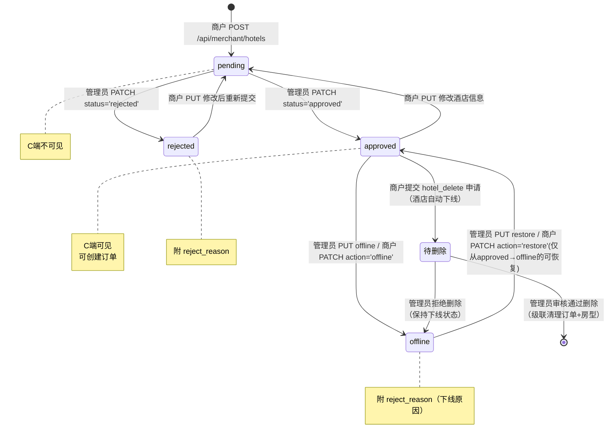

## 2. 订单状态流转

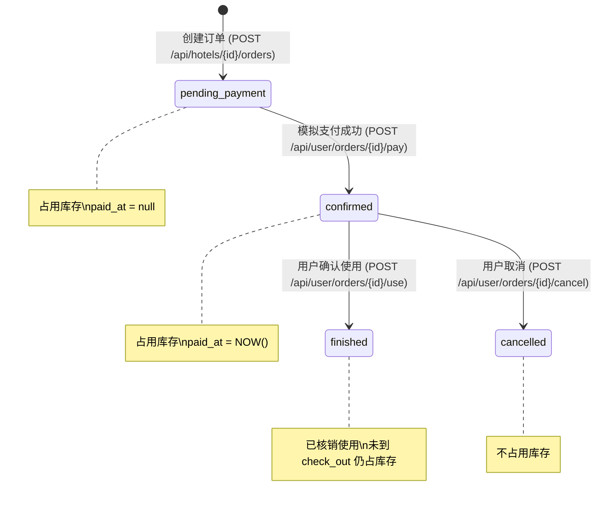

## 3. 商户创建酒店完整流程

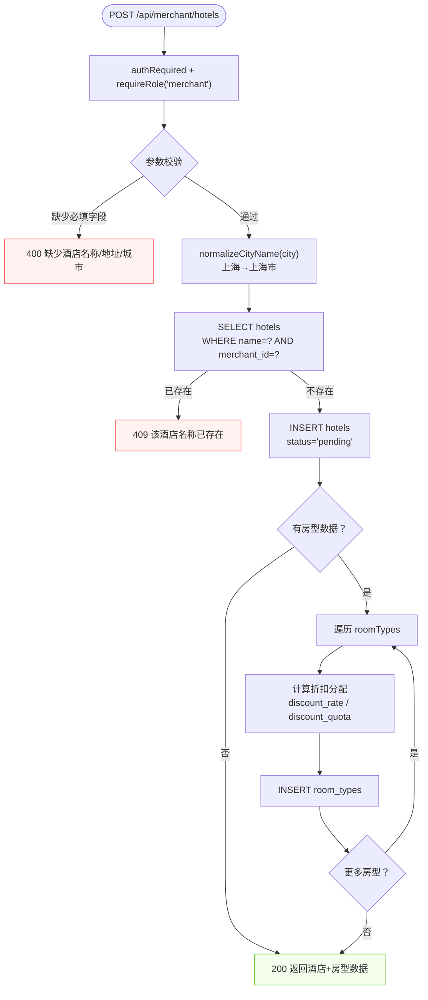

## 4. 商户编辑酒店流程

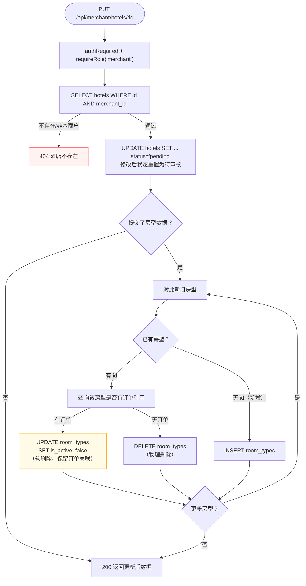

## 5. 管理员审核酒店流程

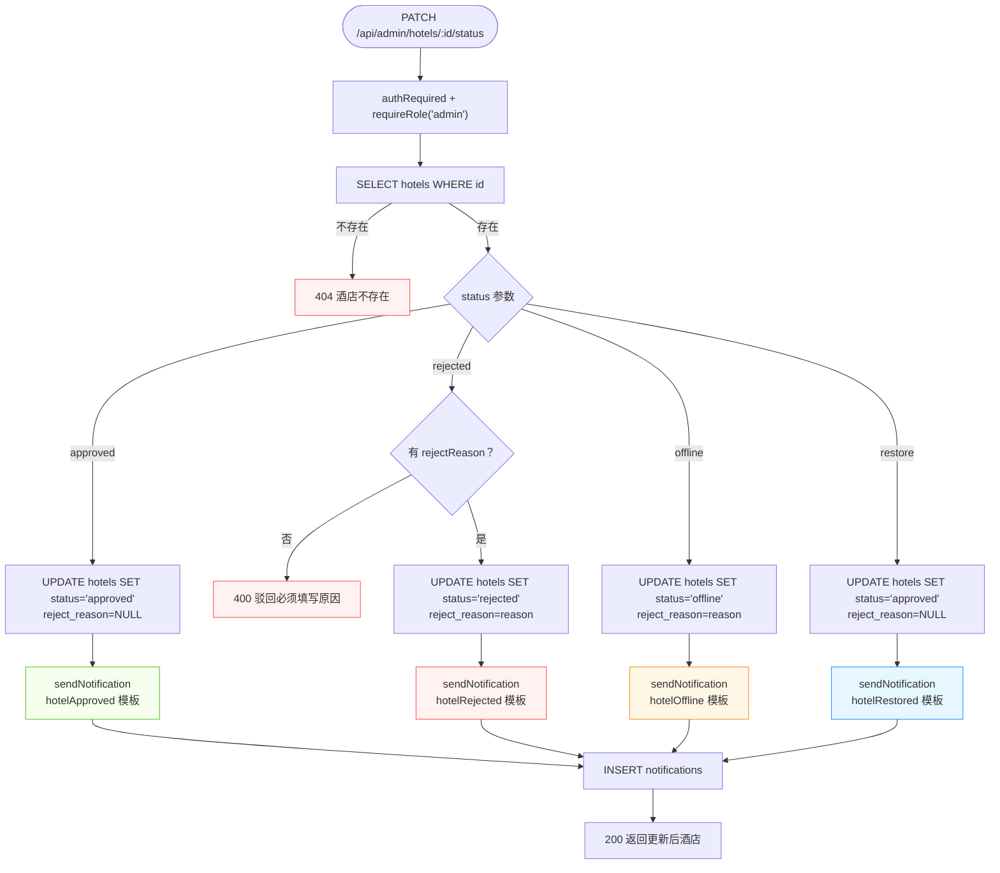

## 6. 申请创建与审核流程

### 6.1 商户提交申请

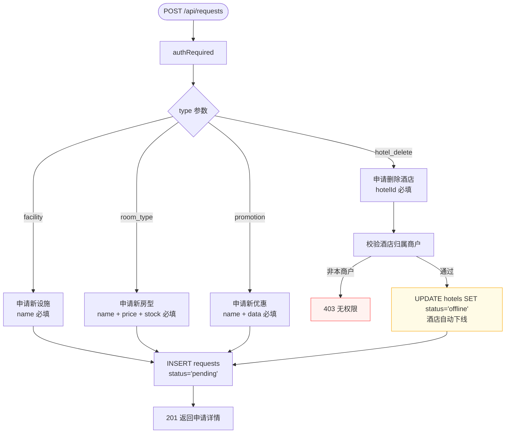

### 6.2 管理员审核申请

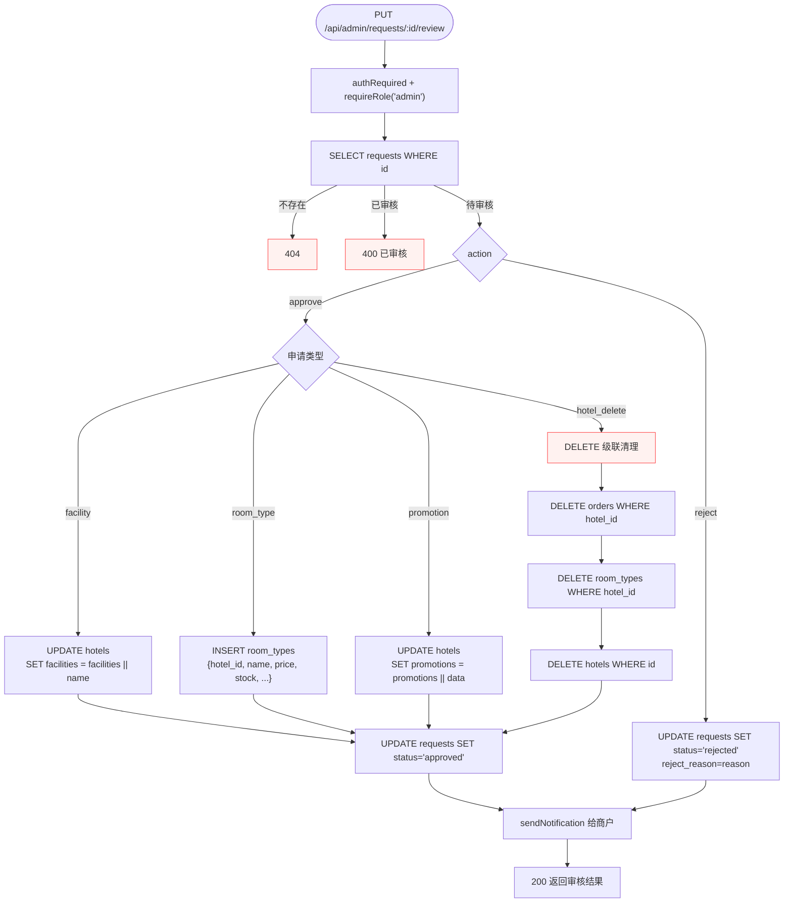

## 7. 订单创建完整流程

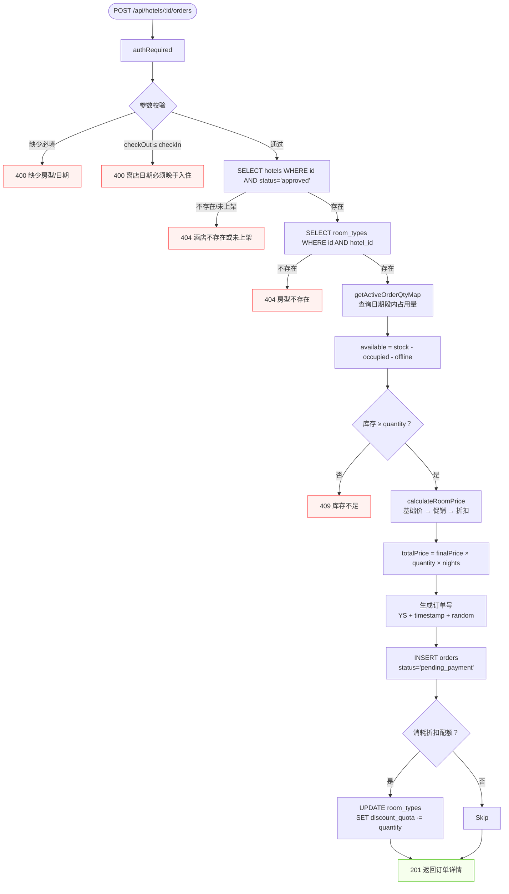

## 8. 订单支付与状态变更流程

```mermaid
flowchart TD
    subgraph 支付["模拟支付"]
        PayStart([POST /api/user/orders/:id/pay]) --> CheckPay{订单状态}
        CheckPay -->|非 pending_payment| ErrPay["400 仅待付款订单可支付"]
        CheckPay -->|pending_payment| DoPay["UPDATE orders<br/>SET status='confirmed', paid_at=NOW()"]
        DoPay --> PayDone["200 支付成功"]
    end

    subgraph 使用["确认使用"]
        UseStart([POST /api/user/orders/:id/use]) --> CheckUse{订单状态}
        CheckUse -->|非 confirmed| ErrUse["400 仅已确认订单可使用"]
        CheckUse -->|confirmed| DoUse["UPDATE orders<br/>SET status='finished'"]
        DoUse --> UseDone["200 使用成功"]
    end

    subgraph 取消["取消订单"]
        CancelStart([POST /api/user/orders/:id/cancel]) --> CheckCancel{订单状态}
        CheckCancel -->|已完成/已取消| ErrCancel["400 无法取消"]
        CheckCancel -->|pending_payment/confirmed| DoCancel["UPDATE orders<br/>SET status='cancelled'"]
        DoCancel --> CancelDone["200 取消成功"]
    end

    style ErrPay fill:#fff2f0,stroke:#ff4d4f
    style ErrUse fill:#fff2f0,stroke:#ff4d4f
    style ErrCancel fill:#fff2f0,stroke:#ff4d4f
    style PayDone fill:#f6ffed,stroke:#52c41a
    style UseDone fill:#f6ffed,stroke:#52c41a
    style CancelDone fill:#f6ffed,stroke:#52c41a
```

## 9. 公开酒店智能搜索流程

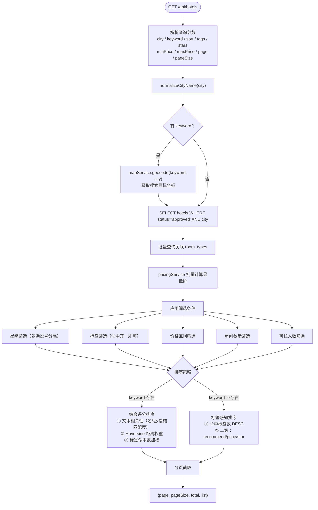

## 10. 批量折扣操作流程

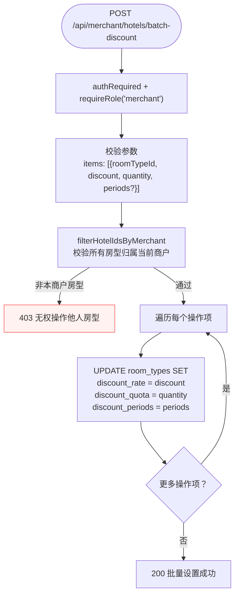

## 11. 验证码流程

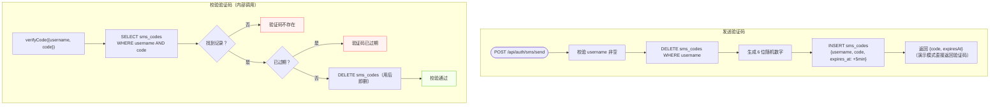

## 12. 收藏管理流程

```mermaid
flowchart TD
    subgraph 添加收藏
        Add([POST /api/user/favorites]) --> AuthAdd["authRequired"]
        AuthAdd --> CheckDup["SELECT favorite_hotels<br/>WHERE user_id AND hotel_id"]
        CheckDup -->|已收藏| ErrDup["400 已收藏"]
        CheckDup -->|未收藏| InsertFav["INSERT favorite_hotels<br/>UNIQUE(user_id, hotel_id)"]
        InsertFav --> AddDone["200 收藏成功"]
    end

    subgraph 取消收藏
        Remove([DELETE /api/user/favorites/:hotelId]) --> AuthRm["authRequired"]
        AuthRm --> DeleteFav["DELETE favorite_hotels<br/>WHERE user_id AND hotel_id"]
        DeleteFav --> RmDone["200 取消成功"]
    end

    subgraph 清空收藏
        Clear([DELETE /api/user/favorites]) --> AuthClear["authRequired"]
        AuthClear --> DeleteAll["DELETE favorite_hotels<br/>WHERE user_id"]
        DeleteAll --> ClearDone["200 清空成功"]
    end

    subgraph 查询收藏
        List([GET /api/user/favorites]) --> AuthList["authRequired"]
        AuthList --> QueryFavs["SELECT favorite_hotels WHERE user_id"]
        QueryFavs --> GetHotels["SELECT hotels WHERE id IN (...)"]
        GetHotels --> ListDone["200 收藏酒店列表"]
    end
```

## 13. 商户管理流程（管理员）

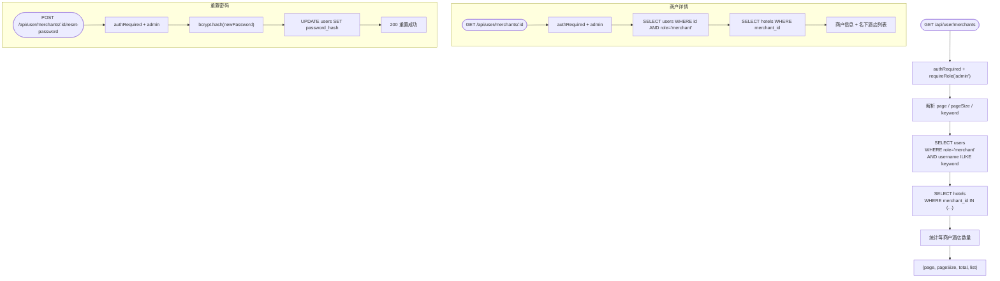

## 14. 订单统计聚合流程

```mermaid
flowchart TD
    Start([GET /api/{role}/hotels/:id/order-stats]) --> Auth["authRequired"]
    Auth --> QueryOrders["SELECT orders WHERE hotel_id"]
    QueryOrders --> QueryRoomTypes["SELECT room_types WHERE hotel_id"]

    QueryOrders --> Aggregate["多维度聚合"]

    Aggregate --> StatusDist["订单状态分布<br/>按 status GROUP BY"]
    Aggregate --> MonthlyRev["月度收入<br/>按 paid_at 月份 SUM(total_price)"]
    Aggregate --> RoomSummary["房型维度汇总<br/>每房型 间夜数 + 营收"]
    Aggregate --> DailyReport["逐日报表<br/>按 check_in 日期 + 房型"]
    Aggregate --> OccupancyRate["入住率计算"]

    QueryRoomTypes --> RoomSummary
    QueryRoomTypes --> DailyReport

    StatusDist --> Response["{totalOrders, revenue,<br/>statusStats, monthly,<br/>roomTypeSummary, roomTypeDaily}"]
    MonthlyRev --> Response
    RoomSummary --> Response
    DailyReport --> Response
    OccupancyRate --> Response
```
