# Server 后端 - 数据流图文档

> 本文档描述后端服务（server）各模块间的数据流向，涵盖请求入口、中间件链、控制器、服务层到数据库的完整链路。

## 1. 全局请求数据流

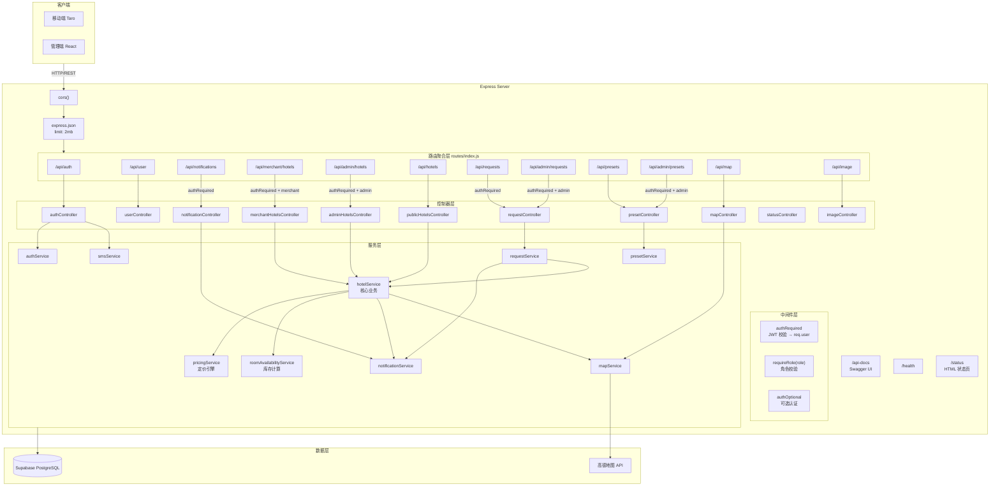

## 2. 认证数据流

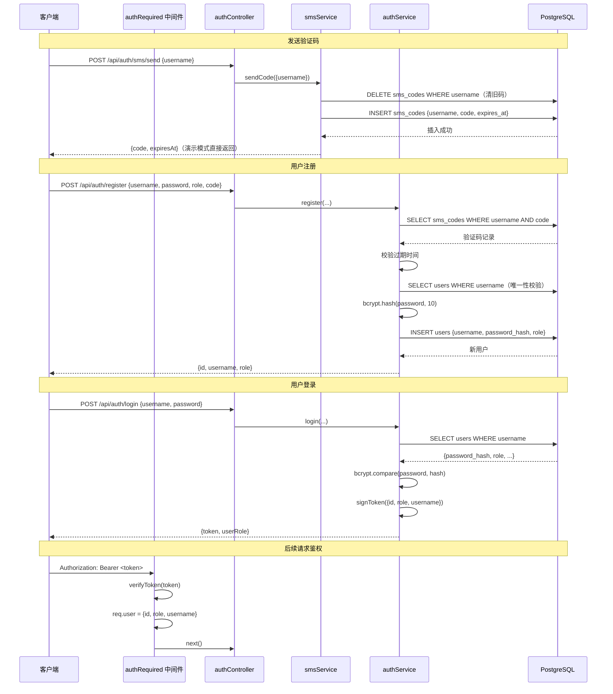

## 3. 酒店管理数据流

### 3.1 创建酒店（商户）

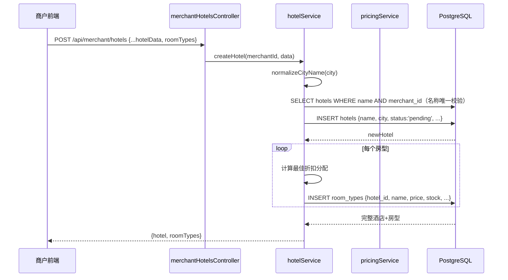

### 3.2 酒店列表查询（支持分页）

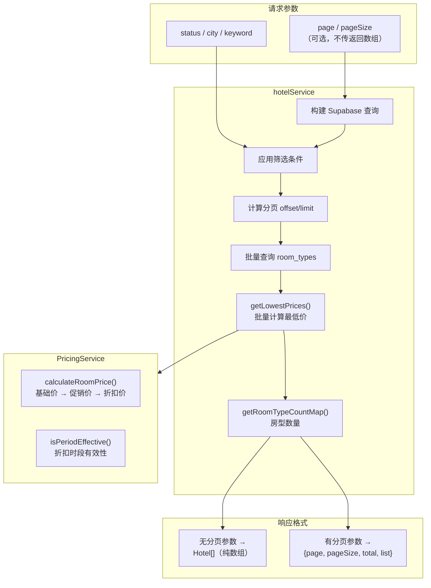

### 3.3 公开酒店智能搜索

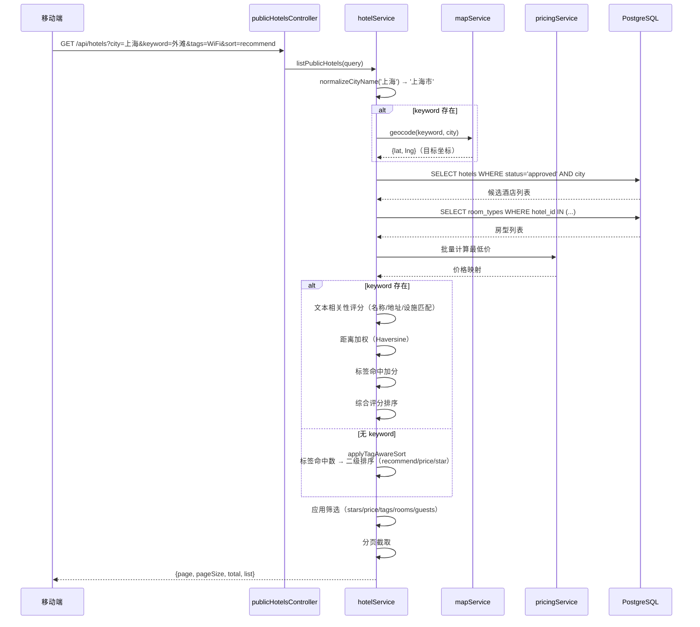

## 4. 订单创建数据流

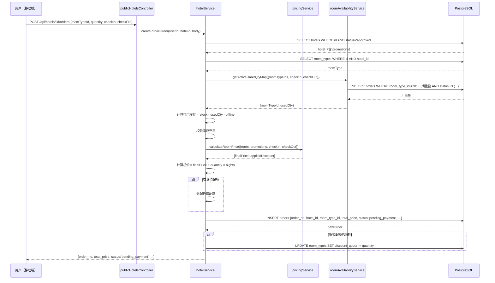

## 5. 审核流数据流

### 5.1 酒店审核

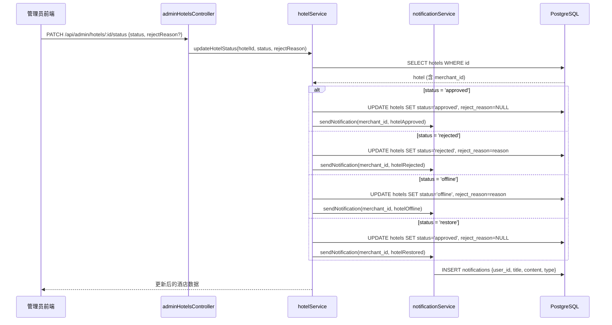

### 5.2 申请审核

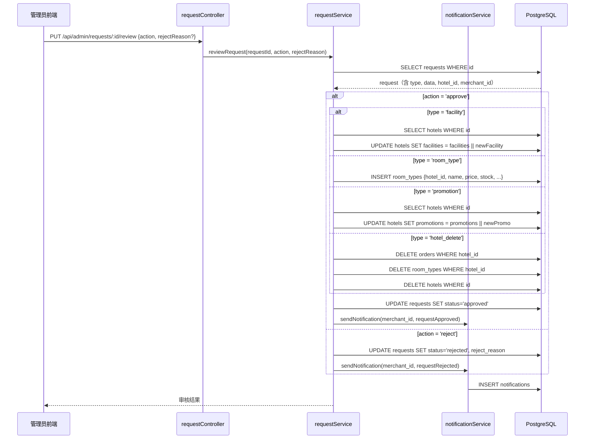

## 6. 通知数据流

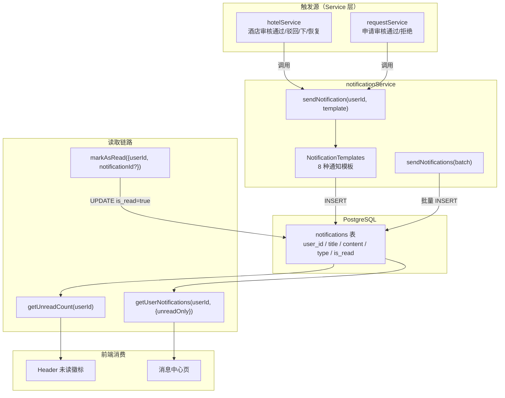

## 7. 定价引擎数据流

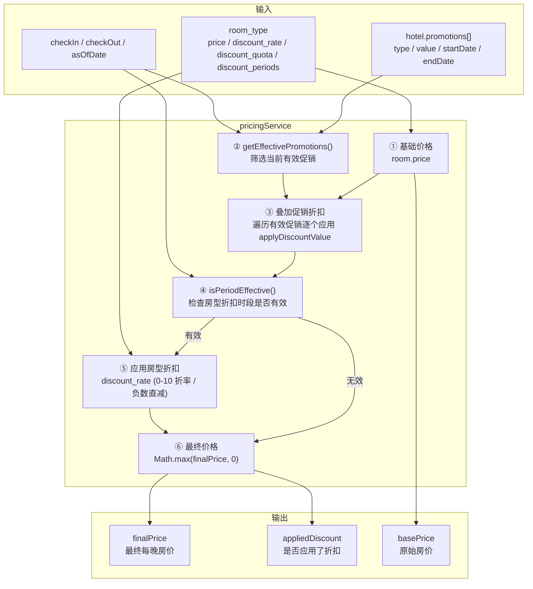

## 8. 库存可用性数据流

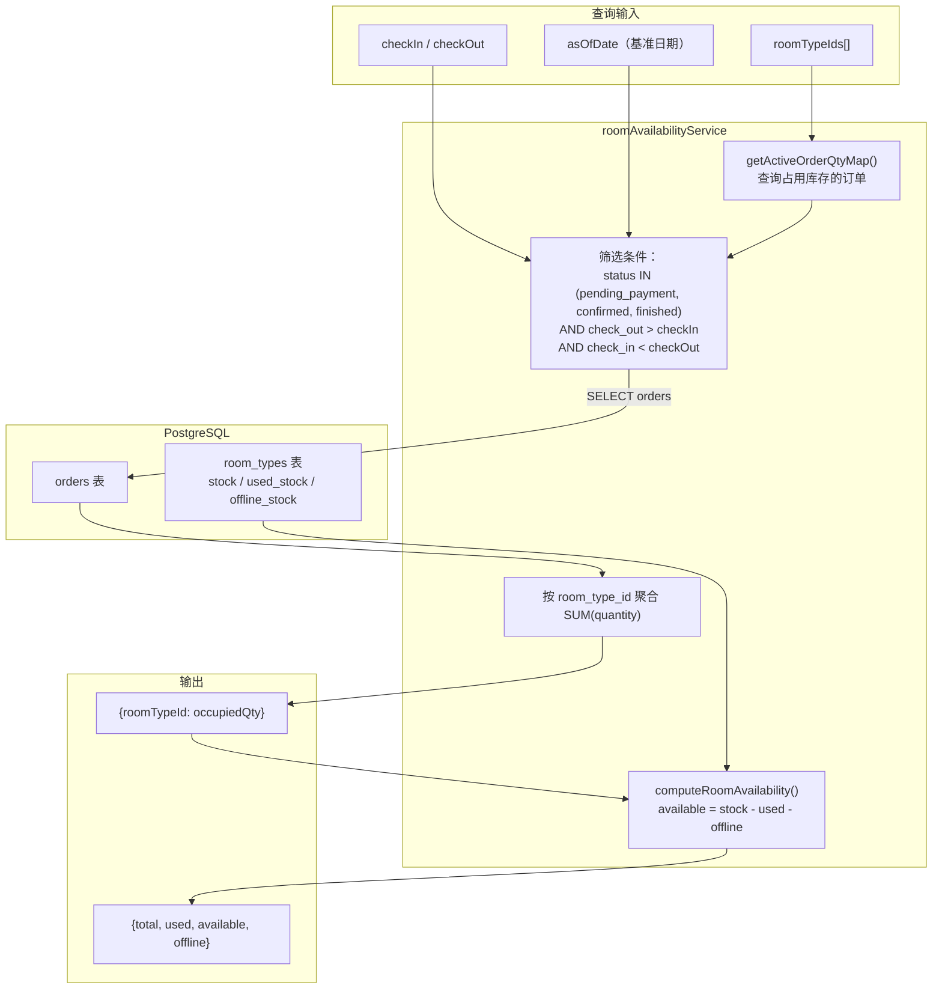

## 9. 地图服务数据流

```mermaid
graph TB
    subgraph MapService["mapService"]
        Geocode["geocode(address, city)<br/>地址 → 坐标"]
        Regeocode["regeocode(location)<br/>坐标 → 地址"]
        SearchPOI["searchPOI(keywords, city)<br/>POI 关键词搜索"]
        HotelLoc["getHotelLocations(city, target, filters)<br/>城市酒店坐标"]
        Cache["geocodeCache (内存)<br/>地理编码缓存"]
    end

    subgraph External["外部 API"]
        AmapGeocode["高德 geocode API"]
        AmapRegeo["高德 regeo API"]
        AmapPlace["高德 place/text API"]
    end

    subgraph Fallback["降级策略"]
        MockData["mockHotelLocations.js<br/>4 城市 × 10 酒店 mock 数据"]
        MockGeo["模拟坐标返回"]
    end

    subgraph DB["PostgreSQL"]
        Hotels["hotels 表<br/>status='approved'"]
    end

    Geocode -->|有 AMAP_KEY| AmapGeocode
    Geocode -->|无 AMAP_KEY| MockGeo
    Geocode --> Cache

    Regeocode --> AmapRegeo
    SearchPOI -->|有 AMAP_KEY| AmapPlace
    SearchPOI -->|无 AMAP_KEY| MockData

    HotelLoc --> Hotels
    HotelLoc -->|DB 无数据| MockData
    HotelLoc -->|计算最低价| PricingSvc["pricingService"]
    HotelLoc -->|Haversine 距离| Sort["筛选 + 排序"]
```

## 10. 用户订单生命周期数据流

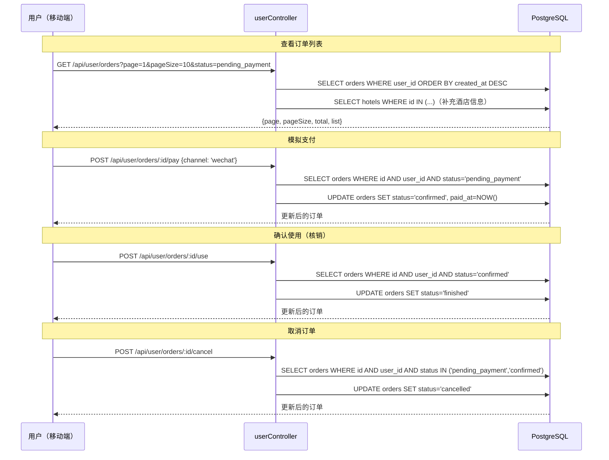

## 11. 预设数据流

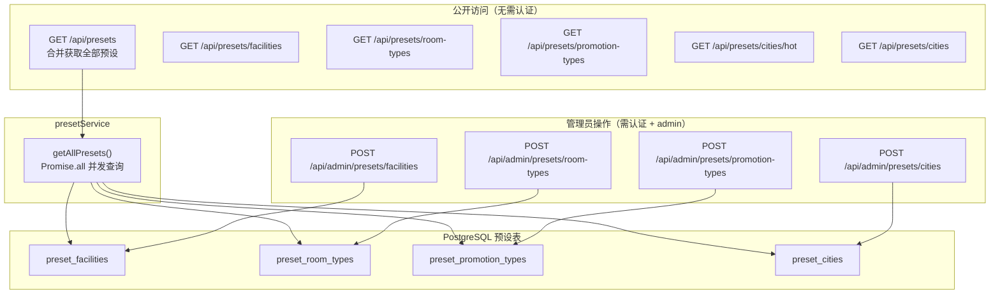

## 12. 图片代理数据流

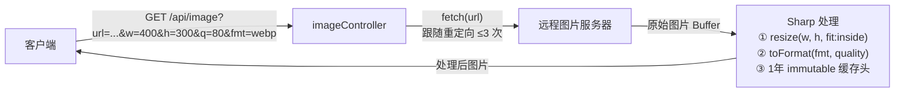
